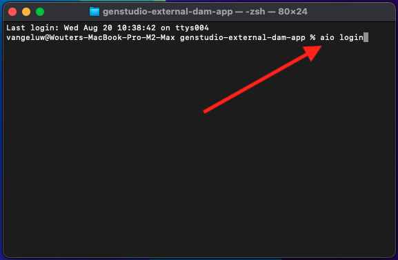
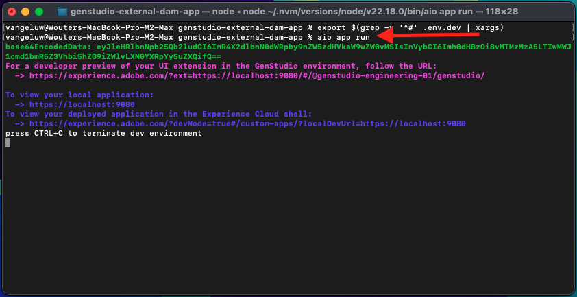

# 1.6.3创建外部DAM应用程序

## 1.6.3.1下载示例应用程序文件

转到[https://github.com/adobe/genstudio-extensibility-examples](https://github.com/adobe/genstudio-extensibility-examples)。 单击&#x200B;**代码**，然后选择&#x200B;**下载ZIP**。


将zip文件解压缩到桌面上。


打开文件夹&#x200B;**genstudio-extensibility-examples-main**。 您将看到多个示例应用程序。 此练习中需要注意的是&#x200B;**genstudio-external-dam-app**。

复制该目录并将其粘贴到桌面上。


现在，您的桌面上应该有以下内容：


在接下来的练习中，您将只使用&#x200B;**genstudio-external-dam-app**&#x200B;文件夹。

## 1.6.3.2配置Adobe Developer命令行界面

右键单击&#x200B;**genstudio-external-dam-app**&#x200B;文件夹，然后选择&#x200B;**新建位于文件夹中的终端**。


您应该会看到此内容。 输入命令`aio login`。 此命令将重定向到您的浏览器，并期待您登录。



成功登录后，您应该会在浏览器中看到此内容。


然后，浏览器将重定向回终端窗口。 您应该会看到一条显示&#x200B;**登录成功**&#x200B;的消息，以及浏览器返回的长令牌。


下一步是配置将用于外部DAM应用程序的实例和Adobe IO项目。

为此，您需要从之前配置的Adobe IO项目下载文件。

转到[https://developer.adobe.com/console/home](https://developer.adobe.com/console/home){target="_blank"}并打开您之前创建的名为`--aepUserLdap-- GSPeM EXT`的项目。 打开&#x200B;**生产**&#x200B;工作区。


单击&#x200B;**全部下载**。 这将下载一个JSON文件。


将JSON文件从&#x200B;**Downloads**&#x200B;目录复制到外部DAM应用程序的根目录中。


返回终端窗口。 输入命令`aio app use XXX-YYY-Production.json`。

>[!NOTE]
>
>您需要更改文件的名称以匹配文件的名称。

命令运行后，您的外部DAM应用程序现在将连接到您之前创建的App Builder的Adobe IO项目。


## 1.6.3.3安装GenStudio可扩展性SDK

接下来，您需要安装&#x200B;**GenStudio可扩展性SDK**。 您可以在此处找到有关SDK的更多详细信息：[https://github.com/adobe/genstudio-extensibility-sdk](https://github.com/adobe/genstudio-extensibility-sdk)。

要安装SDK，请在终端窗口中运行此命令：

`npm install @adobe/genstudio-extensibility-sdk`


几分钟后，将安装SDK。


## 1.6.3.4在Visual Studio Code中查看外部DAM应用程序

打开Visual Studio Code。 单击&#x200B;**打开……**&#x200B;打开文件夹。


选择包含您之前下载的应用程序的&#x200B;**genstudio-external-dam-app**&#x200B;文件夹。


单击以打开文件&#x200B;**.env**。


**.env**&#x200B;文件由您在上一步中运行的命令`aio app use`创建，它包含使用App Builder连接到Adobe IO项目所需的信息。


您现在需要在文件夹的根目录下创建2个新文件：

- `.env.dev`的问题。单击“**新建文件**”按钮，然后输入文件名`.env.dev`。


- `.env.prod`。  单击“**新建文件**”按钮，然后输入文件名`.env.prod`。


这些文件将包含连接到您之前创建的AWS S3存储段所需的凭据。

```
AWS_ACCESS_KEY_ID=
AWS_SECRET_ACCESS_KEY=
AWS_REGION=
AWS_BUCKET_NAME=
```

在上一个练习中创建IAM用户后，字段&#x200B;**AWS_ACCESS_KEY_ID**&#x200B;和&#x200B;**AWS_SECRET_ACCESS_KEY**&#x200B;可用。 系统要求您写下这些值，您现在可以复制这些值。


字段&#x200B;**AWS_REGION**&#x200B;可以从AWS S3 Home视图中获取，位于存储段名称旁边。 在此示例中，区域是&#x200B;**us-west-2**。


字段&#x200B;**AWS_BUCKET_NAME**&#x200B;应为`--aepUserLdap---gspem-dam`。

此信息允许您更新每个变量的值。

```
AWS_ACCESS_KEY_ID=XXX
AWS_SECRET_ACCESS_KEY=YYY
AWS_REGION=us-west-2
AWS_BUCKET_NAME=--aepUserLdap---gspem-dam
```

您现在应将此文本粘贴到`.env.dev`和`.env.prod`这两个文件中。 别忘了保存更改。


接下来，返回终端窗口。 运行此命令：

`export $(grep -v '^#' .env.dev | xargs)`


## 1.6.3.5运行外部DAM应用程序

在终端窗口中，运行命令`aio app run`。 1-2分钟后，您应该会看到此内容。



## 后续步骤

转到[部署代码并私下发布应用程序](./ex4.md){target="_blank"}

返回至[GenStudio for Performance Marketing — 可扩展性](./genstudioext.md){target="_blank"}

返回[所有模块](./../../../overview.md){target="_blank"}
