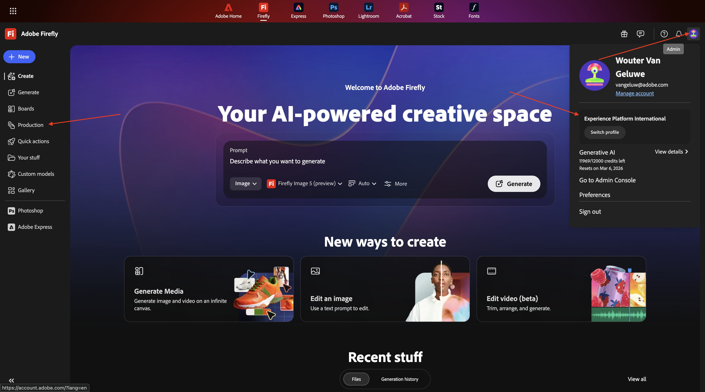
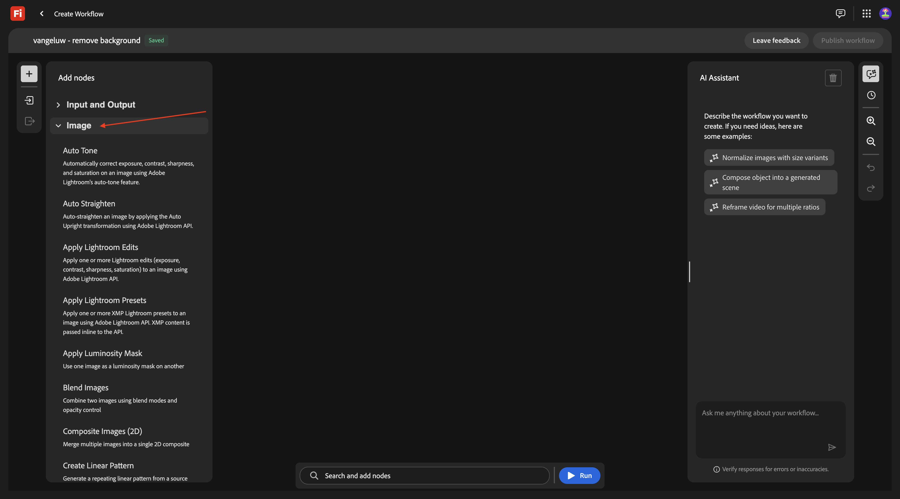
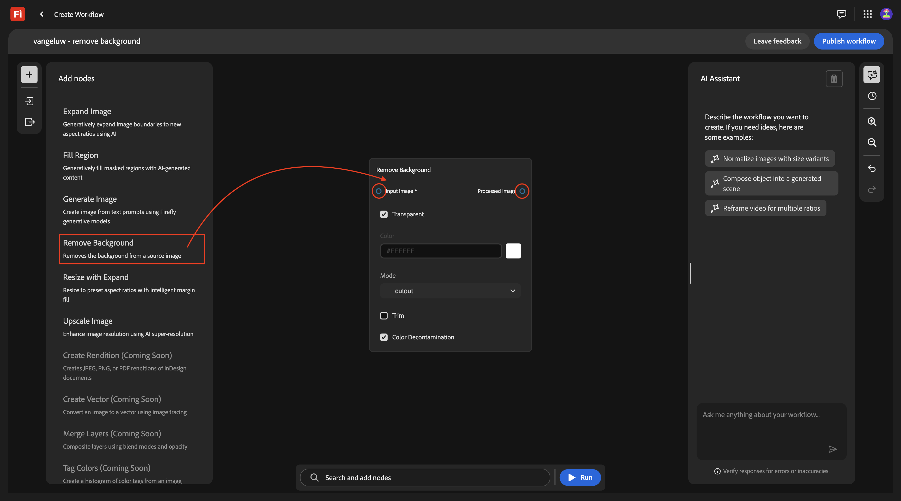
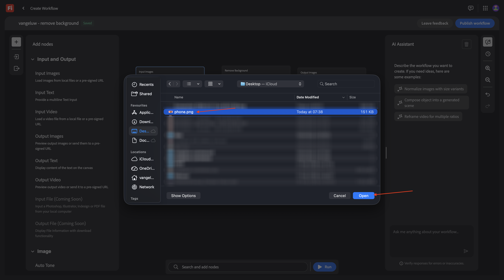
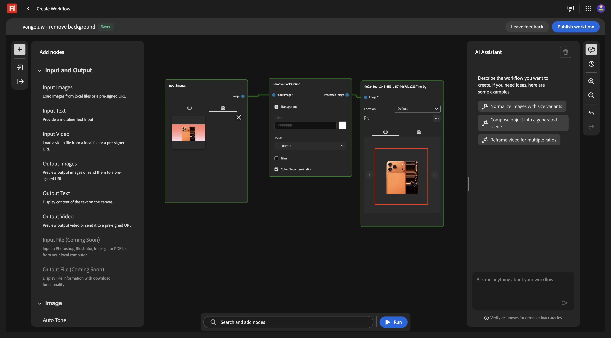
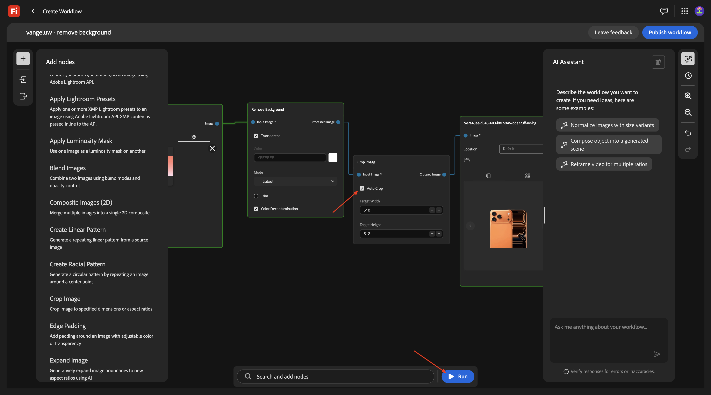
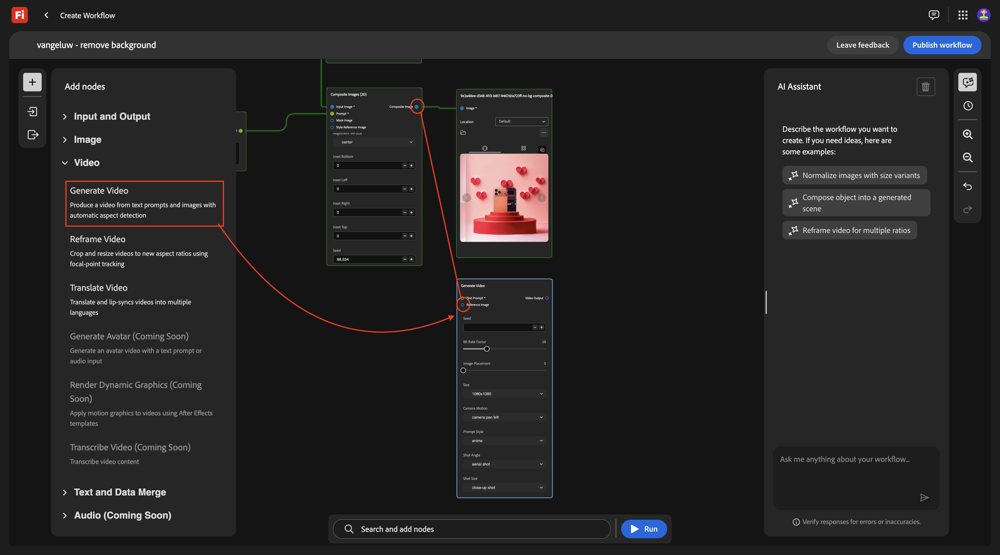
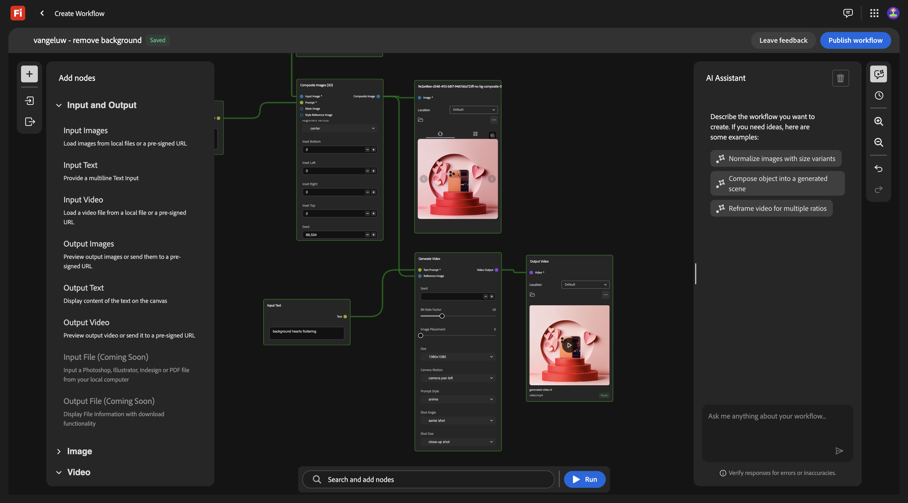
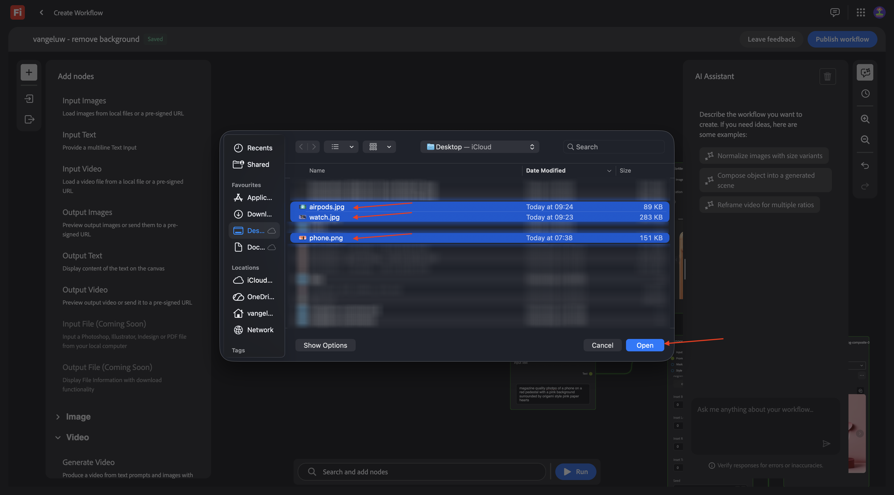

# 1.7.1 Firefly Creative Production for Enterprise快速入门

转到[https://firefly.adobe.com](https://firefly.adobe.com)。 单击右上角的配置文件图标，并确认您选择了正确的实例，应为`--aepImsOrgName--`。

转到&#x200B;**生产**。

您应该会看到此内容。 单击&#x200B;**创建工作流（测试版）**。

## 1.7.1.1删除背景

为了进一步了解Firefly Creative Production for Enterprise，您现在将实施一个基本用例，此用例侧重于删除特定图像的背景。

将工作流的名称更改为`vangeluw - remove background`。

打开&#x200B;**图像**

选择&#x200B;**删除背景**，然后将此节点拖放到画布上。

您现在需要将输入图像节点和输出图像节点连接到&#x200B;**删除背景**。

向上滚动并转到&#x200B;**输入和输出**。 单击&#x200B;**输入图像**&#x200B;节点并将其拖动到画布上。

然后您应该拥有此项。 将&#x200B;**输入图像**&#x200B;节点连接到&#x200B;**删除背景**&#x200B;节点，方法是：将鼠标悬停在&#x200B;**输入图像**&#x200B;节点上&#x200B;**图像**&#x200B;旁边的蓝色圆点上，并在&#x200B;**删除背景**&#x200B;节点上&#x200B;**输入图像**&#x200B;旁边的蓝色圆点处绘制一条直线。

然后您应该拥有此项。 接下来，单击&#x200B;**输出图像**&#x200B;节点，并将其拖动到画布上。

然后您应该拥有此项。 将&#x200B;**删除背景**&#x200B;节点连接到&#x200B;**输出图像**&#x200B;节点，方法是：将鼠标悬停在&#x200B;**删除背景**&#x200B;节点上&#x200B;**输出图像**&#x200B;旁边的蓝色圆点上，并在&#x200B;**输出图像**&#x200B;节点上&#x200B;**图像**&#x200B;旁边的蓝色圆点处绘制一条直线。

然后您应该拥有此项。

您的基本工作流现已准备就绪，可供测试。 将图像[phone.png](./assets/phone.png)下载到桌面。

返回工作流。 单击&#x200B;**输入图像**&#x200B;节点的&#x200B;**拖放**&#x200B;区域。

选择文件&#x200B;**phone.png**。 单击&#x200B;**打开**。

您应该会看到此内容。 单击&#x200B;**运行**。

在1-2分钟后，您应该会看到此结果。

## 1.7.1.2删除背景+裁切

您现在应该向画布添加一个&#x200B;**裁切**&#x200B;节点。 在菜单中，转到&#x200B;**图像**&#x200B;并向下滚动以查找&#x200B;**裁切**。 将其拖动到画布上。

将&#x200B;**裁切**&#x200B;节点放在&#x200B;**删除背景**&#x200B;节点和&#x200B;**输出图像**&#x200B;节点之间。

您现在需要删除&#x200B;**删除背景**&#x200B;节点与&#x200B;**输出图像**&#x200B;节点之间的连接。 您可以通过双击两个节点之间的线来完成此操作。

然后您应该拥有此项。 将&#x200B;**删除背景**&#x200B;节点连接到&#x200B;**裁切**&#x200B;节点，然后将&#x200B;**裁切**&#x200B;节点连接到&#x200B;**输出图像**&#x200B;节点。

选中&#x200B;**自动裁切**&#x200B;复选框，然后单击&#x200B;**运行**&#x200B;测试您的工作流。

1-2分钟后，您应该会看到此内容，它现在显示具有不同分辨率的图像。

## 1.7.1.3删除背景+裁切+复合图像

在菜单的&#x200B;**图像**&#x200B;下，选择&#x200B;**复合图像(2D)**&#x200B;节点，并将其拖动到画布上。

通过将&#x200B;**复合图像(2D)**&#x200B;节点上&#x200B;**裁剪的图像**&#x200B;旁边的蓝色点连接到&#x200B;**输入图像**&#x200B;旁边的蓝色点，添加第二个到&#x200B;**裁剪**&#x200B;节点的连接。

在菜单的&#x200B;**输入和输出**&#x200B;下，选择&#x200B;**输入文本**&#x200B;节点，并将其拖动到画布上。

将&#x200B;**输入文本**&#x200B;节点上&#x200B;**文本**&#x200B;旁边的绿色点连接到&#x200B;**复合图像(2D)**&#x200B;节点上&#x200B;**提示**&#x200B;旁边的绿色点。

然后您应该拥有此项。 在&#x200B;**输入文本**&#x200B;节点中输入以下提示。

`magazine quality photo of a phone on a red pedestal with a pink background surrounded by origami style pink paper hearts`

在菜单的&#x200B;**输入和输出**&#x200B;下，选择&#x200B;**输出图像**&#x200B;节点，并将其拖动到画布上。

将&#x200B;**复合图像(2D)**&#x200B;节点上&#x200B;**复合图像**&#x200B;旁边的蓝点连接到&#x200B;**输出图像**&#x200B;节点上&#x200B;**输入图像**&#x200B;旁边的蓝点。

单击&#x200B;**运行**。

几分钟后，您应该会看到类似这样的内容，其中以特定分辨率根据提供的提示在构成中显示原始图像。

## 1.7.1.4删除背景+裁切+复合图像+生成视频

在菜单中，转到&#x200B;**视频**。 选择&#x200B;**生成视频**&#x200B;节点并将其拖动到画布上。

将&#x200B;**复合图像(2D)**&#x200B;节点的&#x200B;**复合图像**&#x200B;旁边的蓝点连接到&#x200B;**生成视频**&#x200B;节点的&#x200B;**输入图像**&#x200B;旁边的蓝点。

在菜单中，转到&#x200B;**输入和输出**。 选择&#x200B;**输入文本**&#x200B;节点并将其拖动到画布上。

将&#x200B;**输入文本**&#x200B;节点上&#x200B;**文本**&#x200B;旁边的绿点连接到&#x200B;**生成视频**&#x200B;节点的&#x200B;**提示**&#x200B;旁边的绿点。

在`background hearts fluttering`输入文本&#x200B;**节点中输入提示**。

在菜单中，转到&#x200B;**输入和输出**。 选择&#x200B;**输出视频**&#x200B;节点并将其拖动到画布上。

将&#x200B;**生成视频**&#x200B;节点的&#x200B;**视频输出**&#x200B;旁边的紫色点连接到&#x200B;**输出视频**&#x200B;节点上的&#x200B;**视频**&#x200B;旁边的紫色点。

单击&#x200B;**运行**。

观看完几个视频后，您应该会看到此视频，其中基于提供的图像和提示的组合显示了一个视频。

## 1.7.1.5缩放

您现在已为1个图像完成此操作。 现在，让我们使用此工作流，但适用于多个图像。

将这些图像下载到桌面：

- [watch.jpg](./assets/watch.jpg)
- [airpods.jpg](./assets/airpods.jpg)

在工作流中，返回第一个节点&#x200B;**输入图像**。 删除当前选定的图像。

单击&#x200B;**拖放**&#x200B;区域。

选择您已下载的3张图像。 单击&#x200B;**打开**。

您应该会看到此内容。 单击&#x200B;**运行**。

几分钟后，您应该会看到类似的输出，其中3个图像正在生成，3个视频正在生成。

## AEM Assets CS中的1.7.1.5商店

在本练习中，您会将作为自定义工作流的一部分创建的资源存储在AEM Assets CS中。

您应该首先在AEM Assets CS环境中创建新文件夹。

为此，请转到[https://experience.adobe.com](https://experience.adobe.com)。 单击以打开&#x200B;**Experience Manager Assets**。

选择您的AEM Assets CS环境，应将其命名为`--aepUserLdap-- - CitiSignal AEM + ACCS`。

转到&#x200B;**Assets**&#x200B;并单击&#x200B;**创建文件夹**。

输入名称： `--aepUserLdap-- - Firefly Creative Production for Enterprise`。 单击&#x200B;**创建**。

返回自定义工作流，然后转到&#x200B;**输出图像**&#x200B;节点。 单击&#x200B;**默认**，然后选择&#x200B;**AEM Assets**。

然后您应该会看到此弹出窗口。 选择您的AEM Assets CS存储库，然后选择之前创建的文件夹，其名称应为： `--aepUserLdap-- - Firefly Creative Production for Enterprise`。 单击&#x200B;**选择**。

转到&#x200B;**输出视频**&#x200B;节点。 单击&#x200B;**默认**，然后选择&#x200B;**AEM Assets**。

然后您应该会看到此弹出窗口。 选择您的AEM Assets CS存储库，然后选择之前创建的文件夹，其名称应为： `--aepUserLdap-- - Firefly Creative Production for Enterprise`。 单击&#x200B;**选择**。

然后您应该拥有此项。 单击&#x200B;**运行**。

几分钟后，您应该会在AEM Assets CS的文件夹中看到已创建的可用资源。

返回工作流。 单击&#x200B;**发布**。

您应该会看到此内容。

您的工作流现已发布，现在可以在下一个练习中以编程方式执行。

## 后续步骤

转到[1.7.2以编程方式执行自定义工作流](./ex2.md){target="_blank"}

返回[Firefly Creative Production for Enterprise](./workflowbuilder.md){target="_blank"}

返回[所有模块](./../../../overview.md){target="_blank"}
