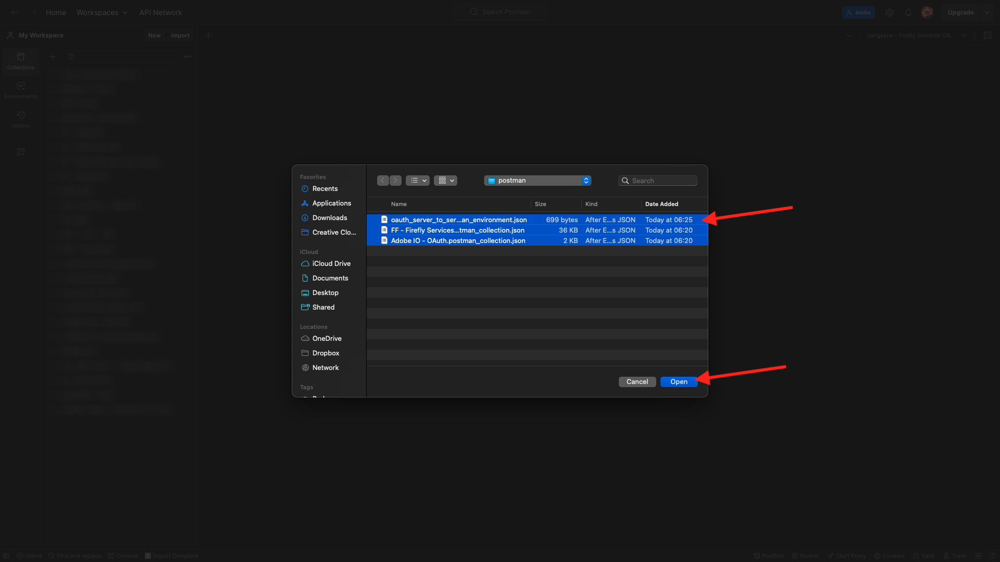
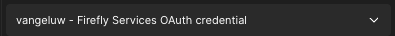

# 1.1.1Firefly服务快速入门

在本练习中，您将使用Postman和Adobe I/O来查询Adobe Firefly服务API。

## 配置Adobe I/O项目

在本练习中，您将集中使用Adobe I/O来根据Firefly服务API进行查询。 请按照以下步骤设置Adobe I/O。

转到[https://developer.adobe.com/console/home](https://developer.adobe.com/console/home)

确保在屏幕右上角选择正确的实例。 您的实例为`--aepImsOrgName--`。 单击&#x200B;**新建项目**。

选择&#x200B;**+添加到项目**&#x200B;并选择&#x200B;**API**。

您随后将看到以下内容：

选择&#x200B;**Creative Cloud**&#x200B;并单击&#x200B;**Firefly-Firefly服务**。 单击&#x200B;**下一步**。

您现在将看到此内容。 为您的凭据提供一个名称： `--aepUserLdap-- - Firefly Services OAuth credential`。 单击&#x200B;**下一步**。

接下来，您需要选择一个产品配置文件，该配置文件将定义此集成可用的权限。

选择配置文件&#x200B;**默认Firefly服务配置**。

单击&#x200B;**保存配置的API**。

您的Adobe I/O集成现已准备就绪。

单击“下载Postman **”按钮，然后单击“** OAuth服务器到服务器&#x200B;**”以下载Postman环境。**

您的IO项目当前具有通用名称。 您需要为集成提供一个友好名称。 按指示单击&#x200B;**项目X**（或类似名称）

单击&#x200B;**编辑项目**。

输入集成的名称： `--aepUserLdap-- Firefly`。

单击&#x200B;**保存**。

Adobe I/O集成的设置现已完成。

## 对Adobe I/O进行Postman身份验证

转到[https://www.postman.com/downloads/](https://www.postman.com/downloads/)。

下载并安装适用于您的操作系统的Postman的相关版本。

安装Postman后，启动应用程序。

在Postman中，有2个概念：环境和收藏集。

- 环境文件包含所有比较一致或不太一致的环境变量。 在该环境中，您可以找到Adobe环境的IMSOrg等内容，以及客户端ID和其他安全凭据。 环境文件是您在上一个练习的Adobe I/O设置过程中下载的文件，其名称如下： **`oauth_server_to_server.postman_environment.json`**。

- 收藏集包含大量您可以使用的API请求。 我们将使用2个收藏集
   - 1个集合用于Adobe I/O的身份验证
   - 1本模块中的练习的集合

请将文件[postman.zip](./../../../assets/postman/postman-ff.zip)下载到您的本地桌面。

在此&#x200B;**postman.zip**&#x200B;文件中，您将找到以下文件：

- `Adobe IO - OAuth.postman_collection.json`
- `FF - Firefly Services Tech Insiders.postman_collection.json`

解压缩&#x200B;**postman-ff.zip**&#x200B;文件，并将这2个文件与从Adobe I/O下载的Postman环境（即文件`oauth_server_to_server.postman_environment.json`）一起存储在桌面上的文件夹中。 您需要在该文件夹中包含以下3个文件：

返回Postman。 单击&#x200B;**导入**。

单击&#x200B;**文件**。

导航到桌面上解压缩2个下载文件的文件夹。 同时选择这3个文件，然后单击&#x200B;**打开**。

单击&#x200B;**打开**&#x200B;后，Postman将向您显示要导入的环境和收藏集的概述。 单击&#x200B;**导入**。

您现在拥有Postman中开始通过API与Firefly服务交互所需的一切。

首先要做的是确保您正确通过了身份验证。 要进行身份验证，您需要请求访问令牌。

在执行任何请求之前，请确保选择了正确的环境。 您可以通过验证右上角的环境下拉列表来检查当前选定的环境。

所选环境的名称应与此名称类似，`--aepUserLdap-- Firefly Services OAuth Credential`。

您的Postman环境和收藏集现已配置完毕，可正常使用。 您现在可以从Postman向Adobe I/O进行身份验证。

在&#x200B;**AdobeIO - OAuth**&#x200B;集合中，选择名为&#x200B;**POST — 获取访问令牌**&#x200B;的请求。 您将在&#x200B;**参数**&#x200B;下引用2个变量： `API_KEY`和`CLIENT_SECRET`。 这些变量取自选定的环境`--aepUserLdap-- Firefly Services OAuth Credential`。

单击&#x200B;**发送**。

单击&#x200B;**发送**&#x200B;后，您将在Postman的&#x200B;**正文**&#x200B;部分中看到一个响应：

如果配置成功，您应该会看到包含以下信息的类似响应：

| 键 | 值 |
|:-------------:| :---------------:| 
| token_type | **持有人** |
| access_token | **eyJhbGciOiJSU...** |
| expires_in | **86399** |

Adobe I/O为您提供了&#x200B;**持有者** — 令牌，该令牌具有特定值（非常长的access_token）和到期窗口。

我们收到的令牌现在有24小时有效。 这意味着24小时后，如果您要使用Postman对Adobe I/O进行身份验证，则必须通过再次运行此请求来生成新令牌。

## Firefly服务API，文本2图像

现在，您可以将第一个请求发送到Firefly服务API。

在&#x200B;**FF - Tech Services Tech Insiders**&#x200B;集合中，选择名为&#x200B;**POST- T2I V3**&#x200B;的FireflyFirefly。 在&#x200B;**正文**&#x200B;部分中，您将看到一个显示`Horses in a field`的默认提示。 单击&#x200B;**发送**&#x200B;以使Firefly服务生成该映像。

然后，您会看到包含图像URL的类似响应。 复制图像URL并在Web浏览器中将其打开。

您现在将看到描述`horses in a field`的美丽图像。

在继续下一个练习之前，请随时尝试使用API请求。

下一步： [1.1.2请求具有规范的图像](./ex2.md)

[返回模块1.1](./firefly-services.md)

[返回所有模块](./../../../overview.md)
