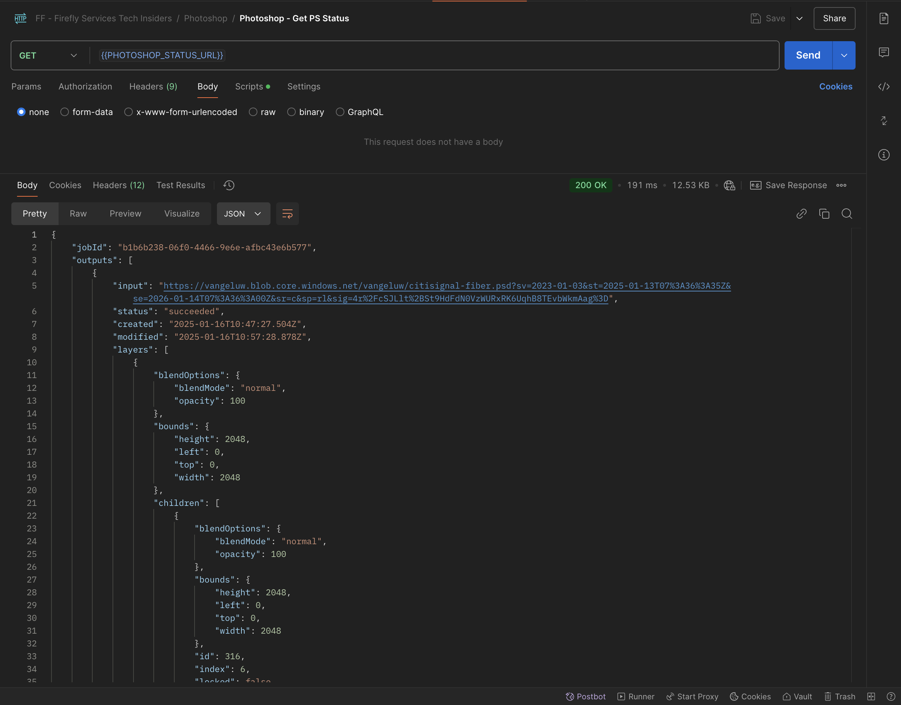

# 1.1.3使用Photoshop API

## 1.1.3.1更新您的Adobe I/O集成

转到[https://developer.adobe.com/console/home](https://developer.adobe.com/console/home){target="_blank"}。


转到&#x200B;**项目**，然后单击以打开您在上一个练习中创建的名为`--aepUserLdap-- Firefly`的项目。


单击&#x200B;**+添加到项目**，然后单击&#x200B;**API**。


选择&#x200B;**Creative Cloud**&#x200B;并单击&#x200B;**Photoshop -Firefly服务**。 单击&#x200B;**下一步**。


单击&#x200B;**下一步**。


接下来，您需要选择一个产品配置文件，该配置文件将定义此集成可用的权限。

选择配置文件&#x200B;**默认Firefly服务配置**&#x200B;和&#x200B;**默认Creative Cloud自动化服务配置**。

单击&#x200B;**保存配置的API**。


您的Adobe I/O项目现已更新为使用Photoshop和Firefly服务API。


## 1.1.3.2以编程方式与PSD文件交互

将文件下载到[citisignal-fibre.psd](./../../../assets/ff/citisignal-fiber.psd){target="_blank"}到您的桌面。

在Photoshop中打开文件&#x200B;**citisignal-fibre.psd**。 然后您应该拥有此项。


在&#x200B;**层**&#x200B;窗格中，您将看到文件的设计者为每个层提供了唯一的名称。 您可以通过在Photoshop中打开PSD文件来查看图层信息，但也可以通过编程方式来查看图层信息。

让我们将您的第一个API请求发送到Photoshop API。

转到Postman。 在向Photoshop发送API请求之前，您需要对Adobe I/O进行身份验证。打开您以前使用的名为&#x200B;**POST的请求 — 获取访问令牌**。

转到&#x200B;**Params**&#x200B;并验证参数&#x200B;**Scope**&#x200B;是否设置正确。 **作用域**&#x200B;的&#x200B;**值**&#x200B;应如下所示：

`openid,session,AdobeID,read_organizations,additional_info.projectedProductContext, ff_apis, firefly_api`

然后，单击&#x200B;**发送**。


然后，您便拥有了有效的访问令牌以与Photoshop API交互。


### 1.1.3.2.1 Photoshop API - Hello World

接下来，让我们向Photoshop API问好，以测试是否正确设置了所有权限和访问权限。 在集合&#x200B;**Photoshop**&#x200B;中，打开名称为&#x200B;**Photoshop Hello（测试身份验证）的请求**&#x200B;的问题。单击&#x200B;**发送**。


然后，您应会收到此响应：**欢迎使用Photoshop API！**。


接下来，为了以编程方式与PSD文件&#x200B;**citisignal-fibre.psd**&#x200B;交互，您需要将其上传到您的存储帐户。 可以通过使用Azure存储资源管理器将其拖放到容器中来手动执行此操作，但此时您应通过API执行此操作。

### 1.1.3.2.2将PSD上传到Azure

在Postman中，打开请求&#x200B;**将PSD上载到Azure Storage帐户**。 在上一个练习中，您已在Postman中配置这些环境变量，您现在将使用该变量：

- `AZURE_STORAGE_URL`
- `AZURE_STORAGE_CONTAINER`
- `AZURE_STORAGE_SAS_READ`
- `AZURE_STORAGE_SAS_WRITE`

正如您在请求&#x200B;**将PSD上载到Azure Storage Account**&#x200B;中看到的，URL已配置为使用这些变量。


在&#x200B;**Body**&#x200B;中，您现在应添加选择文件&#x200B;**citisignal-fibre.psd**。


然后您应该拥有此项。 单击&#x200B;**发送**。


然后，您应该从Azure中获取此空响应，这意味着您的文件存储在您的Azure存储帐户的容器中。


如果你使用Azure存储资源管理器查看，你将在刷新文件夹后看到文件。


### 1.1.3.2.3 Photoshop API — 获取清单

接下来，您需要获取PSD文件的清单文件。 在Postman中，打开请求&#x200B;**Photoshop — 获取PSD清单**。 转到&#x200B;**正文**。

正文应如下所示：

```json
{
  "inputs": [
    {
      "storage": "external",
      "href": "{{AZURE_STORAGE_URL}}/{{AZURE_STORAGE_CONTAINER}}/citisignal-fiber.psd{{AZURE_STORAGE_SAS_READ}}"
    }
  ],
  "options": {
    "thumbnails": {
      "type": "image/jpeg"
    }
  }
}
```

单击&#x200B;**发送**。

在响应中，您现在会看到一个链接。 由于Photoshop中的操作有时需要一些时间才能完成，因此Photoshop将提供状态文件作为对大多数传入请求的响应。 要了解您的请求发生了什么情况，您需要读取状态文件。


要读取状态文件，请打开请求&#x200B;**Photoshop — 获取PS状态**。 然后，您会看到此请求正在使用变量作为URL，该URL是由您发送的上一个请求&#x200B;**Photoshop — 获取PSD清单**&#x200B;设置的变量。 变量在每个请求的&#x200B;**脚本**&#x200B;中设置。

单击&#x200B;**发送**。


您应该会看到此内容。 目前，状态设置为&#x200B;**挂起**，这意味着该进程尚未完成。


您可以在&#x200B;**Photoshop — 获取PS状态**&#x200B;请求中再单击发送几次，直到状态更改为&#x200B;**succeeded**。 这可能需要几分钟的时间。

当响应可用时，您将获得一个包含PSD文件所有层信息的json文件。 这是一个有用的信息，因为您可以在此处看到层名称或层ID等内容。



例如，搜索文本`2048x2048-cta`。 您应该会看到此内容。


### 1.1.3.2.4 Photoshop API — 更改文本

接下来，您现在需要使用API更改行动号召的文本。 在Postman中，打开请求&#x200B;**Photoshop — 更改文本**，然后转到&#x200B;**正文**。

您应该会看到此内容。 您可以看到：

- 首先，指定了输入文件： `citisignal-fiber.psd`
- 其次，指定要更改的图层，文本将更改为
- 第三，指定了输出文件： `citisignal-fiber-changed-text.psd`

```json
{
  "inputs": [
    {
      "storage": "external",
      "href": "{{AZURE_STORAGE_URL}}/{{AZURE_STORAGE_CONTAINER}}/citisignal-fiber.psd{{AZURE_STORAGE_SAS_READ}}"
    }
  ],
  "options": {
    "layers": [
      {
        "name": "2048x2048-cta",
        "text": {
          "content": "Get Fiber now!"
        }
      }
    ]
  },
  "outputs": [
    {
      "storage": "azure",
      "href": "{{AZURE_STORAGE_URL}}/{{AZURE_STORAGE_CONTAINER}}/citisignal-fiber-changed-text.psd{{AZURE_STORAGE_SAS_WRITE}}",
      "type": "vnd.adobe.photoshop",
      "overwrite": true
    }
  ]
}
```

输出文件的名称不同，因为您不想覆盖原始输入文件。

单击&#x200B;**发送**。


与之前一样，响应包含一个指向跟踪进度的状态文件的链接。


要读取状态文件，请打开请求&#x200B;**Photoshop — 再次获取PS状态**，然后单击&#x200B;**发送**。 如果状态未立即设置为&#x200B;**succeeded**，请等待几秒钟，然后再次单击&#x200B;**发送**。

一旦状态设置为&#x200B;**succeeded**，您应该就会看到此信息。 在路径`outputs[0]._links.renditions[0].href`中，您应该看到Photoshop创建的输出文件的URL，其中包含已更改的文本。

单击URL以下载输出文件。


文件&#x200B;**citisignal-fibre-changed-text.psd**&#x200B;将下载到您的计算机，之后您可以打开它。 然后，您应该看到行动号召的占位符已被文本&#x200B;**立即获取Fiber！**&#x200B;替换。


最后，您还可以使用Azure存储资源管理器在容器中查看该文件。


您现在已经完成了此练习。

下一步：[1.1.4Firefly自定义模型](./ex4.md){target="_blank"}

[返回模块1.1](./firefly-services.md){target="_blank"}

[返回所有模块](./../../../overview.md){target="_blank"}
