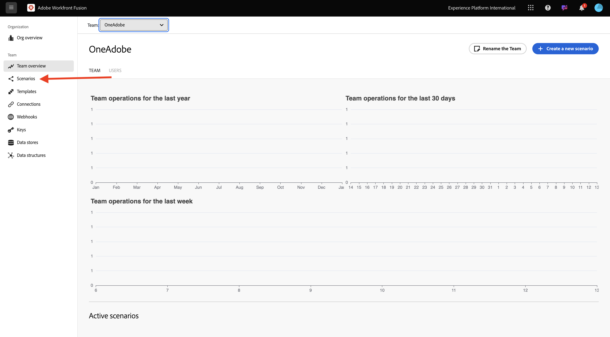
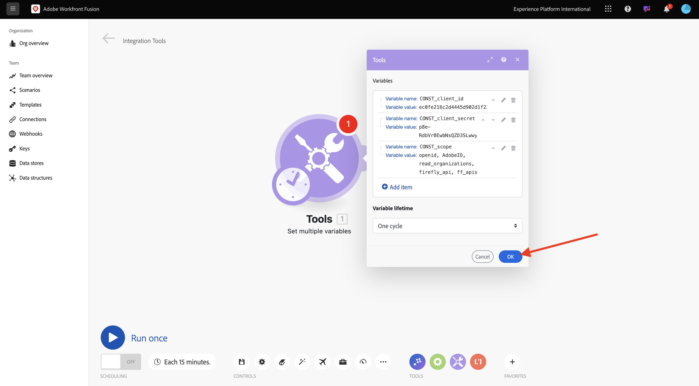

# 1.2.1 Workfront Fusion快速入门

了解如何使用Workfront Fusion和Adobe I/O查询Adobe Firefly服务API。

## 1.2.1.1创建新方案

1. 转到[https://experience.adobe.com/](https://experience.adobe.com/)。 打开&#x200B;**Workfront Fusion**。

   

1. 转到&#x200B;**方案**。

   

1. 选择&#x200B;**创建新方案**。

   

1. 命名文件夹`--aepUserLdap--`并选择&#x200B;**保存**。

   

1. 选择您的文件夹，然后选择&#x200B;**创建新方案**。

   

1. 出现空方案，选择&#x200B;**工具**&#x200B;并选择&#x200B;**设置多个变量**。

   

1. 将&#x200B;**clock**&#x200B;图标移动到新添加的&#x200B;**Set multiple variables**。

   

   您的屏幕应如下所示。

   

1. 右键单击问号并选择&#x200B;**删除模块**。

   

1. 接下来，右键单击&#x200B;**设置多个变量**&#x200B;并选择&#x200B;**设置**。

   

## 1.2.1.2配置Adobe I/O身份验证

现在，您需要配置根据Adobe I/O进行身份验证所需的变量。在上一个练习中，您创建了一个Adobe I/O项目。 该Adobe I/O项目的变量现在需要在Workfront Fusion中定义。

需要定义以下变量：

| 键 | 值 |
|:-------------:| :---------------:| 
| `CONST_client_id` | 您的Adobe I/O项目客户端ID |
| `CONST_client_secret` | 您的Adobe I/O项目客户端密钥 |
| `CONST_scope` | 您的Adobe I/O项目范围 |

1. 通过转到[https://developer.adobe.com/console/projects](https://developer.adobe.com/console/projects)并打开名为`--aepUserLdap-- Firefly`的Adobe I/O项目来查找这些变量。

   

1. 在您的项目中，选择&#x200B;**OAuth Serverto-Server**&#x200B;以查看上述密钥的值。

   

1. 使用上述键和值，您可以配置&#x200B;**Set multiple variables**&#x200B;对象。 选择&#x200B;**添加项**。

   

1. 输入&#x200B;**变量名称**： **CONST_client_id**&#x200B;及其&#x200B;**变量值**，选择&#x200B;**添加**。

   

1. 选择&#x200B;**添加项**。

   

1. 输入&#x200B;**变量名称**：**CONST_client_secret**&#x200B;及其&#x200B;**变量值**，选择&#x200B;**添加**。

   

1. 选择&#x200B;**添加项**。

   

1. 输入&#x200B;**变量名称**： **CONST_scope**&#x200B;及其&#x200B;**变量值**，选择&#x200B;**添加**。

   

1. 选择&#x200B;**确定**。

   

1. 将鼠标悬停在&#x200B;**上设置多个变量**&#x200B;并选择大&#x200B;**+**&#x200B;图标以添加另一个模块。

   

   您的屏幕应如下所示。

   

1. 在搜索栏中，输入&#x200B;**http**。 选择&#x200B;**HTTP**&#x200B;以将其打开。

   

1. 选择&#x200B;**发出请求**。

   

   | 键 | 值 |
   |:-------------:| :---------------:| 
   | `URL` | `https://ims-na1.adobelogin.com/ims/token/v3` |
   | `Method` | `POST` |
   | `Body Type` | `x-www-form-urlencoded` |

1. 选择&#x200B;**添加项**。

   

1. 为以下每个值添加项目：

   | 键 | 值 |
   |:-------------:| :---------------:| 
   | `client_id` | `CONST_client_id`的预定义变量 |
   | `client_secret` | `CONST_client_secret`的预定义变量 |
   | `scope` | `CONST_scope`的预定义变量 |
   | `grant_type` | `client_credentials` |

1. `client_id`的配置：

   

1. `client_secret`的配置。

   

1. `scope`的配置。

   

1. `grant_type`的配置。

   

1. 向下滚动并选中&#x200B;**解析响应**&#x200B;的框。 选择&#x200B;**确定**。

   

1. 您的屏幕应如下所示。 选择&#x200B;**运行一次**。

   

   场景运行后，屏幕应如下所示：

   

1. 选择&#x200B;**设置多个变量**&#x200B;对象上的&#x200B;**问号**&#x200B;图标以查看该对象运行时发生的情况。

   

1. 选择&#x200B;**HTTP上的**&#x200B;问号&#x200B;**图标 — 发出请求**&#x200B;对象以查看该对象运行时发生的情况。 在&#x200B;**OUTPUT**&#x200B;中，查看Adobe I/O返回的&#x200B;**access_token**。

   

1. 将鼠标悬停在&#x200B;**HTTP上 — 发出请求**&#x200B;并选择&#x200B;**+**&#x200B;图标以添加另一个模块。

   

1. 在搜索栏中搜索`tools`。 选择&#x200B;**工具**。

   

1. 选择&#x200B;**设置多个变量**。

   

1. 选择&#x200B;**添加项**。

   

1. 将&#x200B;**变量名称**&#x200B;设置为`bearer_token`。 选择`access_token`作为动态&#x200B;**变量值**。 选择&#x200B;**添加**。

   

1. 您的屏幕应如下所示。 选择&#x200B;**确定**。

   

1. 再次选择&#x200B;**运行一次**。

   

1. 方案运行后，在最后&#x200B;**设置多个变量**&#x200B;对象上选择&#x200B;**问号**&#x200B;图标。 您应该看到access_token存储在变量`bearer_token`中。

   

1. 接下来，右键单击第一个对象&#x200B;**设置多个值**&#x200B;并选择&#x200B;**重命名**。

   

1. 将名称设置为&#x200B;**初始化常量**。 选择&#x200B;**确定**。

   

1. 将第二个对象重命名为&#x200B;**对Adobe I/O**&#x200B;进行身份验证。 选择&#x200B;**确定**。

   

1. 将第三个对象重命名为&#x200B;**设置持有者令牌**。 选择&#x200B;**确定**。

   

   屏幕应如下所示：

   

1. 接下来，将方案的名称更改为`--aepUSerLdap-- - Adobe I/O Authentication`。

   

1. 选择&#x200B;**保存**。

   

## 后续步骤

转到[在Workfront Fusion中使用AdobeAPI](./ex2.md){target="_blank"}

返回[自动Adobe Firefly服务](./automation.md){target="_blank"}

返回[所有模块](./../../../overview.md){target="_blank"}
