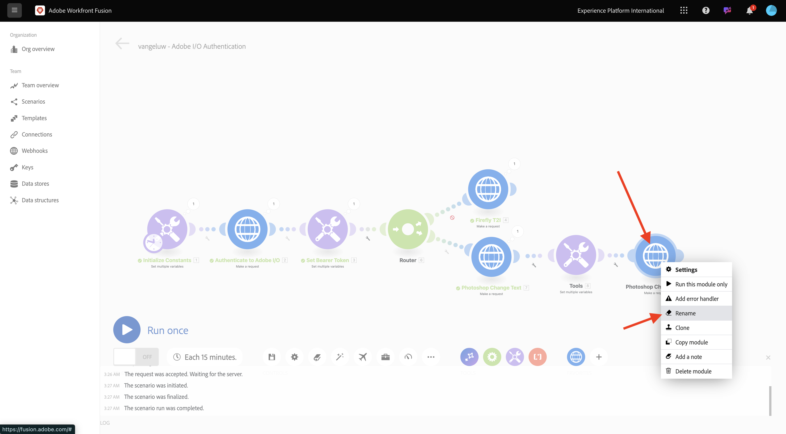
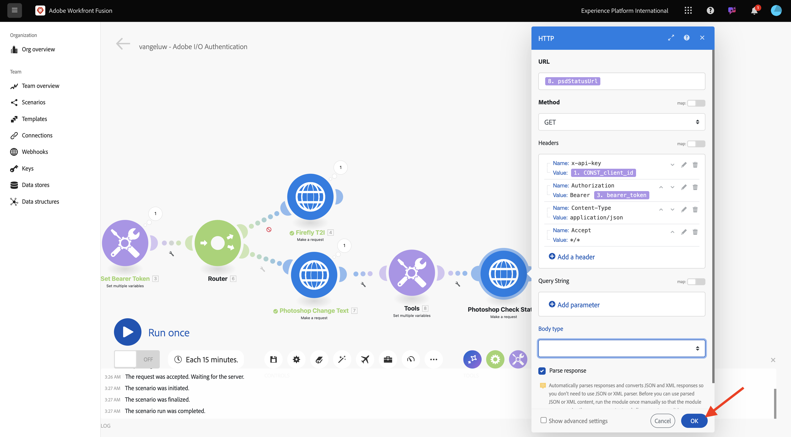
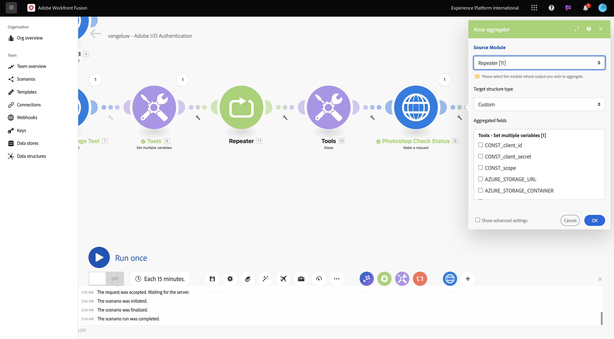
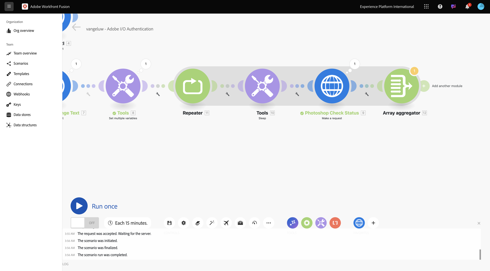
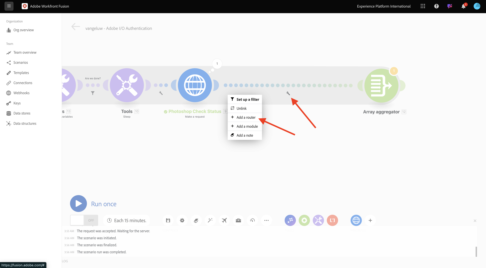

# 1.2.2在Workfront Fusion中使用AdobeAPI

## 1.2.2.1通过Workfront Fusion使用Firefly文本到图像API

将鼠标悬停在第二个&#x200B;**设置多个变量**&#x200B;节点上，然后单击&#x200B;**+**&#x200B;以添加另一个模块。


搜索&#x200B;**http**，然后选择&#x200B;**HTTP**。


选择&#x200B;**发出请求**。


选择以下变量：

- **URL**： `https://firefly-api.adobe.io/v3/images/generate`
- **方法**： `POST`

单击&#x200B;**添加标题**。


您需要输入以下标题：

| 键 | 值 |
|:-------------:| :---------------:| 
| `x-api-key` | 您为`CONST_client_id`存储的变量 |
| `Authorization` | `Bearer ` +您为`bearer_token`存储的变量 |
| `Content-Type` | `application/json` |
| `Accept` | `*/*` |

输入`x-api-key`的详细信息。 单击&#x200B;**添加**。


单击&#x200B;**添加标题**。


输入`Authorization`的详细信息。 单击&#x200B;**添加**。


单击&#x200B;**添加标题**。 输入`Content-Type`的详细信息。 单击&#x200B;**添加**。


单击&#x200B;**添加标题**。 输入`Accept`的详细信息。 单击&#x200B;**添加**。


将&#x200B;**Body类型**&#x200B;设置为&#x200B;**Raw**。 对于&#x200B;**内容类型**，请选择&#x200B;**JSON (application/json)**。


将此有效负载粘贴到&#x200B;**请求内容**&#x200B;字段中。

```json
{
  "numVariations": 1,
  "size": {
    "width": 2048,
    "height": 2048
  },
  "prompt": "Horses in a field",
  "promptBiasingLocaleCode": "en-US"
}
```

选中&#x200B;**分析响应**&#x200B;的复选框。 单击&#x200B;**确定**。


单击&#x200B;**运行一次**。


场景运行后，您应该会看到此内容。


单击&#x200B;**？第四个节点HTTP上的**&#x200B;图标以查看响应。 您应该会在响应中看到图像文件。


复制图像URL并在浏览器窗口中将其打开。 然后，您应该会看到如下所示的内容：


右键单击&#x200B;**HTTP**&#x200B;对象并将其重命名为&#x200B;**FireflyT2I**。


单击&#x200B;**保存**&#x200B;以保存更改。


## 1.2.2.2将Photoshop API用于Workfront Fusion

单击&#x200B;**设置持有者令牌**&#x200B;和&#x200B;**FireflyT2I**&#x200B;之间的&#x200B;**扳手**&#x200B;图标。 选择&#x200B;**添加路由器**。


右键单击&#x200B;**FireflyT2I**&#x200B;对象并选择&#x200B;**克隆**。


将克隆的对象拖放到&#x200B;**Router**&#x200B;对象附近，它将自动连接到&#x200B;**Router**。 然后您应该拥有此项。


您现在具有基于&#x200B;**FireflyT2I** HTTP请求的相同副本。 **FireflyT2I** HTTP请求的某些设置类似于与&#x200B;**Photoshop API**&#x200B;交互所需的设置，后者是节省时间的。 现在，您只需更改不相同的变量即可，例如请求URL和有效负载。

将&#x200B;**URL**&#x200B;更改为`https://image.adobe.io/pie/psdService/text`。


使用以下有效负载替换&#x200B;**请求内容**：

```json
{
  "inputs": [
    {
      "storage": "external",
      "href": "{{AZURE_STORAGE_URL}}/{{AZURE_STORAGE_CONTAINER}}/sevoi-psd.psd{{AZURE_STORAGE_SAS_READ}}"
    }
  ],
  "options": {
    "layers": [
      {
        "name": "2048x2048-button",
        "text": {
          "content": "Click here"
        }
      },
      {
        "name": "2048x2048-cta",
        "text": {
          "content": "Buy this stuff"
        }
      }
    ]
  },
  "outputs": [
    {
      "storage": "azure",
      "href": "{{AZURE_STORAGE_URL}}/{{AZURE_STORAGE_CONTAINER}}/sevoi-psd-changed-text.psd{{AZURE_STORAGE_SAS_WRITE}}",
      "type": "vnd.adobe.photoshop",
      "overwrite": true
    }
  ]
}
```


为了使此&#x200B;**请求内容**&#x200B;正常工作，缺少一些变量：

- `AZURE_STORAGE_URL`
- `AZURE_STORAGE_CONTAINER`
- `AZURE_STORAGE_SAS_READ`
- `AZURE_STORAGE_SAS_WRITE`

返回第一个节点，单击&#x200B;**初始化常量**，然后为每个变量选择&#x200B;**添加项**。


| 键 | 示例值 |
|:-------------:| :---------------:| 
| `AZURE_STORAGE_URL` | `https://vangeluw.blob.core.windows.net` |
| `AZURE_STORAGE_CONTAINER` | `vangeluw` |
| `AZURE_STORAGE_SAS_READ` | `?sv=2023-01-03&st=2025-01-13T07%3A36%3A35Z&se=2026-01-14T07%3A36%3A00Z&sr=c&sp=rl&sig=4r%2FcSJLlt%2BSt9HdFdN0VzWURxRK6UqhB8TEvbWkmAag%3D` |
| `AZURE_STORAGE_SAS_WRITE` | `?sv=2023-01-03&st=2025-01-13T17%3A21%3A09Z&se=2025-01-14T17%3A21%3A09Z&sr=c&sp=racwl&sig=FD4m0YyyqUj%2B5T8YyTFJDi55RiTDC9xKtLTgW0CShps%3D` |

您可以通过返回Postman并打开&#x200B;**环境变量**&#x200B;来查找变量。


将这些值复制到Workfront Fusion，并为这4个变量中的每一个添加新项。

然后您应该拥有此项。 单击&#x200B;**确定**。


接下来，返回克隆的HTTP请求以更新&#x200B;**请求内容**。 您会在&#x200B;**请求内容**&#x200B;中注意到这些黑色变量，它们是从Postman复制的变量。 现在，您需要将这些变量更改为之前在Workfront Fusion中定义的变量。 通过删除黑色文本并用正确的变量替换它，逐一替换每个变量。


在&#x200B;**输入**&#x200B;部分中有3项更改要进行。


**输出**&#x200B;部分还有3项要做的更改。 单击&#x200B;**确定**。


右键单击克隆的节点，然后选择&#x200B;**重命名**。 将名称更改为&#x200B;**Photoshop更改文本**。


然后您应该拥有此项。


单击&#x200B;**运行一次**。


单击&#x200B;**Photoshop更改文本**&#x200B;节点上的&#x200B;**搜索**&#x200B;图标以查看响应。 您应该具有类似于这样的响应，其中包含指向状态文件的链接。


在继续Photoshop API交互之前，让我们禁用到&#x200B;**FireflyT2I**&#x200B;节点的路由，以免向该API端点发送不需要的API调用。 单击&#x200B;**扳手**&#x200B;图标，然后选择&#x200B;**禁用路由**。


然后您应该拥有此项。


接下来，添加另一个&#x200B;**Set multiple variables**&#x200B;节点。


将其放在&#x200B;**Photoshop更改文本**&#x200B;节点之后。


单击&#x200B;**设置多个变量**&#x200B;节点，选择&#x200B;**添加项**。 从上一个请求的响应中选择变量值。

| 变量名称 | 变量值 |
|:-------------:| :---------------:| 
| `psdStatusUrl` | `data > _links > self > href` |

单击&#x200B;**添加**。


单击&#x200B;**确定**。


右键单击&#x200B;**Photoshop更改文本**&#x200B;节点，然后选择&#x200B;**克隆**。


将克隆的HTTP请求拖到刚刚创建的&#x200B;**设置多个变量**&#x200B;节点之后。


右键单击克隆的HTTP请求，选择&#x200B;**重命名**&#x200B;并将名称更改为&#x200B;**Photoshop检查状态**。



单击以打开HTTP请求。 更改URL，使其引用您在上一步中创建的变量，并将&#x200B;**方法**&#x200B;设置为&#x200B;**GET**。


通过选择空选项删除&#x200B;**正文**。


单击&#x200B;**确定**。



单击&#x200B;**运行一次**。


然后，您应该获得包含字段&#x200B;**状态**&#x200B;的响应，状态设置为&#x200B;**正在运行**。 Photoshop需要几秒钟才能完成该过程。


现在您知道该响应还需要一段时间才能完成，因此最好在此HTTP请求前面添加计时器，以便它不会立即运行。

单击&#x200B;**工具**&#x200B;节点，然后选择&#x200B;**休眠**。


将&#x200B;**休眠**&#x200B;节点放置在&#x200B;**设置多个变量**&#x200B;和&#x200B;**Photoshop检查状态**&#x200B;之间。 将&#x200B;**延迟**&#x200B;设置为&#x200B;**5**&#x200B;秒。 单击&#x200B;**确定**。


你就能拥有这个了。 以下配置的挑战是，等待5秒可能足够了，但可能还不够。 实际上，最好有一个更智能的解决方案，如do...while循环，每5秒检查一次状态，直到状态等于&#x200B;**succeeded**。 现在，您将在后续步骤中实施此类策略。


单击介于&#x200B;**设置多个变量**&#x200B;和&#x200B;**睡眠**&#x200B;之间的&#x200B;**扳手**&#x200B;图标。 选择&#x200B;**添加模块**。


搜索`flow`，然后选择&#x200B;**流量控制**。


选择&#x200B;**中继器**。


将&#x200B;**重复**&#x200B;设置为&#x200B;**20**。 单击&#x200B;**确定**。


接下来，在&#x200B;**Photoshop检查状态**&#x200B;上单击&#x200B;**+**&#x200B;以添加另一个模块。


搜索&#x200B;**流**&#x200B;并选择&#x200B;**流控制**。


选择&#x200B;**数组汇总**。


将&#x200B;**Source模块**&#x200B;设置为&#x200B;**中继器**。 单击&#x200B;**确定**。



然后，您应该拥有以下权限：



单击&#x200B;**扳手**&#x200B;图标并选择&#x200B;**添加模块**。


搜索&#x200B;**工具**&#x200B;并选择&#x200B;**工具**。


选择&#x200B;**获取多个变量**。


单击“**+添加项**”并将&#x200B;**变量名称**&#x200B;设置为`done`。


单击&#x200B;**确定**。


单击您之前配置的&#x200B;**设置多个变量**&#x200B;节点。 要初始化变量&#x200B;**done**，您需要在此将其设置为`false`。 单击&#x200B;**+添加项**。


对于&#x200B;**变量名称**，请使用`done`。 要设置状态，需要一个布尔值。 要查找布尔值，请单击&#x200B;**齿轮**&#x200B;图标，然后选择`false`。 单击&#x200B;**添加**。


单击&#x200B;**确定**。


接下来，在您配置的&#x200B;**获取多个变量**&#x200B;节点后单击&#x200B;**扳手**&#x200B;图标。


选择&#x200B;**设置筛选器**。 您现在需要检查变量&#x200B;**done**&#x200B;的值。 如果该值设置为&#x200B;**false**，则必须执行循环的下一部分。 如果该值设置为&#x200B;**true**，则表示该进程已成功完成，因此无需继续循环的下一部分。


对于标签，请使用&#x200B;**我们完成了吗？**&#x200B;的问题。使用现有变量&#x200B;**done**&#x200B;设置&#x200B;**Condition**，运算符应设置为&#x200B;**等于**，值应为布尔变量`false`。 单击&#x200B;**确定**。


接下来，在节点&#x200B;**Photoshop检查状态**&#x200B;和&#x200B;**数组聚合器**&#x200B;之间腾出一些空间。 然后，单击&#x200B;**扳手**&#x200B;图标并选择&#x200B;**添加路由器**。 您这样做是因为在检查Photoshop文件的状态后，应该有2条路径。 如果状态为`succeeded`，则&#x200B;**done**&#x200B;的变量应设置为`true`。 如果状态不等于`succeeded`，则循环应继续。 路由器将可以检查并设置此项。



添加路由器后，单击&#x200B;**扳手**&#x200B;图标，然后选择&#x200B;**设置过滤器**。


对于标签，请使用&#x200B;**我们已完成**。 通过选择响应字段&#x200B;**data.outputs[].status**&#x200B;来使用&#x200B;**Photoshop检查状态**&#x200B;节点的响应设置&#x200B;**条件**，运算符应设置为&#x200B;**等于**，值应为`succeeded`。 单击&#x200B;**确定**。


接下来，单击带有问号的空节点并搜索&#x200B;**工具**。 然后选择&#x200B;**工具**。


选择&#x200B;**设置多个变量**。


使用路由器的此分支时，表示Photoshop文件创建的状态已成功完成。 这意味着do...while循环不再需要继续检查Photoshop中的状态，因此应将变量`done`设置为`true`。

对于&#x200B;**变量名称**，请使用`done`。 对于&#x200B;**变量值**，应使用布尔值`true`。 单击&#x200B;**齿轮**&#x200B;图标，然后选择`true`。 单击&#x200B;**添加**。


单击&#x200B;**确定**。


接下来，右键单击刚刚创建的&#x200B;**设置多个变量**&#x200B;节点，然后选择&#x200B;**克隆**。


拖动克隆的节点，使其与&#x200B;**数组聚合器**&#x200B;连接。 然后，右键单击该节点并选择&#x200B;**重命名**，然后将其名称更改为`Placeholder End`。


删除现有变量并单击&#x200B;**+添加项**。 对于&#x200B;**变量名称**，请使用`placeholder`；对于&#x200B;**变量值**，请使用`end`。 单击&#x200B;**添加**，然后单击&#x200B;**确定**。


单击&#x200B;**保存**&#x200B;以保存您的方案。 接下来，单击&#x200B;**运行一次**。


随后将执行您的场景，并且应该会成功完成。 您会注意到配置的do...while循环运行正常。 在下面的运行中，您可以看到根据&#x200B;**工具>获取多个变量**&#x200B;节点上的气泡，**中继器**&#x200B;运行了20次。 在该节点之后，您配置了一个用于检查状态的过滤器，并且仅当状态不等于&#x200B;**succeeded**&#x200B;时，才会执行后续节点。 在此运行中，筛选器之后的部分仅运行一次，因为第一次运行时的状态已经是&#x200B;**succeeded**。


您可以通过单击&#x200B;**Photoshop检查状态** HTTP请求上的气泡并向下钻取到&#x200B;**状态**&#x200B;字段，来验证新Photoshop文件的创建状态。


您现在已配置可重复场景的基本版本，可自动执行多个步骤。 在下一个练习中，您将通过增加复杂性来反复研究这一点。

下一步： [1.2.3使用Workfront Fusion实现流程自动化](./ex3.md)

[返回模块1.2](./automation.md)

[返回所有模块](./../../../overview.md)
