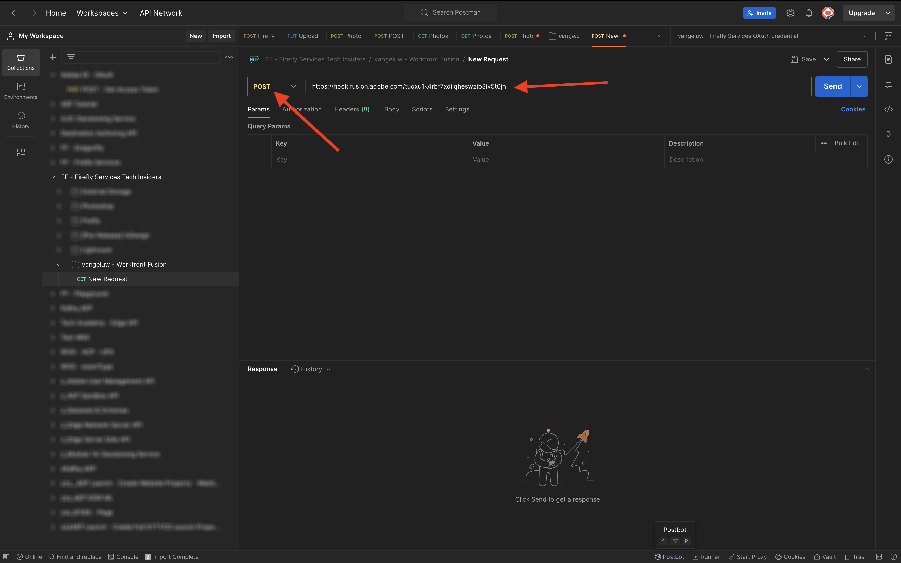

# 1.2.3使用Workfront Fusion实现流程自动化

您的方案现在如下所示。


## 1.2.3.1对多个值进行迭代

到目前为止，您已按静态值更改Photoshop文件中的文本。 要缩放和自动化您的内容创建工作流，需要对值列表进行迭代，并将这些值动态插入到Photoshop文件中。 在接下来的步骤中，您将添加一个用于迭代现有方案中的值的水。

在&#x200B;**路由器**&#x200B;节点和&#x200B;**Photoshop更改文本**&#x200B;节点之间，单击&#x200B;**扳手**&#x200B;图标并选择&#x200B;**添加模块**。


搜索`flow`并选择&#x200B;**流量控制**。


选择&#x200B;**迭代器**。


然后您应该拥有此项。


虽然可以读取CSV文件等输入文件，但现在，您需要使用基本版本的CSV文件，方法是定义文本字符串并拆分该文本文件。

您可以通过单击&#x200B;**T**&#x200B;图标找到&#x200B;**split**&#x200B;函数，在该图标中您可以看到处理文本值的所有可用函数。 单击&#x200B;**split**&#x200B;函数，您应该会看到此内容。


split函数需要分号前有一个值数组，并需要您在分号后指定分隔符。 对于此测试，您应该使用包含2个字段的简单数组，**立即购买**&#x200B;和&#x200B;**单击此处**，要使用的分隔符为&#x200B;**，**。

通过替换当前空的&#x200B;**split**&#x200B;函数： `{{split("Buy now, Click here "; ",")}}`，在&#x200B;**数组**&#x200B;字段中输入此值。 单击&#x200B;**确定**。


您的迭代器现在已配置，如果您现在运行场景，它将执行两次。 但是，由于您当前在&#x200B;**Photoshop更改文本**&#x200B;节点中使用静态值，因此仍然存在问题。 单击&#x200B;**Photoshop更改文本**&#x200B;以添加某些变量，而不是为输入和输出字段添加静态值。


在&#x200B;**请求内容**&#x200B;中，您会看到文本&#x200B;**单击此处**。 此文本需要替换为您数组中的值。


删除文本&#x200B;**单击此处**，然后通过从&#x200B;**迭代器**&#x200B;节点中选择变量&#x200B;**值**&#x200B;来替换它。 这将确保动态更新Photoshop文档中按钮上的文本。


您还需要更新用于在Azure存储帐户中写入文件的文件名。 如果文件名是静态的，则每个新小版本都将只覆盖上一个文件，因此您将丢失自定义的文件。 当前的静态文件名为&#x200B;**sevoi-psd-changed-text.psd**，现在您需要对其进行更新。 将光标置于单词`text`之后。


首先，添加连字符`-`，然后选择值&#x200B;**捆绑订单位置**。 这将确保对于第一次迭代，Workfront Fusion将`-1`添加到文件名，对于第二次迭代`-2`等。 单击&#x200B;**确定**。


保存方案，然后单击&#x200B;**运行一次**。


场景运行后，返回到Azure存储资源管理器并刷新文件夹。 然后，您应该会看到2个新创建的文件。


下载并打开每个文件。 然后，您应该会在按钮上看到各种文本。 这是文件`sevoi-psd-changed-text-1.psd`。


这是文件`sevoi-psd-changed-text-2.psd`。


## 1.2.3.2使用webhook激活场景

到目前为止，您已手动运行场景进行测试。 现在，让我们使用webhook更新您的场景，以便可以从外部环境激活它。

单击&#x200B;**+**&#x200B;图标，搜索&#x200B;**webhook**，然后选择&#x200B;**Webhook**。


选择&#x200B;**自定义webhook**。

拖动并连接&#x200B;**自定义webhook**&#x200B;节点，以使其连接到画布上的第一个节点，该节点称为&#x200B;**初始化常量**。


单击&#x200B;**自定义webhook**&#x200B;节点。 然后，单击&#x200B;**添加**。


将&#x200B;**Webhook名称**&#x200B;设置为`--aepUserLdap-- - Tutorial 1.2`。


选中&#x200B;**获取请求标头**&#x200B;的复选框。 单击&#x200B;**保存**。


您的webhook URL现已可用。 复制URL。


打开Postman并在集合&#x200B;**FF -Firefly服务技术内部人士**&#x200B;中添加新文件夹。


命名您的文件夹`--aepUserLdap-- - Workfront Fusion`。


在刚刚创建的文件夹中，单击3个圆点&#x200B;**...**，然后选择&#x200B;**添加请求**。


将&#x200B;**方法类型**&#x200B;设置为&#x200B;**POST**，并将webhook的URL粘贴到地址栏中。



您需要发送自定义主体，以便可以将外部源中的变量元素提供给Workfront Fusion方案。 转到&#x200B;**正文**&#x200B;并选择&#x200B;**原始**。


将以下文本粘贴到请求正文中。 单击&#x200B;**发送**。

```json
{
    "psdTemplate": "placeholder",
    "xlsFile": "placeholder"
}
```


返回Workfront Fusion。 现在，您将在自定义webhook上看到一条消息，显示：**已成功确定**。


单击&#x200B;**保存**，然后单击&#x200B;**运行一次**。 您的方案现在将处于活动状态，但在您再次单击Postman中的&#x200B;**发送**&#x200B;之前不会运行。


转到Postman，然后再次单击&#x200B;**发送**。


然后，您的方案将再次运行，并像之前一样创建2个文件。


在继续之前，请将Postman请求的名称更改为`POST - Send Request to Workfront Fusion Webhook`。


下一步：[摘要和优点](./summary.md)

[返回模块1.2](./automation.md)

[返回所有模块](./../../../overview.md)
