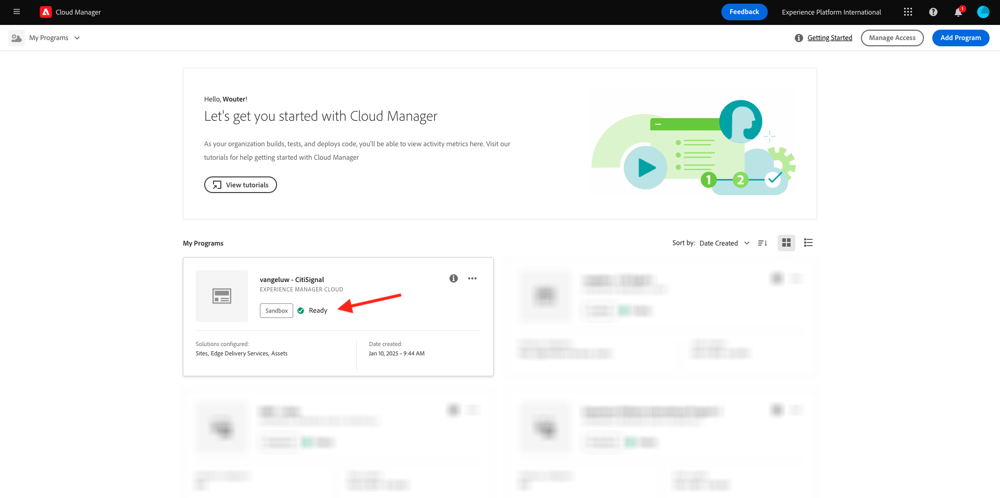
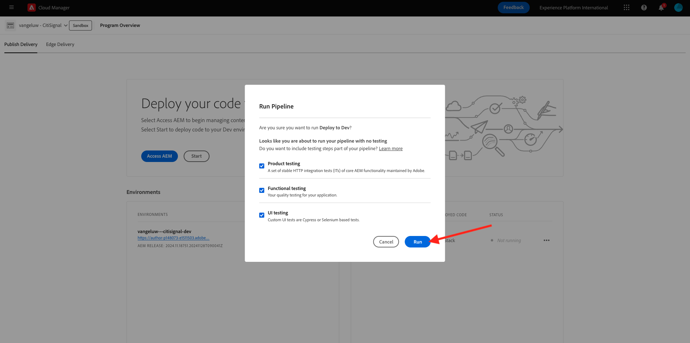

# 2.1.1创建您的Cloud Manager项目

转到[https://my.cloudmanager.adobe.com](https://my.cloudmanager.adobe.com)。 您应选择的组织是`--aepImsOrgName--`。 然后你将看到类似这样的内容。 单击&#x200B;**添加程序**。

对于&#x200B;**计划名称**，请使用`--aepUserLdap-- - CitiSignal`。 单击&#x200B;**继续**。

确保选中以下选项：

- 站点
- 资产
- Edge Delivery Services

单击&#x200B;**创建**。

创建环境将需要一些时间，10-20分钟。

等待时，您可以开始练习[2.1.2创建基于文档的网站](./ex2.md)。

创建环境并准备使用后，您将收到一封电子邮件确认，之后您可以返回此处。

收到电子邮件确认后，请返回[https://my.cloudmanager.adobe.com](https://my.cloudmanager.adobe.com)。 然后，您会看到项目的状态已更改为&#x200B;**就绪**。 单击您的项目以将其打开。

查看选项卡&#x200B;**管道**。 单击3个点&#x200B;**...**，然后单击&#x200B;**运行**。

单击&#x200B;**运行**。

接下来，单击&#x200B;**环境**&#x200B;选项卡上的3个点&#x200B;**...**，然后单击&#x200B;**查看详细信息**。

然后，您将看到环境详细信息，包括&#x200B;**作者**&#x200B;环境的URL，在下个练习中您将需要该URL。

管道运行完成后，您可以继续下一个练习。

下一步： [2.1.2创建基于文档的网站](./ex2.md)

[返回模块2.1](./aemcs.md)

[返回所有模块](./../../../overview.md)
