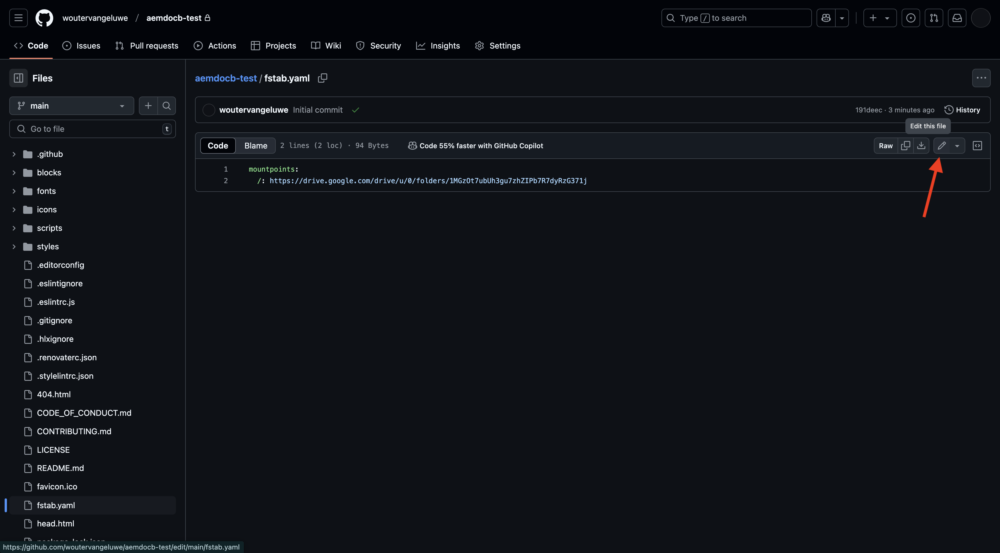
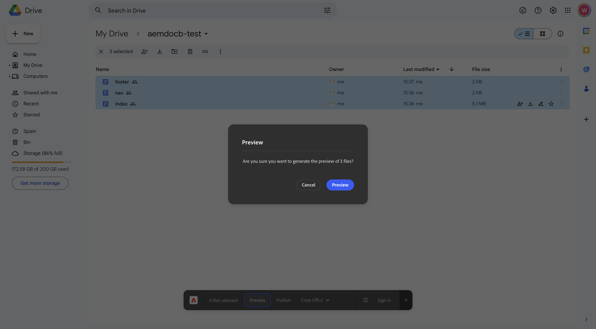
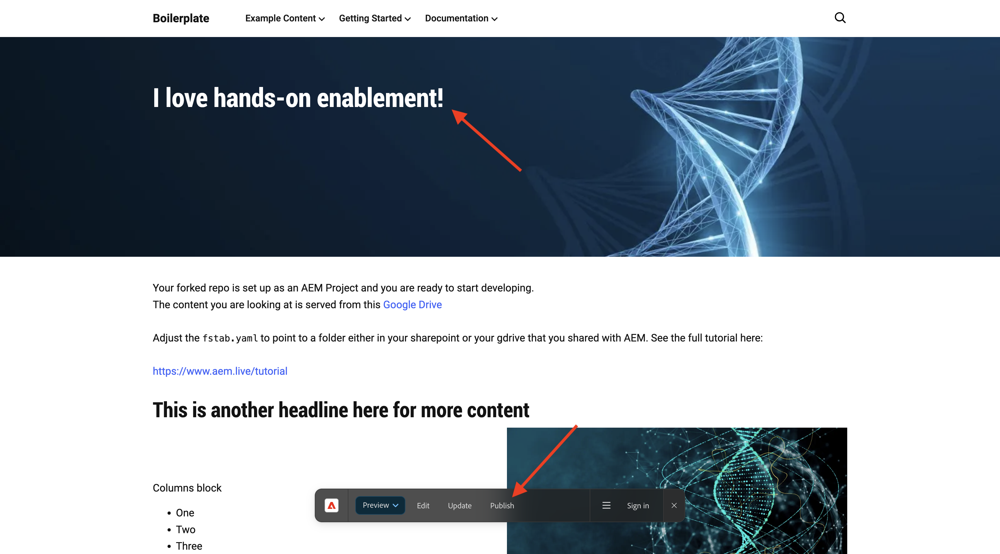

# 2.1.2创建基于文档的网站

在等待创建Cloud Manager项目的过程中，您有足够的时间来设置您的第一个基于文档的创作网站。 以下练习基于[aem.live开发人员教程](https://www.aem.live/developer/tutorial)。 请按照以下步骤开始。

## 2.1.2.1设置Google驱动器

转到[https://drive.google.com](https://drive.google.com)。 单击&#x200B;**+新建**，然后单击&#x200B;**新建文件夹**。

命名您的文件夹`aemdocb-test`。 单击&#x200B;**创建**。

下载文件[aemboilerplate.zip](./../../../assets/aem/aemboilerplate.zip)并在计算机上解压缩。

您将在该文件夹中看到3个文件。 将这些文件复制到新的Google驱动器文件夹中。

现在，您需要将这些文件转换为本机Google文件。 为此，请打开每个文件，然后转到&#x200B;**文件** > **另存为Google Docs**。

您应该对所有3个文件执行此操作，之后，您将在Google驱动器文件夹中看到6个文件。

然后，您的文件夹中会包含此内容。

为了使基于文档的创作演示正常工作，您现在需要与电子邮件地址&#x200B;**helix@adobe.com**&#x200B;共享您的Google驱动器文件夹。 单击您的文件夹名称，单击&#x200B;**共享**，然后再次单击&#x200B;**共享**。

输入电子邮件地址&#x200B;**helix@adobe.com**，然后单击&#x200B;**发送**。

接下来，复制并记下Google Drive文件夹的URL，因为您将在下一个练习中需要该URL。 单击您的文件夹名称，单击&#x200B;**共享**，然后单击&#x200B;**复制链接**。

`https://drive.google.com/drive/folders/1PNIOFeptIfszSebawT-Y_bwB4_anQWk5?usp=drive_link`

您应该删除查询字符串参数`?usp=drive_link`，这样URL应该如下所示：

`https://drive.google.com/drive/folders/1PNIOFeptIfszSebawT-Y_bwB4_anQWk5`

## 2.1.2.2设置您的GitHub存储库

转到[https://github.com](https://github.com)。 单击&#x200B;**登录**。

输入您的凭据。 单击&#x200B;**登录**。

登录后，您将看到您的GitHub功能板。

转到[https://github.com/adobe/aem-boilerplate](https://github.com/adobe/aem-boilerplate)。 你会看到这个。 单击&#x200B;**使用此模板**，然后单击&#x200B;**新建存储库**。

对于&#x200B;**存储库名称**，请使用`aemdocb-test`。 将可见性设置为&#x200B;**私有**。 单击&#x200B;**创建存储库**。

几秒钟后，您将创建存储库。

接下来，转到[https://github.com/apps/aem-code-sync](https://github.com/apps/aem-code-sync)。 单击&#x200B;**配置**。

单击您的GitHub帐户。

单击&#x200B;**仅选择存储库**，然后添加刚刚创建的存储库。 接下来，单击&#x200B;**安装**。

然后您会获得此确认。

## 2.1.2.3更新文件fstab.yaml

在您的GitHub存储库中，单击以打开文件`fstab.yaml`。

单击&#x200B;**编辑**&#x200B;图标。

您现在需要在第2行更新字段&#x200B;**url**&#x200B;的值。

您需要通过特定AEM CS环境的URL与GitHub存储库的设置替换当前值。

这是URL的当前值： `https://drive.google.com/drive/u/0/folders/1MGzOt7ubUh3gu7zhZIPb7R7dyRzG371j`。

将该值替换为您从Google驱动器文件夹`https://drive.google.com/drive/folders/1PNIOFeptIfszSebawT-Y_bwB4_anQWk5`复制的URL。 单击&#x200B;**提交更改……**。

单击&#x200B;**提交更改**。

## 2.1.2.4安装AEM Sidekick扩展

转到[https://chromewebstore.google.com/detail/aem-sidekick/ccfggkjabjahcjoljmgmklhpaccedipo](https://chromewebstore.google.com/detail/aem-sidekick/ccfggkjabjahcjoljmgmklhpaccedipo)。 单击&#x200B;**添加到Chrome**。

固定&#x200B;**AEM Sidekick**&#x200B;扩展。

## 2.1.2.5预览和Publish您的基于文档的网站

返回到Google Drive文件夹。 在任务栏中，单击&#x200B;**AEM Sidekick**&#x200B;扩展。 然后，您会在文件夹中看到AEM Sidekick栏弹出窗口。

选择Google Drive文件夹中的3个文件。 单击&#x200B;**预览**。

再次单击&#x200B;**预览**。

单击以关闭绿色对话框弹出窗口。

再次选择Google Drive文件夹中的3个文件。 现在，单击&#x200B;**Publish**。

单击&#x200B;**Publish**。

单击可再次关闭绿色对话框。 现在，选择文件&#x200B;**索引**，单击&#x200B;**复制URL**，然后单击&#x200B;**复制实时URL**。

复制的URL将如下所示： `https://main--aemdocb-test--woutervangeluwe.aem.live/`。

在上面URL中：

- **main**&#x200B;是指您的GitHub存储库上的分支
- **aemdocb-test**&#x200B;引用GitHub存储库名称
- **woutervangeluwe**&#x200B;引用GitHub用户帐户名称
- **.live**&#x200B;引用AEM实例的实时环境
- 您可以将&#x200B;**.live**&#x200B;替换为&#x200B;**.page**，以打开AEM实例的预览环境

打开新的浏览器窗口并导航到该URL。

## 2.1.2.6进行更改并发布更改

返回到Google驱动器，并在Google中打开文件管理器&#x200B;**索引**。

用任何其他选择的文本替换文本&#x200B;**测试**。 单击&#x200B;**预览**。

随后将打开网站的预览版本。 查看更改并单击&#x200B;**Publish**。

然后，您将看到网站的实时版本。

以上练习是您自己开始并体验基于文档的创作的有效方法。 您现在可以继续下一个练习，在那里您将使用CitiSignal作为演示品牌来设置自己的演示网站。

下一步： [2.1.3设置您的AEM CS环境](./ex3.md)

[返回模块2.1](./aemcs.md)

[返回所有模块](./../../../overview.md)
