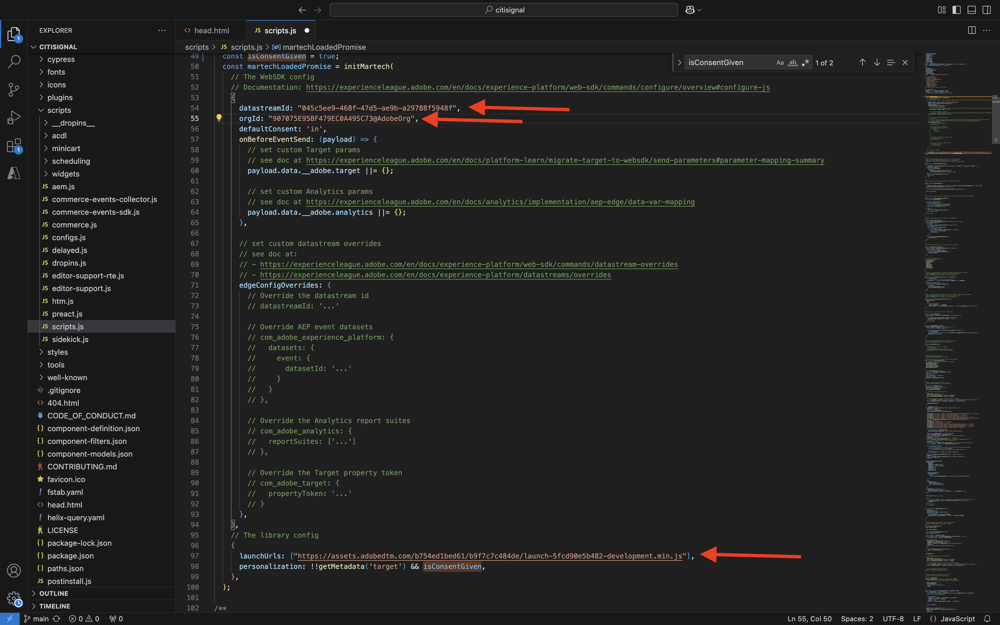
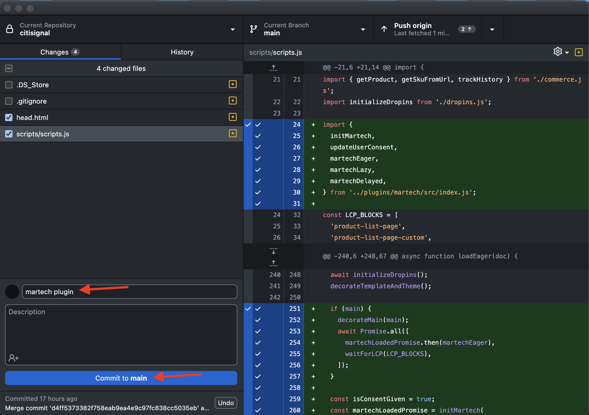

# 2.1.6 AEM Edge Delivery Services MarTech插件

AEM MarTech插件可帮助您为AEM项目快速设置一个完整的MarTech栈栈。

>[!NOTE]
>
>该插件当前通过联合创新项目与AEM Engineering协作提供给客户。 您可以在[https://github.com/adobe-rnd/aem-martech](https://github.com/adobe-rnd/aem-martech)上查找更多信息。

导航到用于&#x200B;**citisignal** GitHub存储库的文件夹。 右键单击文件夹名称，然后选择&#x200B;**在文件夹**&#x200B;新建终端。


你会看到这个。 粘贴以下命令并按&#x200B;**Enter**。

```
git subtree add --squash --prefix plugins/martech https://github.com/adobe/aem-experimentation.git main
```

您应该会看到此内容。


导航到用于&#x200B;**citisignal** GitHub存储库的文件夹，打开文件夹&#x200B;**plugins**。 您现在应该会看到名为&#x200B;**martech**&#x200B;的文件夹。


在Visual Studio代码中，打开文件&#x200B;**head.html**。 复制以下代码并将其粘贴到文件&#x200B;**head.html**&#x200B;中。

```javascript
<link rel="preload" as="script" crossorigin="anonymous" href="/plugins/martech/src/index.js"/>
<link rel="preload" as="script" crossorigin="anonymous" href="/plugins/martech/src/alloy.min.js"/>
<link rel="preconnect" href="https://edge.adobedc.net"/>
<!-- change to adobedc.demdex.net if you enable third party cookies -->
```

保存更改。


在Visual Studio Code中，转到文件夹&#x200B;**scripts**&#x200B;并打开文件&#x200B;**scripts.js**。 复制以下代码并将其粘贴到文件&#x200B;**scripts.js**&#x200B;中的现有导入脚本下。

```javascript
import {
  initMartech,
  updateUserConsent,
  martechEager,
  martechLazy,
  martechDelayed,
} from '../plugins/martech/src/index.js';
```

保存更改。


```javascript
const isConsentGiven = true;
  const martechLoadedPromise = initMartech(
    // The WebSDK config
    // Documentation: https://experienceleague.adobe.com/en/docs/experience-platform/web-sdk/commands/configure/overview#configure-js
    {
      datastreamId: "045c5ee9-468f-47d5-ae9b-a29788f5948f",
      orgId: "907075E95BF479EC0A495C73@AdobeOrg",
      onBeforeEventSend: (payload) => {
        // set custom Target params 
        // see doc at https://experienceleague.adobe.com/en/docs/platform-learn/migrate-target-to-websdk/send-parameters#parameter-mapping-summary
        payload.data.__adobe.target ||= {};

        // set custom Analytics params
        // see doc at https://experienceleague.adobe.com/en/docs/analytics/implementation/aep-edge/data-var-mapping
        payload.data.__adobe.analytics ||= {};
      },

      // set custom datastream overrides
      // see doc at:
      // - https://experienceleague.adobe.com/en/docs/experience-platform/web-sdk/commands/datastream-overrides
      // - https://experienceleague.adobe.com/en/docs/experience-platform/datastreams/overrides
      edgeConfigOverrides: {
        // Override the datastream id
        // datastreamId: '...'

        // Override AEP event datasets
        // com_adobe_experience_platform: {
        //   datasets: {
        //     event: {
        //       datasetId: '...'
        //     }
        //   }
        // },

        // Override the Analytics report suites
        // com_adobe_analytics: {
        //   reportSuites: ['...']
        // },

        // Override the Target property token
        // com_adobe_target: {
        //   propertyToken: '...'
        // }
      },
    },
    // The library config
    {
      launchUrls: ["https://assets.adobedtm.com/b754ed1bed61/b9f7c7c484de/launch-28b548849fb9.min.js"],
      personalization: !!getMetadata('target') && isConsentGiven,
    },
  );
```




```javascript
if (main) {
    decorateMain(main);
    await Promise.all([
      martechLoadedPromise.then(martechEager),
      waitForLCP(LCP_BLOCKS),
    ]);
  }
```


```javascript
await martechLazy();
```


```javascript
window.setTimeout(() => {
    martechDelayed();
    return import('./delayed.js');
  }, 3000);
```





现在，在将XXX替换为您的GitHub用户帐户（本示例中为`woutervangeluwe`）之后，您可以通过转到`main--citisignal--XXX.aem.page/us/en`和/或`main--citisignal--XXX.aem.live/us/en`查看对您网站的更改。

在此示例中，完整URL将变为：
`https://main--citisignal--woutervangeluwe.aem.page/us/en`和/或`https://main--citisignal--woutervangeluwe.aem.live/us/en`。

下一步：[摘要和优点](./summary.md){target="_blank"}

[返回模块2.1](./aemcs.md){target="_blank"}

[返回所有模块](./../../../overview.md){target="_blank"}
