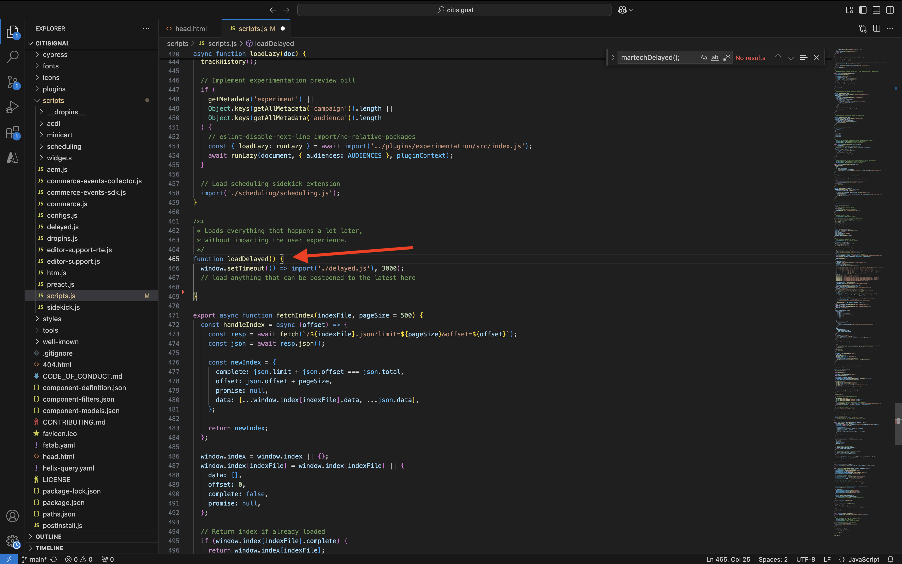
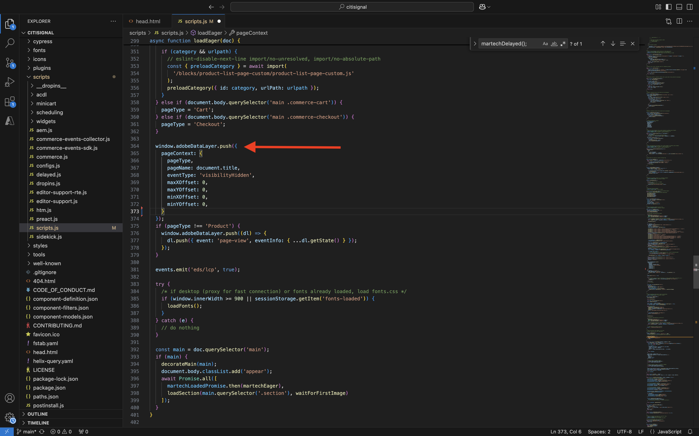
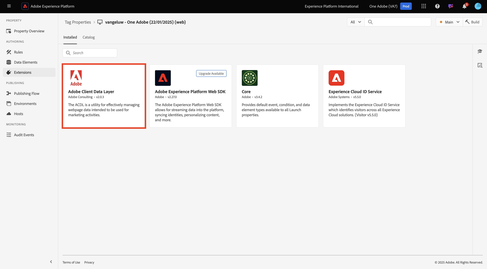

# 2.1.6 AEM Edge Delivery Services MarTech插件

AEM MarTech插件可帮助您为AEM项目快速设置一个完整的MarTech栈栈。

>[!NOTE]
>
>该插件当前通过联合创新项目与AEM Engineering协作提供给客户。 您可以在[https://github.com/adobe-rnd/aem-martech](https://github.com/adobe-rnd/aem-martech)上查找更多信息。

## 2.1.6.1将该插件添加到存储库

导航到用于&#x200B;**citisignal** GitHub存储库的文件夹。 右键单击文件夹名称，然后选择&#x200B;**在文件夹**&#x200B;新建终端。

{zoomable="yes"}

你会看到这个。 粘贴以下命令并按&#x200B;**Enter**。

```
git subtree add --squash --prefix plugins/martech https://github.com/adobe/aem-experimentation.git main
```

您应该会看到此内容。

{zoomable="yes"}

导航到用于&#x200B;**citisignal** GitHub存储库的文件夹，打开文件夹&#x200B;**plugins**。 您现在应该会看到名为&#x200B;**martech**&#x200B;的文件夹。

{zoomable="yes"}

## 2.1.6.2 head.html

在Visual Studio代码中，打开文件&#x200B;**head.html**。 复制以下代码并将其粘贴到文件&#x200B;**head.html**&#x200B;中。

```javascript
<link rel="preload" as="script" crossorigin="anonymous" href="/plugins/martech/src/index.js"/>
<link rel="preload" as="script" crossorigin="anonymous" href="/plugins/martech/src/alloy.min.js"/>
<link rel="preconnect" href="https://edge.adobedc.net"/>
<!-- change to adobedc.demdex.net if you enable third party cookies -->
```

保存更改。

{zoomable="yes"}

## 2.1.6.3 scripts.js

在Visual Studio Code中，转到文件夹&#x200B;**scripts**&#x200B;并打开文件&#x200B;**scripts.js**。 复制以下代码并将其粘贴到文件&#x200B;**scripts.js**&#x200B;中的现有导入脚本下。

```javascript
import {
  initMartech,
  updateUserConsent,
  martechEager,
  martechLazy,
  martechDelayed,
} from '../plugins/martech/src/index.js';
```

保存更改。

{zoomable="yes"}

在Visual Studio Code的文件&#x200B;**scripts.js**&#x200B;中，查找以下代码：

```javascript
const AUDIENCES = {
  mobile: () => window.innerWidth < 600,
  desktop: () => window.innerWidth >= 600,
  // define your custom audiences here as needed
};
```

在&#x200B;**const AUDIENCES = {...}；**&#x200B;下，粘贴以下代码：

```javascript
  const isConsentGiven = true;
  const martechLoadedPromise = initMartech(
    // The WebSDK config
    // Documentation: https://experienceleague.adobe.com/en/docs/experience-platform/web-sdk/commands/configure/overview#configure-js
    {
      datastreamId: "XXX",
      orgId: "XXX",
      defaultConsent: 'in',
      onBeforeEventSend: (payload) => {
        // set custom Target params 
        // see doc at https://experienceleague.adobe.com/en/docs/platform-learn/migrate-target-to-websdk/send-parameters#parameter-mapping-summary
        payload.data.__adobe.target ||= {};

        // set custom Analytics params
        // see doc at https://experienceleague.adobe.com/en/docs/analytics/implementation/aep-edge/data-var-mapping
        payload.data.__adobe.analytics ||= {};
      },

      // set custom datastream overrides
      // see doc at:
      // - https://experienceleague.adobe.com/en/docs/experience-platform/web-sdk/commands/datastream-overrides
      // - https://experienceleague.adobe.com/en/docs/experience-platform/datastreams/overrides
      edgeConfigOverrides: {
        // Override the datastream id
        // datastreamId: '...'

        // Override AEP event datasets
        // com_adobe_experience_platform: {
        //   datasets: {
        //     event: {
        //       datasetId: '...'
        //     }
        //   }
        // },

        // Override the Analytics report suites
        // com_adobe_analytics: {
        //   reportSuites: ['...']
        // },

        // Override the Target property token
        // com_adobe_target: {
        //   propertyToken: '...'
        // }
      },
    },
    // The library config
    {
      launchUrls: ["XXX"],
      personalization: !!getMetadata('target') && isConsentGiven,
    },
  );
```

{zoomable="yes"}

上述代码中有几个变量需要替换为您自己的环境变量：

- `datastreamId: "XXX"`
- `orgId: "XXX"`
- `launchUrls: ["XXX"]`

您可以按照以下说明找到这些变量：

### datastreamId

转到[https://platform.adobe.com/](https://platform.adobe.com/)，然后在左侧菜单中转到&#x200B;**数据流**。 确保您位于正确的沙盒中，即`--aepSandboxName--`。 搜索在本教程的入门部分中创建的数据流，其名称应为`--aepUserLdap-- - One Adobe Datastream`。 单击&#x200B;**复制**&#x200B;图标以复制&#x200B;**数据流ID**，并通过替换`datastreamId:`旁边的占位符值`XXX`将其粘贴到文件&#x200B;**scripts.js**&#x200B;中的Visual Studio Code中。

{zoomable="yes"}

### orgId

转到[https://platform.adobe.com/](https://platform.adobe.com/)，然后在左侧菜单中转到&#x200B;**查询**。 在&#x200B;**凭据**&#x200B;下，您将找到&#x200B;**IMS组织ID**，作为&#x200B;**用户名**。 单击&#x200B;**复制**&#x200B;图标以复制&#x200B;**IMS组织ID**，并通过替换`orgId:`旁边的占位符值`XXX`将其粘贴到Visual Studio Code的文件&#x200B;**scripts.js**&#x200B;中。

{zoomable="yes"}

### launchUrls

转到[https://platform.adobe.com/](https://platform.adobe.com/)，然后在左侧菜单中转到&#x200B;**标记**。 使用LDAP搜索您的属性，应为`--aepUserLdap--`。 打开Web资产。

{zoomable="yes"}

在左侧菜单中，转到&#x200B;**环境**，然后单击&#x200B;**开发**&#x200B;环境的&#x200B;**安装**&#x200B;图标。

{zoomable="yes"}

您随后将找到所需的URL，但它位于HTML`<script></script>`标记内。 您应该只复制从`https`开始直到`.min.js`的部分。

{zoomable="yes"}

URL如下所示： `https://assets.adobedtm.com/b754ed1bed61/b9f7c7c484de/launch-5fcd90e5b482-development.min.js`。 请确保不会复制其他文本，因为这样会导致错误。 在Visual Studio Code中，在文件&#x200B;**scripts.js**&#x200B;中，替换`launchUrls:`数组中的占位符值`XXX`。

您现在拥有所需的三个变量。 您的文件`scripts.js`现在应如下所示：

{zoomable="yes"}

接下来，搜索以查找此代码块：

```javascript
const main = doc.querySelector('main');
  if (main) {
    decorateMain(main);
    document.body.classList.add('appear');
    await loadSection(main.querySelector('.section'), waitForFirstImage);
  }
```

{zoomable="yes"}

使用以下代码块替换它：

```javascript
const main = doc.querySelector('main');
  if (main) {
    decorateMain(main);
    document.body.classList.add('appear');
    await Promise.all([
      martechLoadedPromise.then(martechEager),
      loadSection(main.querySelector('.section'), waitForFirstImage);
    ]);
  }
```

{zoomable="yes"}

接下来，搜索并向下滚动到`async function loadLazy(doc) {`。

{zoomable="yes"}

在第`autolinkModals(doc);`行下，添加以下代码行：

```javascript
await martechLazy();
```

{zoomable="yes"}

接下来，搜索并向下滚动到第`function loadDelayed() {`行。

{zoomable="yes"}

在第`// load anything that can be postponed to the latest here`行下添加此代码块。

```javascript
window.setTimeout(() => {
    martechDelayed();
    return import('./delayed.js');
  }, 3000);
```

{zoomable="yes"}

接下来，搜索并转到包含`window.adobeDataLayer.push`的行。

{zoomable="yes"}

您将看到对象`pageContext`按如下方式定义。 您现在需要在`pageContext`下添加两个对象。

```javascript
	pageContext: {
      pageType,
      pageName: document.title,
      eventType: 'visibilityHidden',
      maxXOffset: 0,
      maxYOffset: 0,
      minXOffset: 0,
      minYOffset: 0,
    }
```

需要添加以下代码：

```javascript
	,
    _experienceplatform: {
      identification:{
        core:{
          ecid: sessionStorage.getItem("com.adobe.reactor.dataElements.ECID")
        }
      }
    },
    web: {
      webPageDetails:{
        name: document.title,
        URL: window.location.href
      }
    }
```

**window.adobeDataLayer.push**&#x200B;现在应如下所示：

```javascript
  window.adobeDataLayer.push({
    pageContext: {
      pageType,
      pageName: document.title,
      eventType: 'visibilityHidden',
      maxXOffset: 0,
      maxYOffset: 0,
      minXOffset: 0,
      minYOffset: 0,
    },
    _experienceplatform: {
      identification:{
        core:{
          ecid: sessionStorage.getItem("com.adobe.reactor.dataElements.ECID")
        }
      }
    },
    web: {
      webPageDetails:{
        name: document.title,
        URL: window.location.href
      }
    }
  });
```

{zoomable="yes"}

您现在已在文件&#x200B;**scripts.js**&#x200B;中进行所有必需的更改。

打开GitHub Desktop客户端并提交更改。

{zoomable="yes"}

单击&#x200B;**推送来源**&#x200B;以将更改推送到GitHub存储库。

{zoomable="yes"}

## 2.1.6.4 Tags属性中的ACDL扩展

为了使AEMEdge Delivery ServicesMarTech插件正常运行，您需要为添加扩展

转到[https://experience.adobe.com/#/data-collection/](https://experience.adobe.com/#/data-collection/)。 搜索并打开Web的Tags属性（名为`--aepUserLdap-- - One Adobe (DD/MM/YYYY)`）。

{zoomable="yes"}

转到&#x200B;**扩展**，转到&#x200B;**目录**。 单击扩展&#x200B;**Adobe客户端数据层**，然后单击&#x200B;**安装**。

{zoomable="yes"}

您应该会看到此内容。 目前无需更改任何内容。 单击&#x200B;**保存到库**。

{zoomable="yes"}

随后，您的扩展将添加到Tags资产中。

{zoomable="yes"}

转到&#x200B;**发布流**&#x200B;并打开您的&#x200B;**Main**&#x200B;库。 单击&#x200B;**添加所有更改的资源**，然后单击&#x200B;**保存并生成到开发**。

{zoomable="yes"}

您的更改现已部署。

## 2.1.6.5将数据发送到Adobe Experience PlatformEdge Network

现在，在将XXX替换为您的GitHub用户帐户（本示例中为`woutervangeluwe`）之后，您可以通过转到`main--citisignal--XXX.aem.page/us/en`和/或`main--citisignal--XXX.aem.live/us/en`查看对您网站的更改。

在此示例中，完整URL将变为：
`https://main--citisignal--woutervangeluwe.aem.page/us/en`和/或`https://main--citisignal--woutervangeluwe.aem.live/us/en`。

>[!NOTE]
>
>请考虑打开无痕网页，以确保您使用的是全新干净的个人资料开始收集数据。 这样可更轻松地进行调试和故障排除。

{zoomable="yes"}

在Chrome中，转到&#x200B;**更多工具** > **开发人员工具**&#x200B;以打开&#x200B;**开发人员工具**。

{zoomable="yes"}

在&#x200B;**控制台**&#x200B;视图中，您将看到许多以`[alloy]`开头的行。 查看请求，其中一个请求应当如下所示，并且具有图像中所指示的请求正文。

`[alloy] Request 55a9ddbc-0521-4ba3-b527-3da2cb35328a: Sending request.`

打开有效负载并深入到字段`events[0].xdm._experienceplatform.identification.core.ecid`，然后复制ECID。

{zoomable="yes"}

## 2.1.6.6在Adobe Experience Platform中查看客户配置文件

通过转到以下URL登录Adobe Experience Platform： [https://experience.adobe.com/platform](https://experience.adobe.com/platform)。

登录后，您将登录到Adobe Experience Platform的主页。

{zoomable="yes"}

在继续之前，您需要选择一个&#x200B;**沙盒**。 要选择的沙盒名为``--aepSandboxName--``。 选择相应的沙盒后，您将看到屏幕变化，现在您位于专用沙盒中。

{zoomable="yes"}

在左侧菜单中，转到&#x200B;**客户** > **配置文件** > **浏览**。 选择&#x200B;**ECID**&#x200B;的&#x200B;**身份命名空间**，然后超过您在上一步中复制的&#x200B;**ECID**。 单击&#x200B;**查看**。 然后，您应该会看到配置文件显示在列表中。 单击以将其打开。

{zoomable="yes"}

您随后将看到&#x200B;**配置文件仪表板**&#x200B;概述，其中显示了ECID。 接下来，转到&#x200B;**活动**。

{zoomable="yes"}

在&#x200B;**事件**&#x200B;下，您将看到多个体验事件，包括具有eventType **web.webpagedetails.pageViews**&#x200B;的事件。 单击&#x200B;**查看JSON**&#x200B;查看收集的所有事件。

{zoomable="yes"}

在&#x200B;**JSON**&#x200B;视图中，使用eventType **web.webpagedetails.pageViews**&#x200B;验证事件以查看&#x200B;**Page Name**&#x200B;和&#x200B;**Page URL**&#x200B;等内容。

{zoomable="yes"}

您现在已经完成了此练习。

下一步：[摘要和优点](./summary.md){target="_blank"}

[返回模块2.1](./aemcs.md){target="_blank"}

[返回所有模块](./../../../overview.md){target="_blank"}
