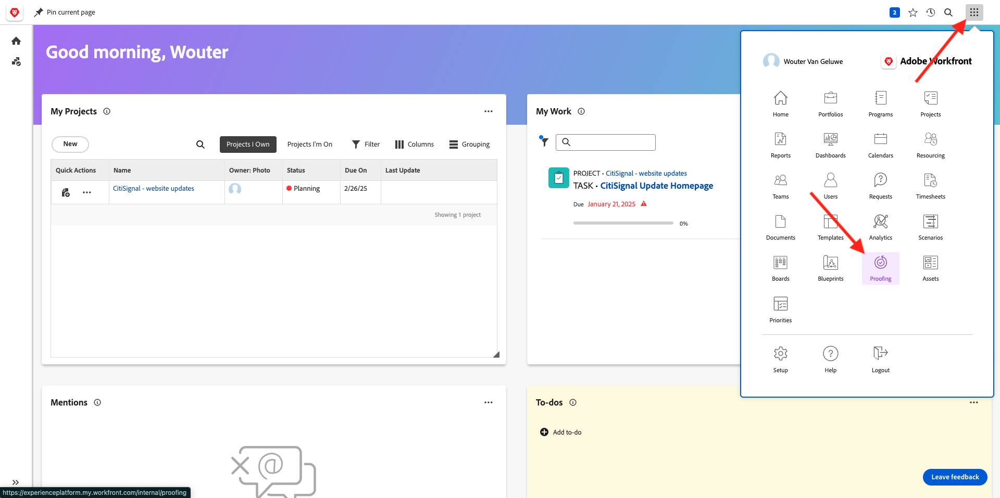
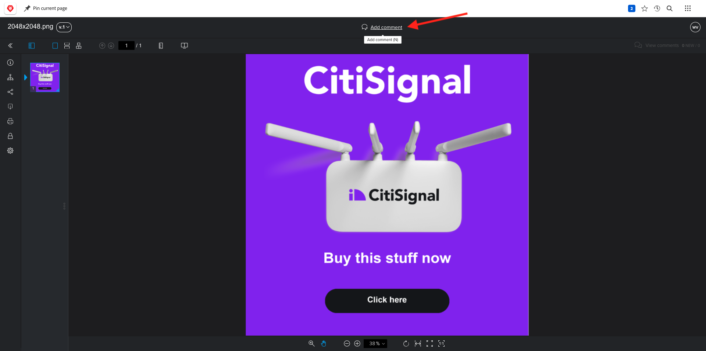
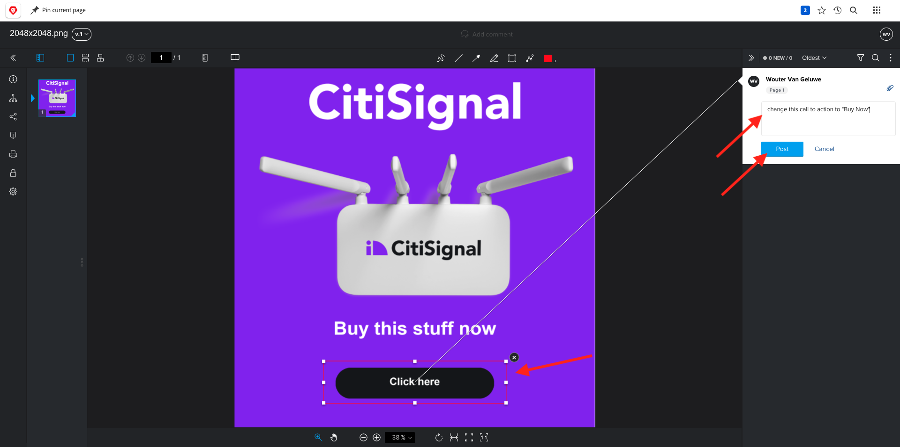
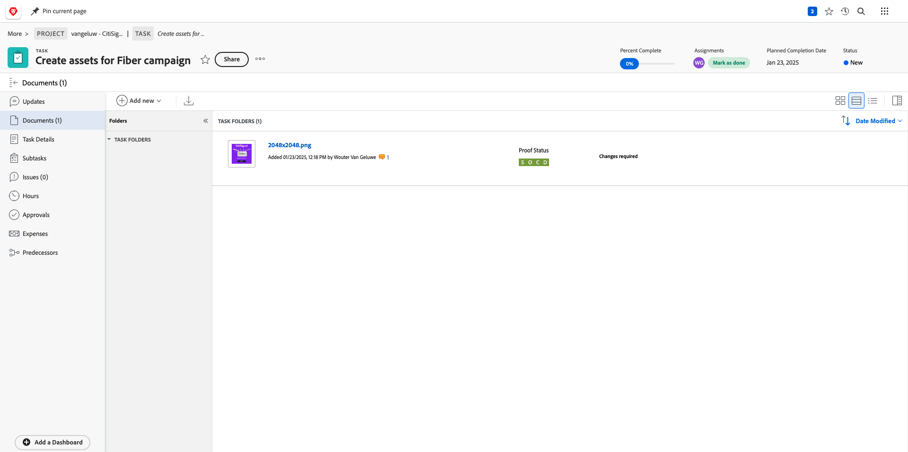
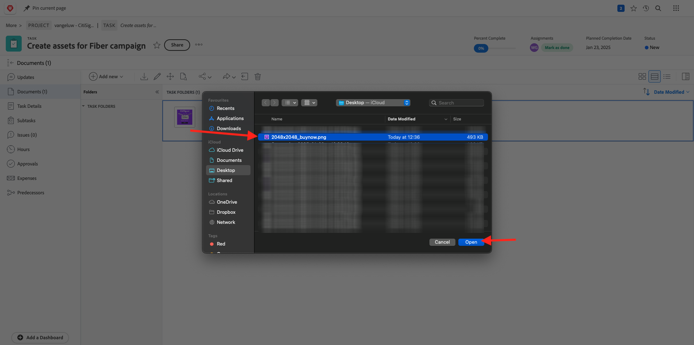
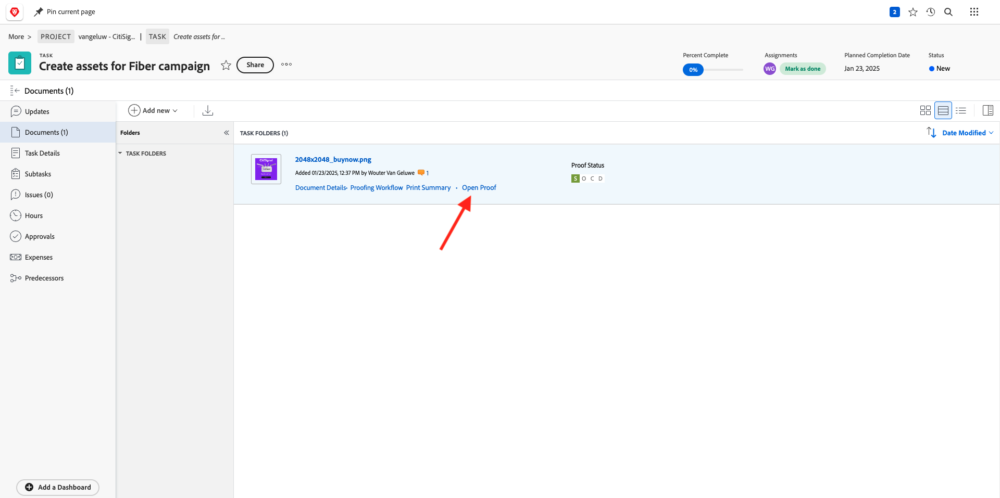

# 2.2.2 Workfront校对

## 2.2.2.1创建新的审批流程

转到[https://experienceplatform.my.workfront.com/](https://experienceplatform.my.workfront.com/){target="_blank"}。

单击9个点&#x200B;**汉堡包**&#x200B;图标并选择&#x200B;**校对**。

转到&#x200B;**工作流**，单击&#x200B;**+新建**，然后选择&#x200B;**新建模板**。

将&#x200B;**模板名称**&#x200B;设置为`--aepUserLdap-- - Approval Workflow`并将&#x200B;**模板所有者**&#x200B;设置为您自己。

向下滚动，在&#x200B;**阶段** > **阶段1**&#x200B;下，添加&#x200B;**Wouter Van Galuwe**，其角色为&#x200B;**，审批者为**，审批者为&#x200B;**。**

单击&#x200B;**创建**。

您的基本审批工作流现已准备就绪，可供使用。

## 2.2.2.2创建新项目

从Workfront主页中，在&#x200B;**我的项目**&#x200B;选项卡中单击&#x200B;**新建**。 选择&#x200B;**空白项目**。

您应该会看到此内容。 将名称更改为`--aepUserLdap-- - CitiSignal Fiber Launch`。

您的项目现已创建。

## 2.2.2.3创建新任务

为您的任务输入此名称： **为Fiber营销活动创建资产**。 单击&#x200B;**创建任务**。

您应该会看到此内容。

## 2.2.2.4向Task添加新文档并完成批准流程

单击&#x200B;**+添加新**，然后选择&#x200B;**文档**。

将[此文件](./images/2048x2048.png)下载到桌面。

{width="50px" align="left"}

选择文件&#x200B;**2048x2048.png**，然后单击&#x200B;**打开**。

然后您应该拥有此项。 单击&#x200B;**创建验证**，然后选择&#x200B;**高级验证**。

在&#x200B;**新验证**&#x200B;窗口中，选择您之前创建的工作流模板，该模板应命名为`--aepuserLdap-- - Approval Workflow`。 单击&#x200B;**创建校对**。

然后你就可以回到你的任务中了。 单击&#x200B;**分配给**&#x200B;按钮并选择&#x200B;**分配给我**。

单击&#x200B;**保存**。

单击&#x200B;**处理它**。

单击&#x200B;**打开校对**

您现在可以查看证明。 选择&#x200B;**添加注释**&#x200B;以添加需要更改文档的注释。

输入您的评论并单击&#x200B;**发布**。 单击&#x200B;**关闭**。

接下来，您需要将您的角色从&#x200B;**审阅者**&#x200B;更改为&#x200B;**审阅者和批准者**。 为此，请返回任务并单击&#x200B;**校对工作流**。

将您的角色从&#x200B;**审阅者**&#x200B;更改为&#x200B;**审阅者和批准者**。

返回您的任务，然后再次打开验证。 您现在看到一个新按钮，**做出决定**。 单击它。

选择&#x200B;**所需的更改**&#x200B;并单击&#x200B;**做出决定**。

那你就该回到这里来。 现在，您需要上传第二个图像，该图像会考虑您提供的评论。

将[此文件](./images/2048x2048_buynow.png)下载到桌面。

{width="50px" align="left"}

在“任务”视图中，选择未批准的旧图像文件。 然后，单击“**+新增**”，选择“**版本**”，然后选择“**文档**”。

选择文件&#x200B;**2048x2048_buynow.png**，然后单击&#x200B;**打开**。

然后您应该拥有此项。 单击&#x200B;**创建验证**，然后再次选择&#x200B;**高级验证**。

你会看到这个。 **工作流模板**&#x200B;现已预选，因为Workfront假定以前的审批工作流仍然有效。 单击&#x200B;**创建校对**。

选择&#x200B;**打开校对**。

现在，您可以在其旁边看到文件的2个版本。

单击&#x200B;**做出决定**，选择&#x200B;**已批准**，然后单击&#x200B;**再次做出决定**。

关闭验证预览。

然后，您将带着批准的资源返回到“任务”视图。 现在，需要向AEM Assets共享此资源。

单击&#x200B;**共享箭头**&#x200B;图标并选择您的应命名为`--aepUserLdap-- - Citi Signal AEM`的AEM Assets集成。

双击您之前创建的文件夹，该文件夹应名为`--aepUserLdap-- - Workfront Assets`。

单击&#x200B;**选择文件夹**。

1-2分钟后，您的文档将发布到AEM Assets中。 您将在文档名称旁边看到AEM图标。

单击&#x200B;**打开摘要**。

转到&#x200B;**元数据**，您应该会看到以下内容：

转到&#x200B;**概述**&#x200B;并单击&#x200B;**+添加**&#x200B;添加说明。

输入您的说明。 您的验证和文档设置现已完成。

## 2.2.2.5在AEM Assets中查看文件

转到AEM Assets中名为`--aepUserLdap - Workfront Assets`的文件夹。

单击图像下面的3个圆点，然后选择&#x200B;**详细信息**。

然后，您将看到之前创建的元数据表单，其中值已由Workfront与AEM Assets之间的集成自动填充。

[返回模块2.2](./workfront.md){target="_blank"}

[返回所有模块](./../../../overview.md){target="_blank"}
