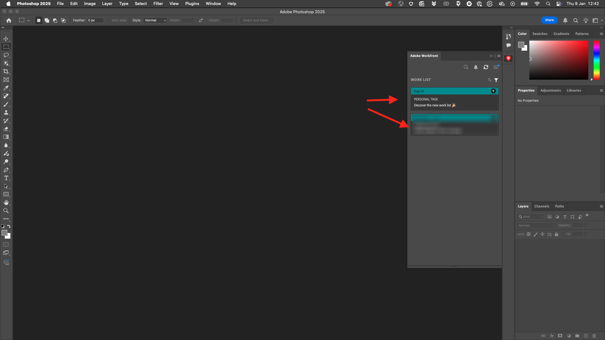

# 2.2.5设置Photoshop + Workfront插件

## 2.2.5.1安装适用于Photoshop的Workfront插件

要设置Workfront与Photoshop之间的集成，请在您的计算机上安装Creative Cloud应用程序。 使用您的Adobe ID登录。

选择&#x200B;**公司或学校帐户**&#x200B;并进行身份验证。

选择要登录的配置文件。

到时候你就在这里。 转到&#x200B;**Stock &amp; Marketplace**。

单击&#x200B;**插件**，然后单击&#x200B;**管理插件**。 在&#x200B;**Adobe Workfront for Photoshop**&#x200B;卡片上单击&#x200B;**安装**。

单击&#x200B;**确定**。

你会看到这个。

## 2.2.5.2在Photoshop中配置插件

打开Photoshop。 在任务栏中，转到&#x200B;**插件** > **Adobe Photoshop的Workfront** >单击&#x200B;**Adobe Workfront**。

你会看到这个。

输入Adobe Workfront实例的域。 单击&#x200B;**登录**。

单击&#x200B;**允许**。

使用您的&#x200B;**Adobe ID**&#x200B;登录。

选择&#x200B;**公司或学校帐户**。

单击&#x200B;**允许访问**。

您随后将看到此确认。

返回到Photoshop，此时您会看到该插件现已准备就绪，可供使用，并且正在显示您的活动任务。

[返回模块2.2](./workfront.md)

[返回所有模块](./../../../overview.md)
