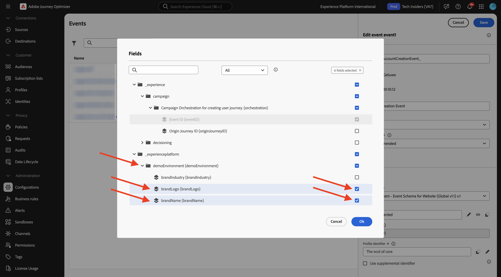
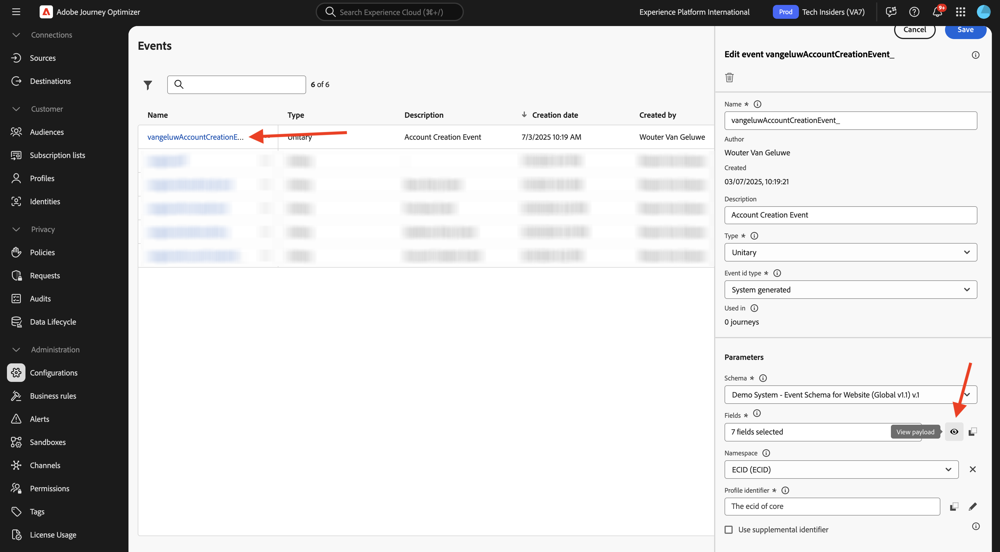
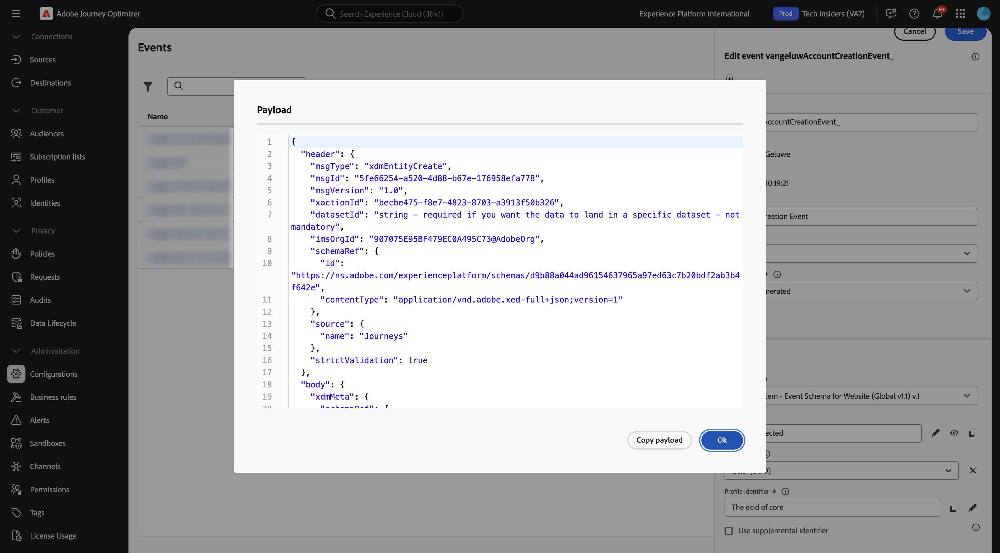

# 3.1.1创建事件

通过转到[Adobe Experience Cloud](https://experience.adobe.com)登录Adobe Journey Optimizer。 单击&#x200B;**Journey Optimizer**。

您将被重定向到Journey Optimizer中的&#x200B;**主页**&#x200B;视图。 首先，确保使用正确的沙盒。 要使用的沙盒名为`--aepSandboxName--`。

在左侧菜单中，向下滚动并单击&#x200B;**配置**。 接下来，单击&#x200B;**事件**&#x200B;下的&#x200B;**管理**&#x200B;按钮。

然后，您将看到所有可用事件的概述。 单击&#x200B;**创建事件**&#x200B;开始创建您自己的事件。

随后将弹出一个新的空事件窗口。

首先，为您的事件提供一个名称，如下所示： `--aepUserLdap--AccountCreationEvent`。
将描述设置为`Account Creation Event`，确保&#x200B;**类型**&#x200B;设置为&#x200B;**单一**，对于&#x200B;**事件ID类型**&#x200B;选择，请选择&#x200B;**系统生成的**。

接下来是架构选择。 请使用架构`Demo System - Event Schema for Website (Global v1.1) v.1`。

选择架构后，您将在&#x200B;**有效负载**&#x200B;部分看到许多字段正在被选择。 现在，您应该将鼠标悬停在&#x200B;**有效负荷**&#x200B;部分上，此时您将看到3个图标弹出窗口。 单击&#x200B;**编辑**&#x200B;图标。

您会看到&#x200B;**字段**&#x200B;窗口弹出窗口，您需要在该窗口中选择个性化电子邮件所需的某些字段。  您稍后将使用Adobe Experience Platform中已有的数据选择其他配置文件属性。

在对象`--aepTenantId--.demoEnvironment`中，请确保选择字段&#x200B;**brandLogo**&#x200B;和&#x200B;**brandName**。

在对象`--aepTenantId--.identification.core`中，请确保选择字段&#x200B;**电子邮件**。 单击&#x200B;**确定**&#x200B;以保存更改。

您应该会看到此内容。 确保&#x200B;**命名空间**&#x200B;设置为&#x200B;**ECID (ECID)**。 单击&#x200B;**保存**。

您的事件现已配置并保存。

再次单击您的事件以再次打开&#x200B;**编辑事件**&#x200B;屏幕。 再次将鼠标悬停在&#x200B;**有效负载**&#x200B;字段上可再次查看这3个图标。 单击&#x200B;**查看有效负载**&#x200B;图标。

您现在将看到预期有效负载的示例。

您的事件具有独特的编排eventID，您可以通过在该有效负荷中向下滚动直至看到`_experience.campaign.orchestration.eventID`来查找该事件。

事件ID是需要发送到Adobe Experience Platform以触发您下一步将构建的历程的事件。 请记住此eventID，因为在下个练习中将需要它。
`"eventID": "d40815dbcd6ffd813035b4b590b181be21f5305328e16c5b75e4f32fd9e98557"`

单击&#x200B;**确定**。

单击&#x200B;**取消**&#x200B;关闭此窗口。

## 后续步骤

转到[3.1.2创建要在消息中使用的片段](./ex2.md){target="_blank"}

返回至[Adobe Journey Optimizer：编排](./journey-orchestration-create-account.md){target="_blank"}

返回[所有模块](./../../../../overview.md){target="_blank"}
