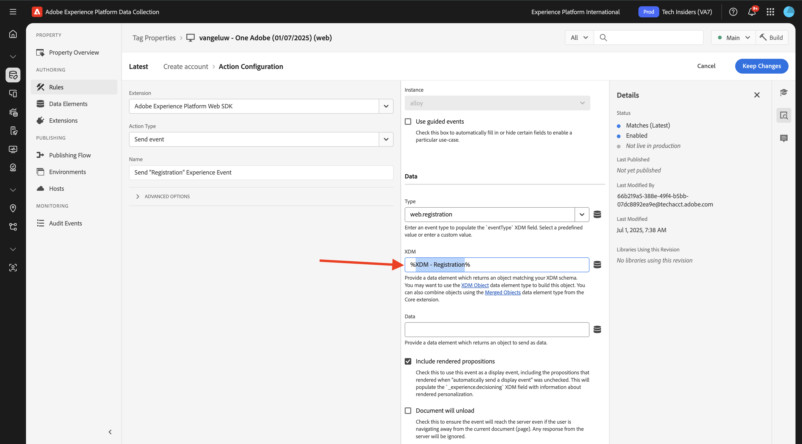

# 3.1.3更新您的数据收集属性并测试您的历程

## 3.1.3.1更新您的数据收集属性

转到[Adobe Experience Platform数据收集](https://experience.adobe.com/data-collection/home)并选择&#x200B;**标记**。

在&#x200B;**快速入门**&#x200B;中，Demo System Next为您创建了两个Tags属性，包括一个用于网站的属性和一个用于移动设备应用程序的属性。 通过在`--aepUserLdap-- - One Adobe`搜索&#x200B;**[!UICONTROL 框中搜索]**&#x200B;来查找它们。 单击以打开&#x200B;**Web**&#x200B;属性。

你会看到这个。

在左侧菜单中，转到&#x200B;**规则**&#x200B;并搜索规则&#x200B;**创建帐户**。 单击规则&#x200B;**创建帐户**&#x200B;以将其打开。

然后，您将看到此规则的详细信息。 单击以打开操作&#x200B;**发送“注册事件”体验事件**。

然后，您会看到在触发此操作时，将使用特定的数据元素来定义XDM数据结构。 您需要更新该数据元素，并且需要定义您在&#x200B;**练习3.1.1**&#x200B;中配置的事件的[事件ID](./ex1.md)。

您现在需要更新数据元素&#x200B;**XDM — 注册事件**。 为此，请转到&#x200B;**数据元素**。 搜索&#x200B;**XDM — 注册**，然后单击以打开该数据元素。

您随后将看到以下内容：

导航到字段`_experience.campaign.orchestration.eventID`。 删除当前值，并将您的eventID粘贴到该处。

提醒一下，您可以在Adobe Journey Optimizer中的&#x200B;**配置>事件**&#x200B;下找到事件ID，您还可以在事件有效负荷中找到事件ID，如下所示： `"eventID": "d40815dbcd6ffd813035b4b590b181be21f5305328e16c5b75e4f32fd9e98557"`。

粘贴eventID后，屏幕应如下所示。 接下来，单击&#x200B;**保存**&#x200B;或&#x200B;**保存到库**。

最后，您需要发布更改。 在左侧菜单中转到&#x200B;**发布流**，然后单击以打开您的&#x200B;**Main**&#x200B;库。

单击&#x200B;**添加所有更改的资源**，然后单击&#x200B;**保存并生成到开发**。

随后将更新您的库，1-2分钟后，您可以继续测试您的配置。

## 3.1.3.2测试您的历程

转到[https://dsn.adobe.com](https://dsn.adobe.com)。 使用Adobe ID登录后，您将看到此内容。 单击网站项目上的3个点&#x200B;**...**，然后单击&#x200B;**运行**&#x200B;以将其打开。

随后您将看到您的演示网站已打开。 选择URL并将其复制到剪贴板。

打开一个新的无痕浏览器窗口。

粘贴您在上一步中复制的演示网站的URL。 然后，系统将要求您使用Adobe ID登录。

选择您的帐户类型并完成登录过程。

然后，您会看到您的网站已加载到无痕浏览器窗口中。 对于每个练习，您将需要使用新的无痕浏览器窗口来加载演示网站URL。

单击屏幕左上角的Adobe徽标图标以打开配置文件查看器。

请查看配置文件查看器面板和实时客户配置文件，将&#x200B;**Experience Cloud ID**&#x200B;作为此当前未知客户的主要标识符。 单击&#x200B;**登录**。

单击&#x200B;**创建帐户**。

填写您的详细信息，然后单击&#x200B;**注册**，之后您将被重定向到上一页。

打开配置文件查看器面板，然后转到Real-time Customer Profile。 在“配置文件查看器”面板上，您应该会看到所有显示的个人数据，如新添加的电子邮件和电话标识符。

创建帐户1分钟后，您将收到来自Adobe Journey Optimizer的帐户创建电子邮件。

您还将在Journey Optimizer中的旅程仪表板上看到旅程条目和旅程进度。

## 后续步骤

转到[摘要和优点](./summary.md){target="_blank"}

返回至[Adobe Journey Optimizer：编排](./journey-orchestration-create-account.md){target="_blank"}

返回[所有模块](./../../../../overview.md){target="_blank"}
