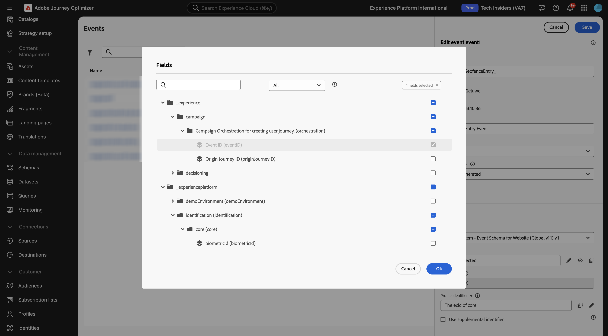

# 3.2.1定义事件

通过转到[Adobe Experience Cloud](https://experience.adobe.com)登录Adobe Journey Optimizer。 单击&#x200B;**Journey Optimizer**。

您将被重定向到Journey Optimizer中的&#x200B;**主页**&#x200B;视图。 首先，确保使用正确的沙盒。 要使用的沙盒名为`--aepSandboxName--`。 然后，您将进入沙盒&#x200B;**的**&#x200B;主页`--aepSandboxName--`视图。

在左侧菜单中，向下滚动并单击&#x200B;**配置**。 接下来，单击&#x200B;**事件**&#x200B;下的&#x200B;**管理**&#x200B;按钮。

然后，您将看到所有可用事件的概述。 单击&#x200B;**创建事件**&#x200B;开始创建您自己的事件。

随后将弹出一个新的空事件窗口。
作为事件的名称，请使用`--aepUserLdap--GeofenceEntry`。

将描述设置为： `Geofence Entry Event`。

确保&#x200B;**类型**&#x200B;设置为&#x200B;**单一**，对于&#x200B;**事件ID类型**&#x200B;选择，请选择&#x200B;**系统生成的**

接下来，您需要选择一个架构。

您会注意到并非所有架构都会显示。 Adobe Experience Platform中有更多架构可用。
要显示在此列表中，架构需要有一个非常特定的字段组链接到该架构。 此处需要显示的字段组称为`Orchestration eventID`。

让我们快速了解一下如何在Adobe Experience Platform中定义这些架构。

在左侧菜单中，转到&#x200B;**架构**&#x200B;并在新的浏览器选项卡中打开它。 在&#x200B;**架构**&#x200B;中，转到&#x200B;**浏览**以查看可用架构的列表。
打开架构`Demo System - Event Schema for Website (Global v1.1)`。

打开架构后，您将看到字段组`Orchestration eventID`是架构的一部分。
此字段组只有两个字段：`_experience.campaign.orchestration.eventID`和`originJourneyID`。

一旦此字段组和此特定eventID字段成为架构的一部分，该架构将可供Adobe Journey Optimizer使用。

返回到Adobe Journey Optimizer中的事件配置。

在此使用案例中，您希望侦听地理围栏事件以了解客户是否位于特定位置，因此现在选择架构`Demo System - Event Schema for Website (Global v1.1)`作为事件的架构。

Adobe Journey Optimizer随后将自动选择某些必填字段，但您可以编辑对Adobe Journey Optimizer可用的字段。

单击&#x200B;**铅笔**&#x200B;图标以编辑字段。

然后，您将看到一个弹出窗口，其中包含允许您选择字段的架构层次结构。

必须填写诸如ECID和Orchestration eventID之类的字段，并且必须预先选定这些字段。

但是，营销人员需要灵活访问所有为历程提供上下文的数据点。 因此，让我们确保也至少选择以下字段（可在Place上下文节点中找到）：

- 城市

完成后，单击&#x200B;**确定**。

Adobe Journey Optimizer还需要一个标识符来标识客户。 由于Adobe Journey Optimizer已链接到Adobe Experience Platform，因此架构的主要标识符会自动被视为历程的标识符。
主要标识符还将自动考虑Adobe Experience Platform的完整身份图，并将所有可用身份、设备和渠道的所有行为链接到同一配置文件，以便Adobe Journey Optimizer具有情境性、相关性和一致性。 单击**保存**。

然后，您的事件将成为可用事件列表的一部分。

最后，您需要为自定义事件恢复`Orchestration eventID`。

单击事件列表中的事件以再次打开该事件。
在事件中，单击**字段**&#x200B;旁边的&#x200B;**查看有效负荷**&#x200B;图标。

单击&#x200B;**查看有效负载**&#x200B;图标将打开此事件的示例XDM有效负载。 向下滚动&#x200B;**有效负荷**，直到看到第`eventID`行。

写下`eventID`，因为您最后需要它来测试您的配置。

在此示例中，`eventID`是`209a2eecb641e20a517909e186a559ced155384a26429a557eb259e5a470bca7`。

您现在已定义将触发我们正在构建的历程的事件。 触发历程后，地理围栏字段（如“城市”）和您可能选择的任何其他字段（如“国家/地区”、“纬度”和“经度”）将提供给历程。

正如用例描述中所讨论的那样，我们随后需要根据天气情况提供上下文促销活动。 为了获取天气信息，我们需要定义一个外部数据源，为我们提供该位置的天气信息。 您将使用&#x200B;**OpenWeather API**&#x200B;服务向我们提供该信息。

## 后续步骤

转到[3.2.2定义外部数据源](./ex2.md){target="_blank"}

返回[Adobe Journey Optimizer：外部数据源和自定义操作](journey-orchestration-external-weather-api-sms.md){target="_blank"}

返回[所有模块](./../../../../overview.md){target="_blank"}