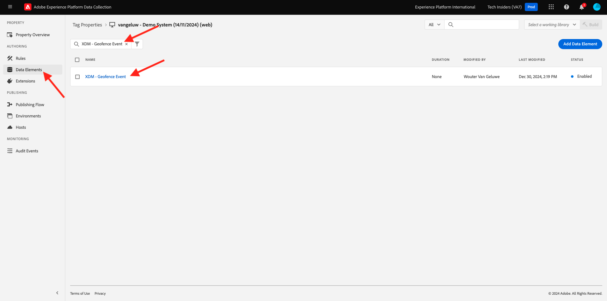
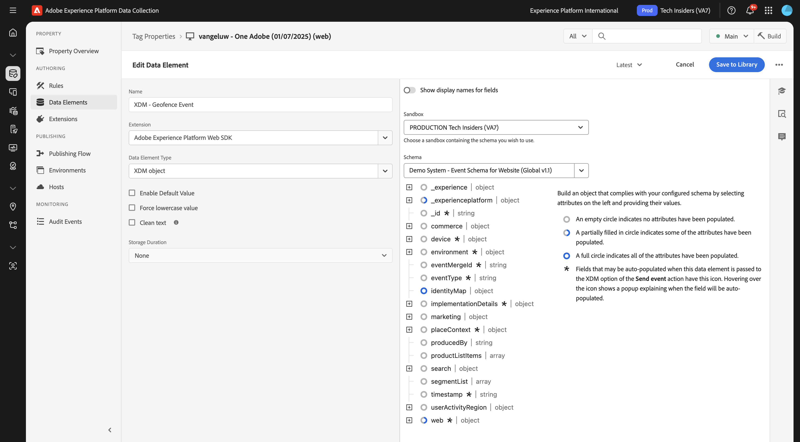
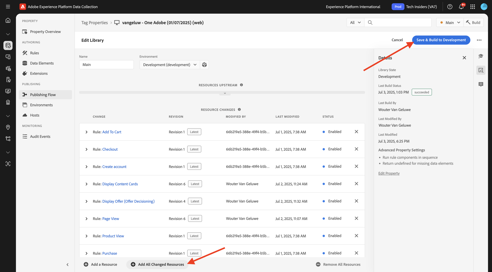

# 3.2.5触发您的历程

在本练习中，您将测试并触发在此模块中配置的历程。

## 3.2.5.1更新地理围栏事件配置

转到[Adobe Experience Platform数据收集](https://experience.adobe.com/launch/)并选择&#x200B;**标记**。

这是您之前看到的Adobe Experience Platform数据收集属性页面。

在&#x200B;**快速入门**&#x200B;中，演示系统为您创建了两个客户端属性：一个用于网站，另一个用于移动应用程序。 通过在&#x200B;**[!UICONTROL 搜索]**&#x200B;框中搜索`--aepUserLdap--`来查找它们。 单击以打开&#x200B;**Web**&#x200B;属性。

你会看到这个。

在左侧菜单中，转到&#x200B;**规则**&#x200B;并搜索规则&#x200B;**地理围栏事件**。 单击规则&#x200B;**地理围栏事件**&#x200B;以将其打开。

然后，您将看到此规则的详细信息。 单击以打开操作&#x200B;**Adobe Experience Platform Web SDK — 发送事件**。

然后，您会看到在触发此操作时，将使用特定的数据元素来定义XDM数据结构。 您需要更新该数据元素，并且需要定义您在[练习3.2.1](./ex1.md)中配置的事件的&#x200B;**事件ID**。

您现在需要更新数据元素&#x200B;**XDM — 地理围栏事件**。 为此，请转到&#x200B;**数据元素**。 搜索&#x200B;**XDM — 地理围栏事件**，然后单击以打开该数据元素。

您随后将看到以下内容：

导航到字段`_experience.campaign.orchestration.eventID`。 删除当前值，并将您的eventID粘贴到该处。

提醒一下，您可以在Adobe Journey Optimizer中的&#x200B;**配置>事件**&#x200B;下找到事件ID，您还可以在事件有效负荷中找到事件ID，如下所示： `"eventID": "4df8dc10731eba7b0c37af83a9db38d4de7aa6aebcce38196d9d47929b9c598e"`。

接下来，您应该在此数据元素中定义您的城市。 转到&#x200B;**placeContext >地域>城市**，然后输入选择的城市。 接下来，单击&#x200B;**保存**&#x200B;或&#x200B;**保存到库**。

最后，您需要发布更改。 在左侧菜单中转到&#x200B;**发布流**，然后单击&#x200B;**Man**&#x200B;以打开您的库。

单击&#x200B;**添加所有更改的资源**，然后单击&#x200B;**保存并生成到开发**。

## 3.2.5.2触发您的历程

转到[https://dsn.adobe.com](https://dsn.adobe.com)。 使用Adobe ID登录后，您将看到此内容。 单击网站项目上的3个点&#x200B;**...**，然后单击&#x200B;**运行**&#x200B;以将其打开。

随后您将看到您的演示网站已打开。 选择URL并将其复制到剪贴板。

打开一个新的无痕浏览器窗口。

粘贴您在上一步中复制的演示网站的URL。 然后，系统将要求您使用Adobe ID登录。

选择您的帐户类型并完成登录过程。

然后，您会看到您的网站已加载到无痕浏览器窗口中。 对于每个练习，您将需要使用新的无痕浏览器窗口来加载演示网站URL。

单击屏幕左上角的Adobe徽标图标以打开配置文件查看器。

打开配置文件查看器面板，然后转到Real-time Customer Profile。 在“配置文件查看器”面板上，您应该会看到所有显示的个人数据，如新添加的电子邮件和电话标识符。

在配置文件查看器面板上，单击&#x200B;**实用工具**。 输入`geofenceevent`并单击&#x200B;**发送**。

>[!NOTE]
>
>如果您在配置文件查看器面板上无法选择发送直接调用事件，则可以手动发送，方法是打开浏览器的开发人员视图并转到&#x200B;**控制台**，然后粘贴并发送以下命令： `_satellite.track('geofenceevent')`。

几秒钟后，您将在Slack渠道中看到来自Adobe Journey Optimizer的消息。

## 后续步骤

转到[摘要和优点](./summary.md){target="_blank"}

返回[Adobe Journey Optimizer：外部数据源和自定义操作](journey-orchestration-external-weather-api-sms.md){target="_blank"}

返回[所有模块](./../../../../overview.md){target="_blank"}
