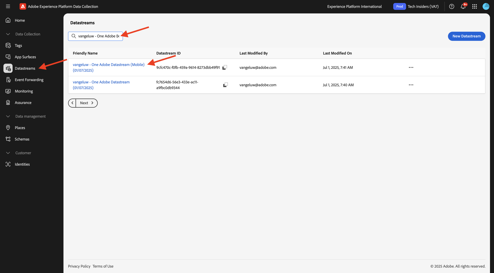
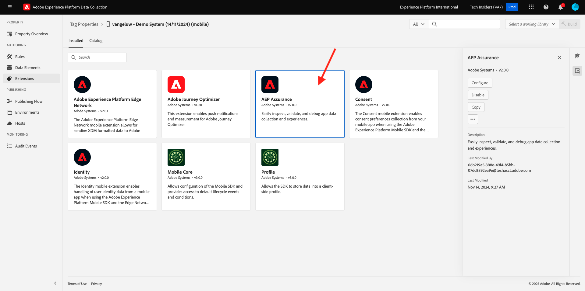
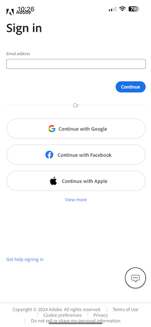
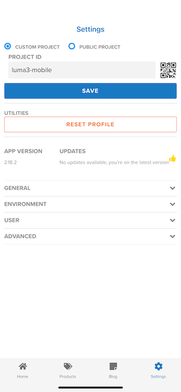

# 3.3.1推送通知入门

要在Adobe Journey Optimizer中使用推送通知，需要检查并了解大量设置。

以下是需要验证的所有设置：

- Adobe Experience Platform中的数据集和架构
- 适用于移动设备的数据流
- 移动设备的数据收集属性
- 推送证书的应用程序表面
- 使用AEP Assurance测试推送设置

让我们逐一回顾一下。

通过转到[Adobe Experience Cloud](https://experience.adobe.com)登录Adobe Journey Optimizer。 单击&#x200B;**Journey Optimizer**。

您将被重定向到Journey Optimizer中的&#x200B;**主页**&#x200B;视图。 首先，确保使用正确的沙盒。 要使用的沙盒名为`--aepSandboxName--`。 然后，您将进入沙盒&#x200B;**的**&#x200B;主页`--aepSandboxName--`视图。

## 3.4.4.1推送数据集

Adobe Journey Optimizer使用数据集在Adobe Journey Optimizer的数据集中存储来自移动设备的推送令牌或与推送消息的交互（例如：已发送消息、已打开消息等）。

您可以通过转到屏幕左侧菜单中的&#x200B;**[!UICONTROL 数据集]**&#x200B;来查找这些数据集。 要显示系统数据集，请单击过滤器图标。

启用选项&#x200B;**显示系统数据集**&#x200B;并搜索&#x200B;**AJO**。 然后，您将看到用于推送通知的数据集。

## 移动的3.4.4.2数据流

转到[https://experience.adobe.com/#/data-collection/](https://experience.adobe.com/#/data-collection/)。

在左侧菜单中，转到&#x200B;**[!UICONTROL 数据流]**&#x200B;并搜索您在[快速入门](./../../../../modules/getting-started/gettingstarted/ex2.md)中创建的、名为`--aepUserLdap-- - Demo System Datastream (Mobile)`的数据流。 单击以将其打开。

单击&#x200B;**Adobe Experience Platform**&#x200B;服务上的&#x200B;**编辑**。

然后，您将看到定义的数据流设置，以及要将数据集事件和配置文件属性存储到哪些中。

如果尚未启用以下选项，则也应启用它们：

- **产品建议决策**
- **个性化目标**
- **Adobe Journey Optimizer**

单击&#x200B;**保存**。

## 3.4.4.3查看您的移动数据收集属性

转到[https://experience.adobe.com/#/data-collection/](https://experience.adobe.com/#/data-collection/)。 作为[快速入门](./../../../../modules/getting-started/gettingstarted/ex1.md)的一部分，创建了2个数据收集属性。
您已在以前的模块中使用了这些数据收集客户端属性。

单击以打开移动设备的数据收集属性。

在数据收集属性中，转到&#x200B;**扩展**。 然后，您将看到移动应用程序所需的各种扩展。 单击以打开扩展&#x200B;**Adobe Experience Platform Edge Network**。

然后，您将看到您的移动数据流链接到了此处。 接下来，单击&#x200B;**取消**&#x200B;以返回扩展概述。

你以后会回到这里的。 您将看到&#x200B;**AEP Assurance**&#x200B;的扩展。 AEP Assurance可帮助您检查、验证、模拟和验证在移动应用程序中收集数据或提供体验的方式。 您可以在此处[https://aep-sdks.gitbook.io/docs/beta/project-griffon](https://aep-sdks.gitbook.io/docs/beta/project-griffon)阅读有关AEP Assurance和项目Griffon的更多信息。

接下来，单击&#x200B;**配置**&#x200B;以打开扩展&#x200B;**Adobe Journey Optimizer**。

然后，您会看到这是用于跟踪推送事件的数据集的链接位置。

无需对数据收集属性进行任何更改。

## 3.4.4.4查看您的应用程序表面设置

转到[https://experience.adobe.com/#/data-collection/](https://experience.adobe.com/#/data-collection/)。 在左侧菜单中，转到&#x200B;**应用程序表面**，然后打开&#x200B;**DX演示应用程序APNS**&#x200B;的应用程序表面。

然后，您将看到为iOS和Android配置的应用程序表面。

## 3.4.4.5使用AEP Assurance测试推送通知设置。

安装应用程序后，您将在设备的主屏幕上找到该应用程序。 单击图标以打开应用程序。

首次使用应用程序时，系统会要求您使用Adobe ID登录。 完成登录过程。

登录后，您将看到一条通知，请求您发送通知的权限。 我们将在本教程中发送通知，因此请单击&#x200B;**允许**。

然后，您将看到该应用程序的主页。 转到&#x200B;**设置**。

在设置中，您会看到当前应用程序中已加载&#x200B;**公共项目**。 单击&#x200B;**自定义项目**。

您现在可以加载自定义项目。 单击二维码可轻松加载项目。

在完成&#x200B;**快速入门**&#x200B;部分后，您得到了此结果。 单击以打开为您创建的&#x200B;**移动零售项目**。

如果您意外关闭了浏览器窗口，或者为了将来演示或支持会议，还可以转到[https://dsn.adobe.com/projects](https://dsn.adobe.com/projects)访问您的网站项目。 使用Adobe ID登录后，您将看到此内容。 单击您的移动应用程序项目以将其打开。

接下来，单击&#x200B;**运行**。

随后您将看到一个弹出窗口，其中包含二维码。 在移动设备应用程序中扫描此二维码。

然后，您将在应用程序中看到项目ID，随后可单击&#x200B;**保存**。

现在，返回应用程序中的&#x200B;**主页**。 您的应用程序现已准备就绪，可供使用。

现在，您需要扫描二维码以将移动设备连接到AEP Assurance会话。

要启动AEP Assurance会话，请转到[https://experience.adobe.com/#/data-collection/](https://experience.adobe.com/#/data-collection/)。 单击左侧菜单中的&#x200B;**Assurance**。 然后单击&#x200B;**创建会话**。

单击&#x200B;**开始**。

填写值：

- 会话名称：使用`--aepUserLdap-- - push debugging`并将ldap替换为ldap
- 基本URL：使用`dxdemo://default`

单击&#x200B;**下一步**。

然后，您将在屏幕上看到一个二维码，您应该使用iOS设备扫描该二维码。

在移动设备上，打开相机应用程序并扫描AEP Assurance显示的二维码。

然后，您会看到一个弹出屏幕，要求您输入PIN码。 从AEP Assurance屏幕复制PIN码，然后单击&#x200B;**连接**。

你会看到这个。

在Assurance中，您现在会看到一台设备正在访问Assurance会话。 单击&#x200B;**完成**。

转到&#x200B;**推送调试**。

>[!NOTE]
>
>如果在左侧菜单中找不到&#x200B;**推送调试**，请单击屏幕左下角的&#x200B;**配置**，然后将&#x200B;**推送调试**&#x200B;添加到菜单中。

你会看到这样的东西。

部分原因在于：

- 第一列&#x200B;**Client**&#x200B;显示iOS设备上的可用标识符。 您将看到ECID和推送令牌。
- 第2列显示了&#x200B;**App Store凭据和配置**，该凭据和配置是作为练习&#x200B;**3.4.5.4在Launch中创建应用程序配置**&#x200B;的一部分设置的
- 第二列显示&#x200B;**配置文件**&#x200B;信息，以及有关推送令牌所在的平台（APNS或APNSSandbox）的其他信息。 如果单击“**检查配置文件**”按钮，您将转到Adobe Experience Platform，并看到完整的Real-time Customer Profile。

要测试推送配置设置，请转到&#x200B;**发送测试推送设置**&#x200B;按钮。 单击&#x200B;**发送测试推送通知**

您需要确保在单击&#x200B;**发送推送通知**&#x200B;按钮时未打开&#x200B;**DX演示**&#x200B;应用程序。 如果应用程序处于打开状态，则推送通知可能会在后台收到，因此不会显示。

然后，您将在移动设备上看到类似这样的推送通知。

如果您已收到推送通知，则意味着您的设置正确且运行正常，您现在可以创建真正的历程，从而从Journey Optimizer发送推送消息。

## 后续步骤

转到[3.3.2配置包含推送消息的历程](./ex2.md){target="_blank"}

返回[Adobe Journey Optimizer：推送和应用程序内消息](ajopushinapp.md){target="_blank"}

返回[所有模块](./../../../../overview.md){target="_blank"}
