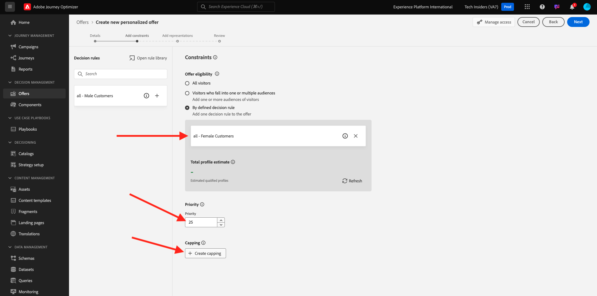
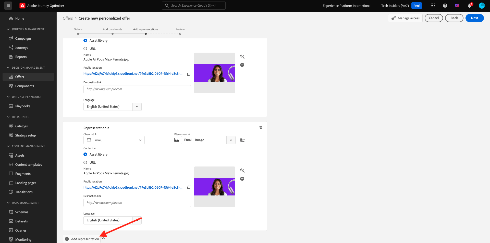
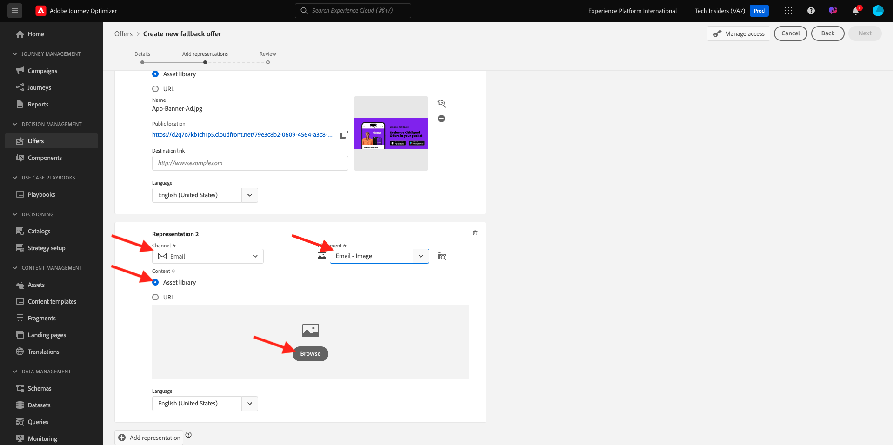

# 3.3.2配置优惠和决策

## 3.3.2.1创建个性化优惠

在本练习中，您将创建四个&#x200B;**个性化优惠**。 以下是创建这些优惠时要考虑的详细信息：

| 名称 | Date Range | 电子邮件的图像链接 | Web的图像链接 | 文本 | 优先级 | 资格 | 语言 | 上限频率 | 图像名称 |
|-----|------------|----------------------|--------------------|------|:--------:|--------------|:-------:|:-------:|:-------:|
| `--aepUserLdap-- - AirPods Max` | 今天 — 1个月后 | https://bit.ly/4a9RJ5d | 从Assets Library中选择 | `{{ profile.person.name.firstName }}, 10% discount on AirPods Max` | 25 | 全部 — 女性客户 | 英语（美国） | 3 | Apple AirPods Max- Female.jpg |
| `--aepUserLdap-- - Galaxy S24` | 今天 — 1个月后 | https://bit.ly/3W8yuDv | 从Assets Library中选择 | `{{ profile.person.name.firstName }}, 5% discount on Galaxy S24` | 15 | 全部 — 女性客户 | 英语（美国） | 3 | Galaxy S24 - Female.jpg |
| `--aepUserLdap-- - Apple Watch` | 今天 — 1个月后 | https://bit.ly/4fGwfxX | https://bit.ly/4fGwfxX | `{{ profile.person.name.firstName }}, 10% discount on Apple Watch` | 25 | 全部 — 男性客户 | 英语（美国） | 3 | Apple Watch - Male.jpg |
| `--aepUserLdap-- - Galaxy Watch 7` | 今天 — 1个月后 | https://bit.ly/4gTrkeo | 从Assets Library中选择 | `{{ profile.person.name.firstName }}, 5% discount on Galaxy Watch 7` | 15 | 全部 — 男性客户 | 英语（美国） | 3 | Galaxy Watch7 - Male.jpg |

{style="table-layout:auto"}

通过转到[Adobe Experience Cloud](https://experience.adobe.com)登录Adobe Journey Optimizer。 单击&#x200B;**Journey Optimizer**。

您将被重定向到Journey Optimizer中的&#x200B;**主页**&#x200B;视图。 首先，确保使用正确的沙盒。 要使用的沙盒名为`--aepSandboxName--`。 然后，您将进入沙盒`--aepSandboxName--`的&#x200B;**主页**&#x200B;视图。

在左侧菜单中，单击&#x200B;**选件**，然后转到&#x200B;**选件**。 单击&#x200B;**+创建选件**。

然后您会看到此弹出窗口。 选择&#x200B;**个性化优惠**，然后单击&#x200B;**下一步**。

您现在位于&#x200B;**详细信息**&#x200B;视图中。

在这种情况下，您需要配置选件`--aepUserLdap-- - AirPods Max`。 使用上表中的信息填写字段。 在此示例中，个性化优惠的名称为&#x200B;**vangeluw - AirPods Max**。 此外，将&#x200B;**开始日期和时间**&#x200B;设置为今天，并将&#x200B;**结束日期和时间**&#x200B;设置为从现在起一个月内的某个日期。

完成后，您应该拥有此项。 单击&#x200B;**下一步**。

您随后将看到以下内容：

选择&#x200B;**根据定义的决策规则**&#x200B;并单击&#x200B;**+**&#x200B;图标以添加规则&#x200B;**all - Female Customers**。

如上表所示，填写&#x200B;**优先级**。 接下来，单击&#x200B;**+创建上限**&#x200B;以定义向客户显示此优惠的次数。

对于上限，选择以下选项：

- **选择上限事件**： **决策事件**
- **上限类型**：**每个配置文件（为每个配置文件应用上限）**
- **事件计数上限**： **3**
- **重置上限频率**： **每日**
- **每**：**1天**

这将确保此选件每天向每位客户显示的次数不会超过3次。

单击&#x200B;**创建**。

你以后会回到这里的。 单击&#x200B;**下一步**。

您现在需要创建&#x200B;**呈现**。 表示是&#x200B;**版面**&#x200B;和实际资源的组合。

对于&#x200B;**呈现1**，请选择：

- 渠道：Web
- 版面：Web — 图像
- 内容： URL
- 公共位置：从上表中列&#x200B;**Web**&#x200B;的图像链接复制URL

或者，您也可以为内容选择&#x200B;**资源库**，然后单击&#x200B;**浏览**。

随后您将看到Assets库的弹出窗口，转到文件夹&#x200B;**enablement-assets**&#x200B;并选择图像文件&#x200B;**Apple AirPods Max - Female.jpg**。 然后，单击&#x200B;**选择**。

你会看到这个。 单击&#x200B;**+添加呈现**。

对于&#x200B;**呈现2**，请选择：

- 渠道：电子邮件
- 版面：电子邮件 — 图像
- 内容： URL
- 公共位置：选择&#x200B;**资产库**。 单击&#x200B;**浏览**

随后您将看到Assets库的弹出窗口，转到文件夹&#x200B;**enablement-assets**&#x200B;并选择图像文件&#x200B;**Apple AirPods Max - Female.jpg**。 然后，单击&#x200B;**选择**。

你会看到这个。 接下来，单击&#x200B;**+添加呈现**。

对于&#x200B;**呈现3**，请选择：

- 渠道：非数字
- 版面：非数字 — 文本

接下来，您需要添加内容。 在这种情况下，这意味着添加要用作行动号召的文本。

选择&#x200B;**自定义**&#x200B;并单击&#x200B;**添加内容**。

然后您会看到此弹出窗口。

查看上表中的&#x200B;**文本**&#x200B;字段，并在此处输入该文本，在本例中为： `{{ profile.person.name.firstName }}, 10% discount on AirPods Max`。

您还会注意到您可以选择任何配置文件属性，并将其作为动态字段包含在选件文本中。 在本例中，字段`{{ profile.person.name.firstName }}`将确保接收此优惠的客户的名字将包含在优惠文本中。

你会看到这个。 单击&#x200B;**保存**。

您现在拥有了此功能。 单击&#x200B;**下一步**。

然后，您将看到新&#x200B;**个性化优惠**&#x200B;的概述。 单击&#x200B;**完成**。

单击&#x200B;**保存并批准**。

然后，您将在选件概述中看到新创建的个性化选件变得可用：

现在，您应该重复上述步骤，为上表中提供的产品创建其他三个个性化优惠。

完成后，您的&#x200B;**个性化优惠**&#x200B;的&#x200B;**优惠概述**&#x200B;屏幕应显示所有优惠。

## 3.3.2.2创建您的后备优惠

创建四个个性化优惠后，您现在应配置&#x200B;**后备优惠**。

确保您处于&#x200B;**选件**&#x200B;视图中。 单击&#x200B;**+创建选件**。

然后您会看到此弹出窗口。 选择&#x200B;**后备优惠**&#x200B;并单击&#x200B;**下一步**。

你会看到这个。 为您的后备优惠输入此名称： `--aepUserLdap-- - CitiSignal Fallback Offer`。 单击&#x200B;**下一步**。

您现在需要创建&#x200B;**呈现**。 表示是&#x200B;**版面**&#x200B;和实际资源的组合。

对于&#x200B;**呈现1**，请选择：

- **渠道**： **Web**
- **位置**： **Web — 图像**
- **内容**： **资源库**

单击&#x200B;**浏览**&#x200B;以选择您的图像。

随后您将看到Assets库的弹出窗口，转到文件夹&#x200B;**citi-signal-images**&#x200B;并选择图像文件&#x200B;**App-Banner-Ad.jpg**。 然后，单击&#x200B;**选择**。

你会看到这个。 单击&#x200B;**+添加呈现**。

对于&#x200B;**呈现2**，请选择：

- **渠道**： **电子邮件**
- **投放位置**：**电子邮件 — 图像**
- **内容**： **资源库**

单击&#x200B;**浏览**&#x200B;以选择您的图像。

随后您将看到Assets库的弹出窗口，转到文件夹&#x200B;**citi-signal-images**&#x200B;并选择图像文件&#x200B;**App-Banner-Ad.jpg**。 然后，单击&#x200B;**选择**。

你会看到这个。 单击&#x200B;**+添加呈现**。

对于&#x200B;**呈现3**，请选择：

- **频道**： **非数字**
- **投放位置**：**非数字 — 文本**
- **内容**： **自定义**

单击&#x200B;**添加内容**。

然后您会看到此弹出窗口。 输入文本`{{ profile.person.name.firstName }}, download the CitiSignal app now!`并单击&#x200B;**保存**。

你会看到这个。 单击&#x200B;**下一步**。

然后，您将看到新&#x200B;**后备优惠**&#x200B;的概述。 单击&#x200B;**完成**。

最后，单击&#x200B;**保存并批准**。

在&#x200B;**选件概述**&#x200B;屏幕中，您现在将看到以下内容：

## 3.3.2.3创建您的收藏集

收藏集用于&#x200B;**从个性化优惠列表中**&#x200B;筛选出优惠的子集，并将其用作决策的一部分，以加快决策过程。

转到&#x200B;**收藏集**。 单击&#x200B;**+创建收藏集**。

然后您会看到此弹出窗口。 像这样配置您的收藏集。 单击&#x200B;**下一步**。

- 集合名称：使用`--aepUserLdap-- - CitiSignal Collection`
- 选择&#x200B;**创建静态集合**。

单击&#x200B;**下一步**。

在下一个屏幕中，选择您在上一个练习中创建的4个&#x200B;**个性化优惠**。 单击&#x200B;**保存**。

您现在将看到以下内容：

## 3.3.2.4创建决策

决策将投放位置、个性化优惠集合和备用优惠组合在一起，以由Offer Decisioning引擎根据每个个性化的优惠特征（如优先级、资格限制和总/用户上限）最终用于为特定用户档案查找最佳优惠。

要配置您的&#x200B;**决策**，请转到&#x200B;**决策**。 单击&#x200B;**+创建决策**。

你会看到这个。 填写这样的字段。 单击&#x200B;**下一步**。

- 名称： `--aepUserLdap-- - CitiSignal Decision`
- 开始日期和时间：今天
- 结束日期和时间：今天+ 1个月

在下一个屏幕中，您需要将投放位置添加到决策范围。 您需要为投放位置&#x200B;**Web — 图像**、**电子邮件 — 图像**&#x200B;和&#x200B;**非数字 — 文本**&#x200B;创建决策范围。

首先，通过在下拉菜单中选择投放位置来创建&#x200B;**非数字型 — 文本**&#x200B;的决策范围。 然后，单击“**添加**”按钮以添加评估标准。

选择您的收藏集`--aepUserLdap-- - CitiSignal Collection`并单击&#x200B;**添加**。

你会看到这个。 单击&#x200B;**+**&#x200B;按钮以添加新决策范围。

选择版面&#x200B;**Web — 图像**，并根据评估条件添加收藏集`--aepUserLdap-- - CitiSignal Collection`。 然后，再次单击&#x200B;**+**&#x200B;按钮以添加新的决策范围。

选择版面&#x200B;**电子邮件 — 图像**，并根据评估条件添加您的收藏集`--aepUserLdap-- - CitiSignal Collection`。 然后，单击&#x200B;**下一步**。

您现在需要选择名为`--aepUserLdap-- - CitiSignal Fallback Offer`的&#x200B;**备用选件**。 单击&#x200B;**下一步**。

查看您的决定。 单击&#x200B;**完成**。

在弹出窗口中，单击&#x200B;**保存并激活**。

最后，您将在概述中看到您的决策：

您现在已成功配置决策。 您的决策现已上线，并可用于实时为客户提供优化和个性化的优惠。

## 后续步骤

转到[3.3.3为Offer Decisioning准备数据收集客户端属性和Web SDK设置](./ex3.md){target="_blank"}

返回[Offer Decisioning](offer-decisioning.md){target="_blank"}

返回[所有模块](./../../../../overview.md){target="_blank"}
