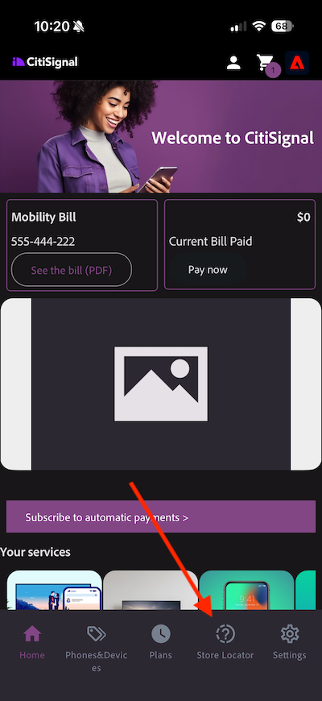
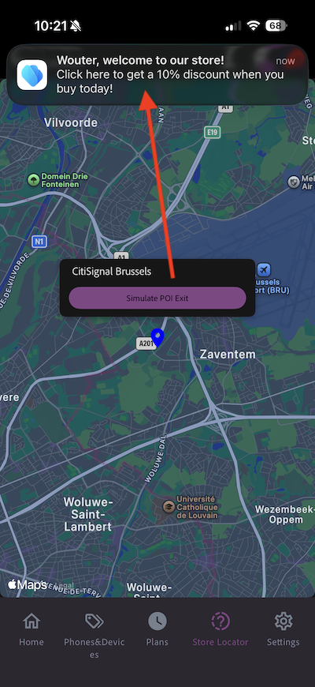

# 3.3.2使用推送消息配置历程

通过转到[Adobe Experience Cloud](https://experience.adobe.com)登录Adobe Journey Optimizer。 单击&#x200B;**Journey Optimizer**。

您将被重定向到Journey Optimizer中的&#x200B;**主页**&#x200B;视图。 首先，确保使用正确的沙盒。 要使用的沙盒名为`--aepSandboxName--`。 然后，您将进入沙盒&#x200B;**的**&#x200B;主页`--aepSandboxName--`视图。

## 3.3.2.1创建新事件

在左侧菜单中，转到&#x200B;**配置**，然后单击&#x200B;**事件**&#x200B;下的&#x200B;**管理**。

在&#x200B;**事件**&#x200B;屏幕上，您会看到类似于此内容的视图。 单击&#x200B;**创建事件**。

然后，您将看到空的事件配置。
首先，为您的事件提供如下名称： `--aepUserLdap--StoreEntryEvent`并将描述设置为`Store Entry Event`。
下一个是**事件类型**&#x200B;选择。 选择&#x200B;**单一**。
下一个是**事件ID类型**&#x200B;选择。 选择&#x200B;**系统生成的**。

接下来是架构选择。 为本练习准备了一个方案。 请使用架构`Demo System - Event Schema for Mobile App (Global v1.1) v.1`。

选择架构后，您将在&#x200B;**有效负载**&#x200B;部分看到许多字段正在被选择。 验证字段&#x200B;**Namespace**&#x200B;是否设置为&#x200B;**ECID**。 您的事件现已完全配置。

单击&#x200B;**保存**。

您的事件现已配置并保存。 再次单击您的事件以再次打开&#x200B;**编辑事件**&#x200B;屏幕。

将鼠标悬停在&#x200B;**有效负载**&#x200B;字段上并单击&#x200B;**查看有效负载**&#x200B;图标。

您现在将看到预期有效负载的示例。

您的事件具有独特的编排eventID，您可以通过在该有效负荷中向下滚动直至看到`_experience.campaign.orchestration.eventID`来查找该事件。

事件ID需要发送到Adobe Experience Platform以触发您将在下一步中构建的历程。 记下此eventID，因为您将在下一步中需要它。
`"eventID": "aa895251f76831e6440f169f1bb9d2a4388f0696d8e2782cfab192a275817dfa"`

单击&#x200B;**确定**。

单击&#x200B;**取消**。

## 3.3.2.2创建历程

在左侧菜单中，转到&#x200B;**历程**&#x200B;并单击&#x200B;**创建历程**。

你会看到这个。 为您的历程提供一个名称： `--aepUserLdap-- - Store Entry journey`。 单击&#x200B;**保存**。

首先，您需要添加事件作为历程的起点。 搜索您的事件`--aepUserLdap--StoreEntryEvent`并将其拖放到画布上。 单击&#x200B;**保存**。

接下来，在&#x200B;**操作**&#x200B;下，搜索&#x200B;**推送**&#x200B;操作。 将&#x200B;**推送**&#x200B;操作拖放到画布上。

将&#x200B;**类别**&#x200B;设置为&#x200B;**营销**，并选择一个允许您发送推送通知的推送表面。 在这种情况下，要选择的电子邮件表面为&#x200B;**Push-iOS-Android**。

>[!NOTE]
>
>Journey Optimizer中需要存在使用以前审阅过的&#x200B;**应用程序表面**&#x200B;的渠道。

下一步是创建消息。 为此，请单击&#x200B;**编辑内容**。

你会看到这个。 单击&#x200B;**标题**&#x200B;字段的&#x200B;**个性化**&#x200B;图标。

你会看到这个。 您现在可以直接从Real-time Customer Profile中选择任何用户档案属性。

搜索字段&#x200B;**名字**，然后单击字段&#x200B;**名字**&#x200B;旁边的&#x200B;**+**&#x200B;图标。 随后您将看到添加的名字的个性化令牌： **{{profile.person.name.firstName}}**。

接下来，添加文本&#x200B;**，欢迎来到我们的商店！**&#x200B;在&#x200B;**{{profile.person.name.firstName}}**&#x200B;之后。

单击&#x200B;**保存**。

您现在拥有了此功能。 单击&#x200B;**正文**&#x200B;字段的&#x200B;**个性化**&#x200B;图标。

输入此文本&#x200B;**单击此处可在您今天购买时获得10%的折扣！**&#x200B;并单击&#x200B;**保存**。

你就能拥有这个了。 单击左上角的箭头可返回您的历程。

单击&#x200B;**保存**&#x200B;以关闭您的推送操作。

单击&#x200B;**发布**。

再次单击&#x200B;**发布**。

您的历程现已发布。

## 3.3.2.3更新您的移动数据收集属性

在&#x200B;**快速入门**&#x200B;中，演示系统Next为您创建了标记属性：一个用于网站，一个用于移动设备应用程序。 通过在`--aepUserLdap--`搜索&#x200B;**框中搜索**&#x200B;来查找它们。 单击以打开&#x200B;**移动设备**&#x200B;属性。

您应该会看到此内容。

在左侧菜单中，转到&#x200B;**规则**，然后单击以打开规则&#x200B;**位置条目**。

您应该会看到此内容。 单击操作&#x200B;**移动核心 — 附加数据**。

您应该会看到此内容。

将事件`--aepUserLdap--StoreEntryEvent`的eventID粘贴到&#x200B;**JSON有效负载**&#x200B;窗口中。 单击&#x200B;**保留更改**。

单击&#x200B;**保存**&#x200B;或&#x200B;**保存到库**。

转到&#x200B;**发布流**，然后单击以打开库&#x200B;**Main**。

单击&#x200B;**添加所有更改的资源**，然后单击&#x200B;**保存并生成到开发**。

## 3.3.2.4测试您的历程和推送消息

打开&#x200B;**DSN Mobile**&#x200B;应用程序。

转到&#x200B;**存储定位器**&#x200B;页面。

单击&#x200B;**模拟POI条目**。

几秒钟后，您将看到推送通知显示。

## 后续步骤

转到[3.3.3使用应用程序内消息配置营销活动](./ex3.md){target="_blank"}

返回[Adobe Journey Optimizer：推送和应用程序内消息](ajopushinapp.md){target="_blank"}

返回[所有模块](./../../../../overview.md){target="_blank"}