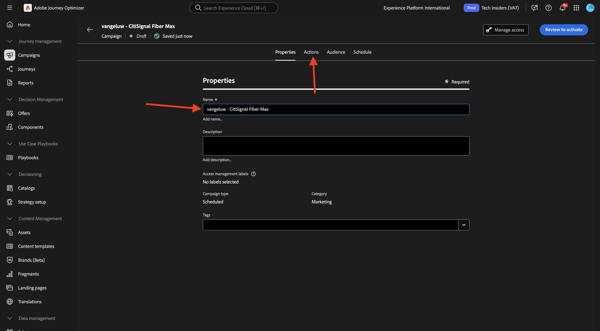
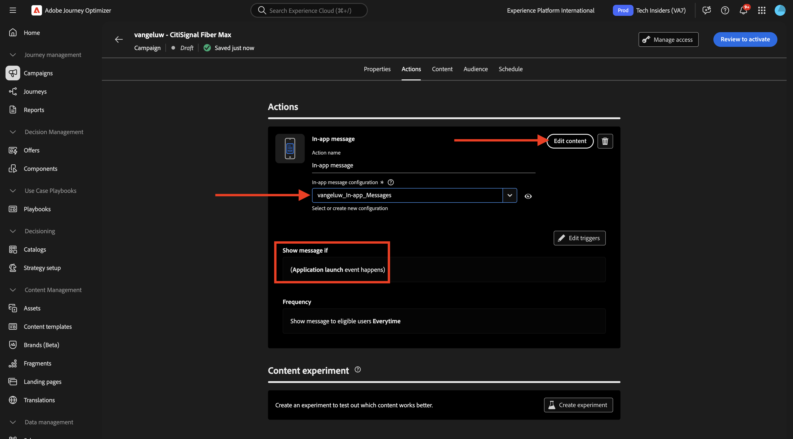

# 3.3.3使用应用程序内消息配置营销活动

通过转到[Adobe Experience Cloud](https://experience.adobe.com)登录Adobe Journey Optimizer。 单击&#x200B;**Journey Optimizer**。

您将被重定向到Journey Optimizer中的&#x200B;**主页**&#x200B;视图。 首先，确保使用正确的沙盒。 要使用的沙盒名为`--aepSandboxName--`。 然后，您将进入沙盒&#x200B;**的**&#x200B;主页`--aepSandboxName--`视图。

## 3.3.3.1应用程序内消息频道配置

在左侧菜单中，转到&#x200B;**渠道**，然后选择&#x200B;**渠道配置**。 单击&#x200B;**创建渠道配置**。

输入名称： `--aepUserLdap--_In-app_Messages`，选择渠道&#x200B;**应用程序内消息传送**，然后启用平台&#x200B;**Web**、**iOS**&#x200B;和&#x200B;**Android**。

向下滚动，您应该会看到此内容。

确保启用了&#x200B;**单页**。

对于&#x200B;**Web**，请输入以前作为&#x200B;**快速入门**&#x200B;模块的一部分创建的网站的URL，它类似于： `https://dsn.adobe.com/web/--aepUserLdap---XXXX`。 别忘了将&#x200B;**XXXX**&#x200B;更改为您网站的唯一代码。

对于&#x200B;**iOS**&#x200B;和&#x200B;**Android**，请输入`com.adobe.dsn.dxdemo`。

向上滚动并单击&#x200B;**提交**。

您的渠道配置现已准备就绪，可供使用。

## 3.3.3.2为应用程序内消息配置计划的营销活动

在左侧菜单中，转到&#x200B;**营销活动**，然后单击&#x200B;**创建营销活动**。

选择&#x200B;**计划 — 营销**，然后单击&#x200B;**创建**。

输入名称`--aepUserLdap-- - CitiSignal Fiber Max`，然后单击&#x200B;**操作**。

单击&#x200B;**+添加操作**，然后选择&#x200B;**应用程序内消息**。

选择在上一步中创建的应用程序内消息通道配置，其名称为： `--aepUserLdap--_In-app_Messages`。 单击&#x200B;**编辑内容**。

您应该会看到此内容。 单击&#x200B;**模式**。

单击&#x200B;**更改布局**。

单击&#x200B;**媒体URL**&#x200B;图标可从AEM Assets中选择资源。

转到文件夹&#x200B;**citisignal-images**&#x200B;并选择图像文件&#x200B;**neon-rabbit.jpg**。 单击&#x200B;**选择**。

对于&#x200B;**标头**&#x200B;文本，使用： `CitiSignal Fiber Max`。
对于&#x200B;**正文**&#x200B;文本，使用： `Conquer lag with Fiber Max`。

将文本&#x200B;**#1**&#x200B;按钮设置为： `Go to Plans`。
将&#x200B;**目标**&#x200B;设置为`com.adobe.dsn.dxdemo://plans`。

单击&#x200B;**查看以激活**。

单击&#x200B;**激活**。

营销活动的状态现在设置为&#x200B;**正在激活**。 可能需要几分钟时间，该营销活动才会正式上线。

一旦状态更改为&#x200B;**实时**，您就可以测试营销活动。

## 3.3.3.3在移动设备上测试您的应用程序内消息传送活动

在移动设备上，打开应用程序。 随后，您应该会在启动应用程序后看到新的应用程序内消息。 单击按钮&#x200B;**转到计划**。

然后您将被带到&#x200B;**计划**&#x200B;页面。

## 后续步骤

转到[摘要和优点](./summary.md){target="_blank"}

返回[Adobe Journey Optimizer：推送和应用程序内消息](ajopushinapp.md){target="_blank"}

返回[所有模块](./../../../../overview.md){target="_blank"}
