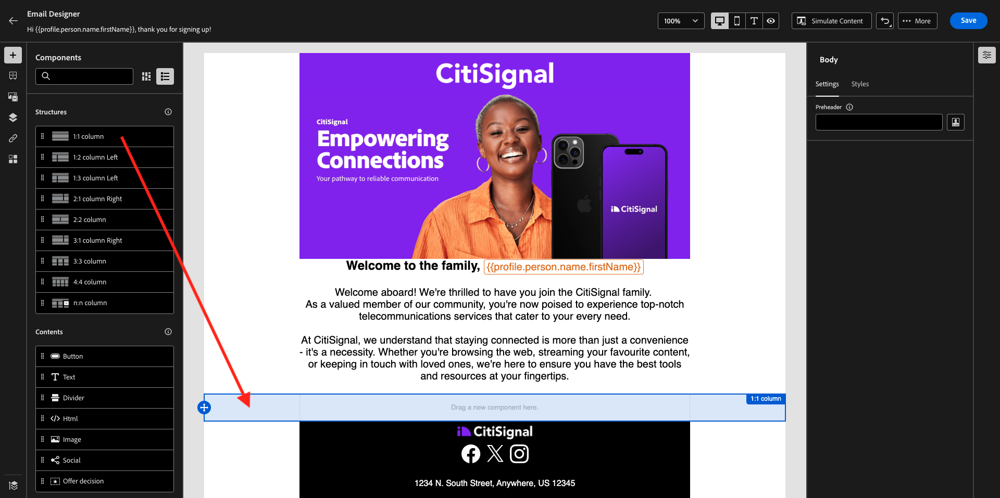

# 3.3.5在电子邮件中使用您的决定

在本练习中，您将使用自己的决定来个性化电子邮件和短信的投放。

转到&#x200B;**历程**。 查找您在练习3.1.3中创建的名为`--aepUserLdap-- - Registration Journey`的历程。 单击您的历程以将其打开。

你会看到这个。 单击&#x200B;**...更多**，然后单击&#x200B;**创建新版本**。

单击&#x200B;**创建新版本**。

单击&#x200B;**电子邮件**&#x200B;操作，然后单击&#x200B;**编辑内容**。

然后，您将看到消息仪表板。 单击&#x200B;**编辑电子邮件正文**。

你会看到这个。 将新的&#x200B;**1:1列**&#x200B;结构组件拖动到画布上。

在菜单中，转到&#x200B;**目录**。 选择&#x200B;**优惠决策**&#x200B;组件，然后按指示将此组件拖放到电子邮件的内容优惠占位符中。 然后，单击&#x200B;**添加**。

选择要包含在电子邮件中的版面类型。 在&#x200B;**版面**&#x200B;下拉菜单中，选择&#x200B;**电子邮件 — 图像**，然后选择您的决策`--aepUserLdap-- - CitiSignal Decision`。 单击&#x200B;**添加**。

您现在可以循环查看所有个性化优惠和备用优惠，所有这些优惠都在电子邮件设计器中可视化。 单击&#x200B;**保存**。

现在，单击箭头返回到上一个屏幕。

单击左上角的箭头可返回您的历程。

单击&#x200B;**保存**&#x200B;以关闭&#x200B;**电子邮件**&#x200B;操作。

单击&#x200B;**发布**&#x200B;以发布更新的历程。

再次单击&#x200B;**发布**&#x200B;以确认。

您的消息现已发布。

在演示网站上创建新帐户后，您将收到以下电子邮件：

您已完成此练习。

## 后续步骤

转到[3.3.6使用API测试您的决定](./ex6.md){target="_blank"}

返回[Offer Decisioning](offer-decisioning.md){target="_blank"}

返回[所有模块](./../../../../overview.md){target="_blank"}
