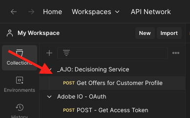

# 3.3.6使用API测试您的决策

## 3.3.6.1使用Postman处理Offer Decisioning API

>[!IMPORTANT]
>
>如果您是Adobe员工，请按照此处的说明使用[PostBuster](./../../../../modules/getting-started/gettingstarted/ex8.md)。

将[此Offer DecisioningPostman收藏集](./../../../../assets/postman/postman_offer-decisioning.zip)下载到您的桌面并解压缩。 然后，您将拥有以下权限：

您的桌面上现在有此文件：

- `_AJO- Decisioning Service.postman_collection.json`

在[练习2.1.3 — 对Adobe I/O的Postman身份验证](./../../../../modules/delivery-activation/rtcdp-b2c/rtcdpb2c-1/ex3.md)中，您已安装Postman。 在本练习中，您将需要再次使用Postman 。

打开Postman并导入文件`_AJO- Decisioning Service.postman_collection.json`。 然后，您将在Postman中拥有此收藏集。

您现在拥有Postman中开始通过API与Adobe Experience Platform交互所需的一切。

在使用以下API之前，请确保使用您在练习2.1.3中配置的集合&#x200B;**Adobe IO - OAuth**&#x200B;重新进行身份验证。

### 3.3.6.2获取客户资料选件

单击以打开请求&#x200B;**POST — 获取客户资料的选件**。 要更新的第一件事是&#x200B;**x-sandbox-name**&#x200B;的&#x200B;**标头**&#x200B;变量。 您应将其设置为`--aepSandboxName--`。

对于此请求，有一些字段需要更新。 转到&#x200B;**正文**。

- **xdm：placementId**
- **xdm：activityId**
- **xdm：id**
- **xdm：itemCount**（将其更改为选择的值）

需要填写字段&#x200B;**xdm：activityId**。 您可以在Adobe Experience Platform UI中检索它，如下所示。

需要填写字段&#x200B;**[!UICONTROL xdm：placementId]**。 您可以在Adobe Experience Platform UI中检索它，如下所示。 在以下示例中，您可以看到版面&#x200B;**[!UICONTROL Web — 图像]**&#x200B;的placementId。

对于字段&#x200B;**xdm：id**，输入要为其请求优惠的客户配置文件的电子邮件地址。 根据需要设置所有值后，单击&#x200B;**[!UICONTROL 发送]**。

最后，您将看到什么类型的个性化优惠以及需要向该客户显示哪些资产的结果。 在此示例中，请求了2个项目，如您所见，已返回2个个性化优惠。 Apple Watch有1个报价，Galaxy Watch 7有1个报价。

您现在已经完成了此练习。

## 后续步骤

转到[摘要和优点](./summary.md){target="_blank"}

返回[Offer Decisioning](offer-decisioning.md){target="_blank"}

返回[所有模块](./../../../../overview.md){target="_blank"}
