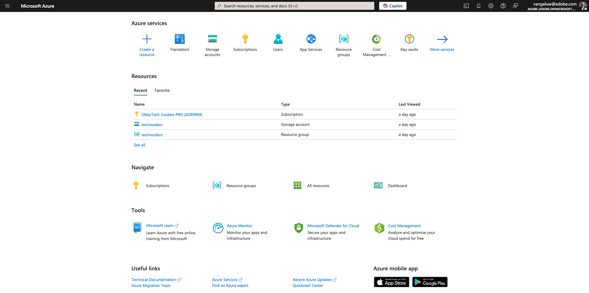
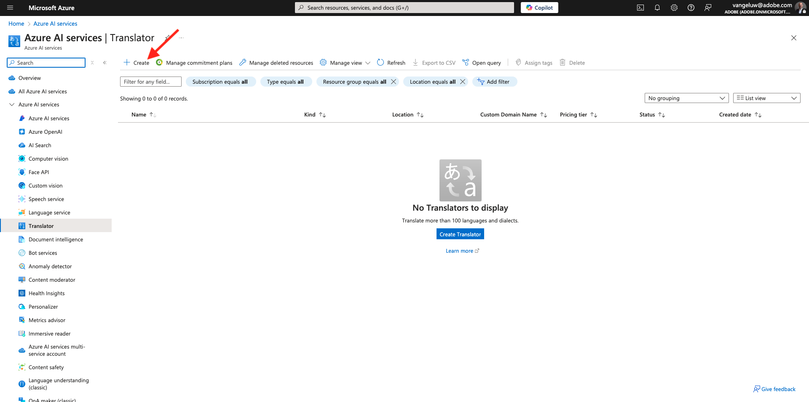

# 3.5.1翻译提供程序

## 3.5.1.1配置Microsoft Azure Translator

转到[https://portal.azure.com/#home](https://portal.azure.com/#home)。

在搜索栏中输入`translators`。 然后，单击&#x200B;**+创建**。

选择&#x200B;**创建转换器**。

选择您的&#x200B;**订阅ID**&#x200B;和&#x200B;**资源组**。
将**区域**&#x200B;设置为&#x200B;**全局**。
将**定价层**&#x200B;设置为&#x200B;**免费F0**。

选择&#x200B;**审阅+创建**。

选择&#x200B;**创建**。

选择&#x200B;**转到资源**。

在左侧菜单中，转到&#x200B;**资源管理** > **密钥和终结点**。 单击以复制密钥。

## 3.5.1.2语言环境词典

转到[https://experience.adobe.com/](https://experience.adobe.com/)。 单击&#x200B;**Journey Optimizer**。

在左侧菜单中，转到&#x200B;**翻译**，然后转到&#x200B;**区域设置词典**。 如果看到此消息，请单击&#x200B;**添加默认区域设置**。

您应该会看到此内容。

## 3.5.1.3在AJO中配置翻译提供程序

转到[https://experience.adobe.com/](https://experience.adobe.com/)。 单击&#x200B;**Journey Optimizer**。

在左侧菜单中，转到&#x200B;**翻译**，然后转到&#x200B;**提供程序**。 单击&#x200B;**添加提供程序**。

在&#x200B;**提供程序**&#x200B;下，选择&#x200B;**Microsoft Translator**。 选中此复选框可启用翻译提供商的使用。 粘贴您从Microsoft Azure转换器复制的密钥。 然后单击&#x200B;**验证凭据**。

随后，您的凭据应会被成功验证。 如果是，请向下滚动以选择要翻译的语言。

确保选择`[en-US] English`、`[es] Spanish`、`[fr] French`、`[nl] Dutch`。

向上滚动并单击&#x200B;**保存**。

您的&#x200B;**翻译提供商**&#x200B;现已准备就绪，可供使用。

## 3.5.1.4配置翻译项目

转到[https://experience.adobe.com/](https://experience.adobe.com/)。 单击&#x200B;**Journey Optimizer**。

在左侧菜单中，转到&#x200B;**翻译**，然后转到&#x200B;**区域设置词典**。 如果看到此消息，请单击&#x200B;**创建项目**。

输入名称`--aepUserLdap-- - Translations`，将&#x200B;**Source区域设置**&#x200B;设置为`[en-US] English - United States`，并选中复选框以启用&#x200B;**自动发布已批准的翻译**&#x200B;和&#x200B;**启用审阅工作流**。 接下来，单击&#x200B;**+添加区域设置**。

搜索`fr`，启用`[fr] French`的复选框，然后启用&#x200B;**Microsoft Translator**&#x200B;的复选框。 单击&#x200B;**+添加区域设置**。

搜索`es`，启用`[es] Spanish`的复选框，然后启用&#x200B;**Microsoft Translator**&#x200B;的复选框。 单击&#x200B;**+添加区域设置**。

搜索`nl`，启用`[nl] Spanish`的复选框，然后启用&#x200B;**Microsoft Translator**&#x200B;的复选框。 单击&#x200B;**+添加区域设置**。

单击&#x200B;**保存**。

您的&#x200B;**翻译**&#x200B;项目现已准备就绪，可供使用。

## 3.5.1.5配置语言设置

转到&#x200B;**渠道** > **常规设置** > **语言设置**。 单击&#x200B;**创建语言设置**。

使用名称`--aepUserLdap--_translations`。 选择&#x200B;**翻译项目**。 然后单击&#x200B;**编辑**&#x200B;图标。

选择在上一步中创建的翻译项目。 单击&#x200B;**选择**。

您应该会看到此内容。 将&#x200B;**回退首选项**&#x200B;设置为&#x200B;**英语 — 联合统计信息**。 单击以选择&#x200B;**选择个人资料语言首选属性**，该属性将决定客户个人资料中要用于加载翻译的字段。 然后，单击&#x200B;**编辑**&#x200B;图标以选择要使用的字段。

在搜索栏中输入&#x200B;**首选语言**，然后选择字段&#x200B;**首选语言**。

单击&#x200B;**英语 — 美国**&#x200B;和&#x200B;**荷兰语**&#x200B;的&#x200B;**编辑**&#x200B;图标以查看其配置。

以下是&#x200B;**英语 — 美国**&#x200B;的配置。 单击&#x200B;**取消**。

单击以查看&#x200B;**荷兰语**&#x200B;的配置。 单击&#x200B;**取消**。

向上滚动并单击&#x200B;**提交**。

您的语言设置现已配置完成。

您已完成此练习。

## 后续步骤

转到[3.5.2创建您的营销活动](./ex2.md)

返回[Adobe Journey Optimizer：翻译服务](./ajotranslationsvcs.md){target="_blank"}

返回[所有模块](./../../../../overview.md){target="_blank"}
