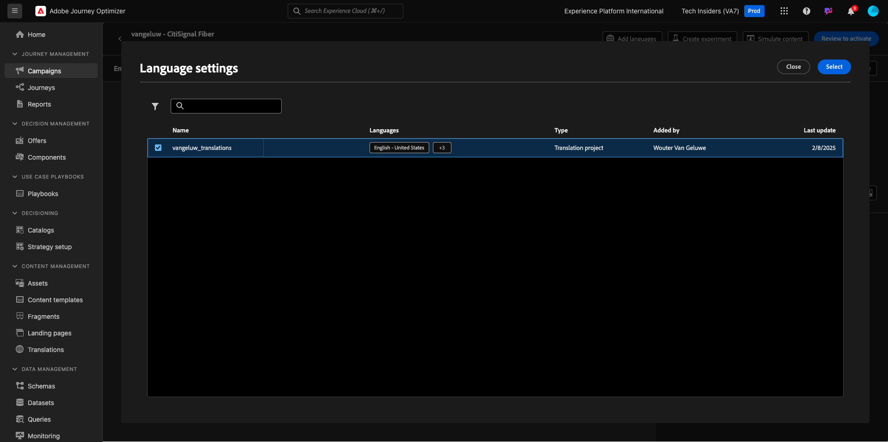
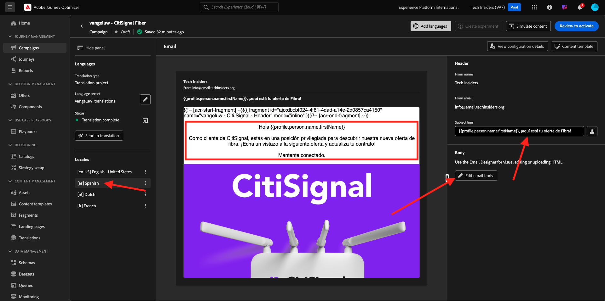
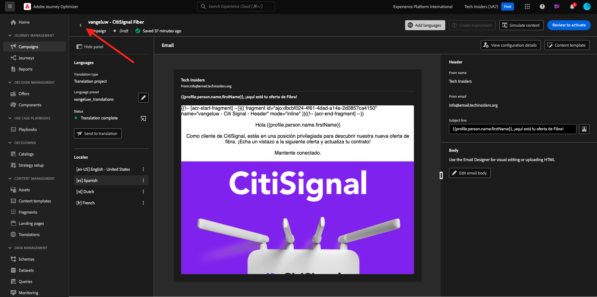

# 3.5.3向电子邮件添加语言

转到[https://experience.adobe.com/](https://experience.adobe.com/)。 单击&#x200B;**Journey Optimizer**。

您将被重定向到Journey Optimizer中的&#x200B;**主页**&#x200B;视图。 首先，确保使用正确的沙盒。 要使用的沙盒名为`--aepSandboxName--`。

转到&#x200B;**营销活动**，然后单击以打开您刚刚创建的营销活动。

单击&#x200B;**修改营销活动**。

单击&#x200B;**修改**。

向下滚动至&#x200B;**电子邮件**&#x200B;操作，然后单击&#x200B;**编辑内容**。

单击&#x200B;**添加语言**。

选择名为`--aepUserLdap--_translations`的&#x200B;**语言设置**。 单击&#x200B;**选择**。

您应该会看到此内容。 单击&#x200B;**发送到翻译**。

然后，您应该会看到如下消息。 **发送到翻译**工作流现已启动，需要几分钟才能完成。
您会看到状态更改为**正在进行翻译**。

几分钟后，翻译工作流的状态将更改为&#x200B;**翻译完成**。

单击&#x200B;**`[es] Spanish`**&#x200B;翻译。 然后，您将在电子邮件预览中以及&#x200B;**主题行**中看到更新的文本。
如果需要，您仍然可以直接在**主题行**&#x200B;字段中查看和更新翻译。

单击&#x200B;**编辑电子邮件正文**&#x200B;以查看电子邮件内的翻译。

如果需要审核翻译，您可以手动更改文本。

单击左上角主题行文本旁边的&#x200B;**箭头**，返回营销活动概述。

那你就该回到这里来。 无需再次激活此营销活动。

单击左上角的&#x200B;**箭头**&#x200B;返回营销活动。

请确保您的营销活动处于&#x200B;**已停止**&#x200B;状态。

您现在已经完成了此练习。

## 后续步骤

转到[摘要和优点](./summary.md)

返回[Adobe Journey Optimizer：翻译服务](./ajotranslationsvcs.md){target="_blank"}

返回[所有模块](./../../../../overview.md){target="_blank"}
