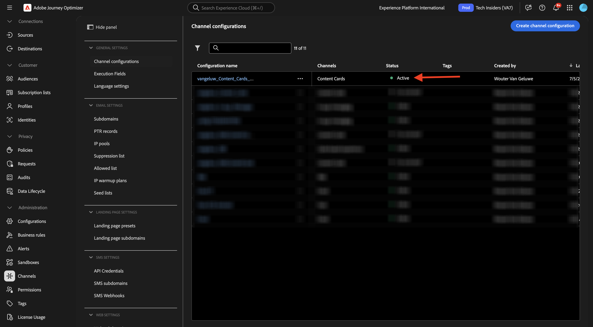
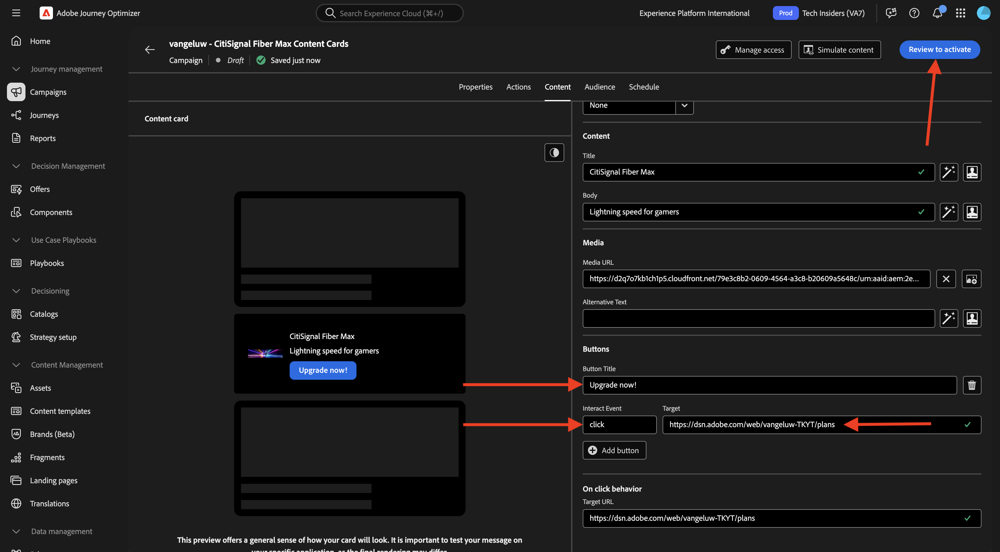
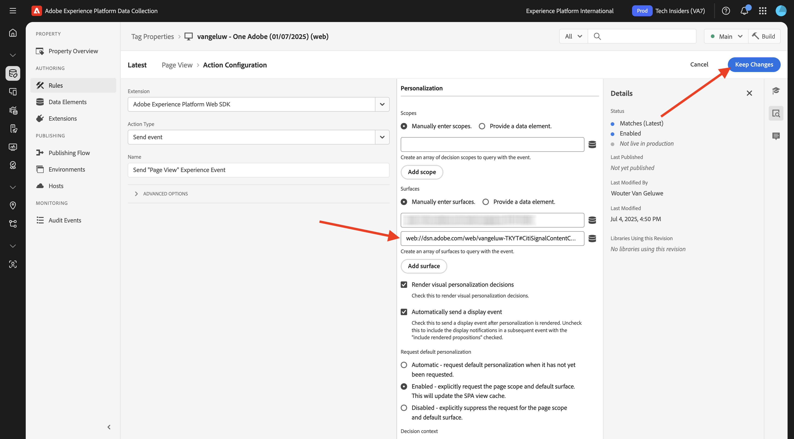
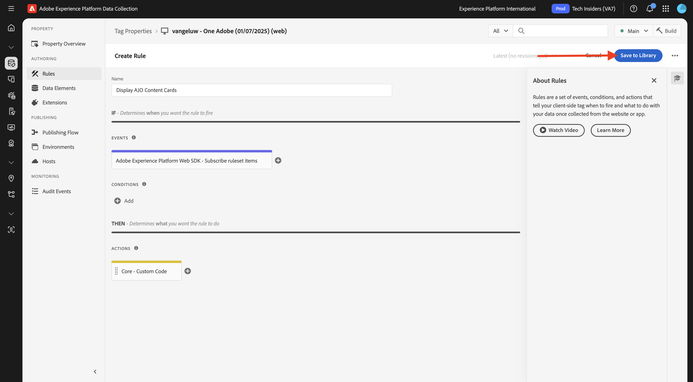

# 3.6.1内容卡

通过转到[Adobe Experience Cloud](https://experience.adobe.com)登录Adobe Journey Optimizer。 单击&#x200B;**Journey Optimizer**。


您将被重定向到Journey Optimizer中的&#x200B;**主页**&#x200B;视图。 首先，确保使用正确的沙盒。 要使用的沙盒名为`--aepSandboxName--`。 然后，您将进入沙盒&#x200B;**的**&#x200B;主页`--aepSandboxName--`视图。


## 3.6.1.1内容卡渠道配置

在左侧菜单中，转到&#x200B;**渠道**，然后选择&#x200B;**渠道配置**。 单击&#x200B;**创建渠道配置**。


输入名称： `--aepUserLdap--_Content_Cards_Web`，选择频道&#x200B;**内容卡**，然后启用平台&#x200B;**Web**。


向下滚动，并确保启用了&#x200B;**单页**&#x200B;选项。

输入以前作为&#x200B;**快速入门**&#x200B;模块的一部分创建的网站的URL，它类似于： `https://dsn.adobe.com/web/--aepUserLdap---XXXX`。 别忘了将&#x200B;**XXXX**&#x200B;更改为您网站的唯一代码。

>[!IMPORTANT]
>
>以上对CitiSignal演示网站URL `https://dsn.adobe.com/web/--aepUserLdap---XXXX`的引用需要更改为实际的URL。 您可以通过转到[https://dsn.adobe.com/](https://dsn.adobe.com/)上的网站项目来查找该URL。

将页面&#x200B;**上的字段**&#x200B;位置设置为`CitiSignalContentCardContainer`。


向上滚动并单击&#x200B;**提交**。


您的渠道配置现已准备就绪，可供使用。



## 3.6.1.2为内容卡配置计划的营销活动

在左侧菜单中，转到&#x200B;**营销活动**，然后单击&#x200B;**创建营销活动**。


选择&#x200B;**计划 — 营销**，然后单击&#x200B;**创建**。


输入名称`--aepUserLdap-- - CitiSignal Fiber Max Content Cards`，然后单击&#x200B;**操作**。


单击&#x200B;**+添加操作**，然后选择&#x200B;**内容卡**。


选择您在上一步中创建的名为`--aepUserLdap--_Content_Cards_Web`的内容卡渠道配置。

接下来，单击&#x200B;**编辑规则**。


单击&#x200B;**X**&#x200B;可删除当前规则。


单击&#x200B;**+添加条件**。


选择条件&#x200B;**将数据发送到Platform**。 单击&#x200B;**完成**


您应该会看到此内容。 单击&#x200B;**编辑内容**。


您应该会看到此内容。


配置以下设置：

- **标题**： `CitiSignal Fiber Max`
- **正文**： `Lightning speed for gamers`
- **目标URL**： `https://dsn.adobe.com/web/--aepUserLdap---XXXX/plans`

>[!IMPORTANT]
>
>以上对CitiSignal演示网站URL `https://dsn.adobe.com/web/--aepUserLdap---XXXX/plans`的引用需要更改为实际的URL。 您可以通过转到[https://dsn.adobe.com/](https://dsn.adobe.com/)上的网站项目来查找该URL。

单击图标以通过从AEM Assets中选择资源来更改URL。


转到文件夹&#x200B;**citisignal-imaes**&#x200B;并选择文件&#x200B;**`neon_rabbit_banner.jpg`**。 单击&#x200B;**选择**。


然后您应该拥有此项。 单击&#x200B;**+添加按钮**。


为按钮配置以下设置：

- **按钮标题**： `Upgrade now!`
- **交互事件**： `click`
- **目标**： `https://dsn.adobe.com/web/--aepUserLdap---XXXX/plans`

>[!IMPORTANT]
>
>以上对CitiSignal演示网站URL `https://dsn.adobe.com/web/--aepUserLdap---XXXX/plans`的引用需要更改为实际的URL。 您可以通过转到[https://dsn.adobe.com/](https://dsn.adobe.com/)上的网站项目来查找该URL。

单击&#x200B;**查看以激活**。



单击&#x200B;**激活**。


您的营销活动随后将激活，这可能需要几分钟的时间。


几分钟后，您的营销活动将上线。


## 3.6.1.3更新您的DSN网站

要在网站上显示内容卡，您需要对CitiSignal演示网站的主页设计进行更改。

转到[https://dsn.adobe.com/](https://dsn.adobe.com/)。 单击您网站上的&#x200B;**3点**，然后单击&#x200B;**编辑**。


单击以选择页面&#x200B;**主页**。 单击&#x200B;**编辑内容**。


将鼠标悬停在主页图像上，然后单击&#x200B;**+**&#x200B;按钮。


转到&#x200B;**常规**，选择&#x200B;**横幅**，然后单击&#x200B;**添加**。


单击以选择新创建的横幅。 转到&#x200B;**样式**&#x200B;并在`CitiSignalContentCardContainer`自定义CSS类&#x200B;**字段中输入**。


转到&#x200B;**对齐方式**。 将字段&#x200B;**Alignment**&#x200B;设置为`left`并将字段&#x200B;**Vertical Alignment**&#x200B;设置为`middle`。

单击&#x200B;**X**&#x200B;图标以关闭对话框窗口。


您的网站设计现已更改。

如果您现在在新的浏览器窗口中打开网站，则它应当如下所示。 灰色区域是新创建的横幅，但它还没有任何内容。


要确保内容动态加载到新创建的横幅中，需要对数据收集标记属性进行更改。

## 3.6.1.4更新您的数据收集标记属性

转到[https://experience.adobe.com/#/data-collection/](https://experience.adobe.com/#/data-collection/)，转到&#x200B;**标记**。 作为[快速入门](./../../../../modules/getting-started/gettingstarted/ex1.md)模块的一部分，已创建数据收集标记属性。

您已在以前的模块中使用过这些数据收集标记属性。

单击以打开Web的数据收集属性。


在左侧菜单中，转到&#x200B;**规则**，然后单击以打开规则&#x200B;**页面视图**。


单击操作&#x200B;**发送“页面查看”体验事件**。


作为&#x200B;**页面查看**&#x200B;规则的一部分，需要从Edge请求特定表面的个性化说明。 表面是您在上一步中配置的横幅。 为此，请向下滚动到&#x200B;**Personalization**&#x200B;并在`web://dsn.adobe.com/web/--aepUserLdap---XXXX#CitiSignalContentCardContainer`Surfaces **下输入**。

>[!IMPORTANT]
>
>以上对CitiSignal演示网站URL `web://dsn.adobe.com/web/--aepUserLdap---XXXX#CitiSignalContentCardContainer`的引用需要更改为实际的URL。 您可以通过转到[https://dsn.adobe.com/](https://dsn.adobe.com/)上的网站项目来查找该URL。

单击&#x200B;**保留更改**。



单击&#x200B;**保存**&#x200B;或&#x200B;**保存到库**。


在左侧菜单中，转到&#x200B;**规则**&#x200B;并单击&#x200B;**添加规则**。


输入名称： `Display AJO Content Cards`。 单击“**+添加**”以添加新事件。


选择&#x200B;**扩展**： **Adobe Experience Platform Web SDK**，然后选择&#x200B;**事件类型**： **订阅规则集项**。

在&#x200B;**架构**&#x200B;下，选择&#x200B;**内容卡**。

在&#x200B;**表面**&#x200B;下，输入`web://dsn.adobe.com/web/--aepUserLdap---XXXX#CitiSignalContentCardContainer`

>[!IMPORTANT]
>
>以上对CitiSignal演示网站URL `web://dsn.adobe.com/web/--aepUserLdap---XXXX#CitiSignalContentCardContainer`的引用需要更改为实际的URL。 您可以通过转到[https://dsn.adobe.com/](https://dsn.adobe.com/)上的网站项目来查找该URL。

单击&#x200B;**保留更改**。


您应该会看到此内容。 单击&#x200B;**+添加**&#x200B;以添加新操作。


选择&#x200B;**扩展**： **核心**，然后选择&#x200B;**操作类型**： **自定义代码**。

启用&#x200B;**语言**： **JavaScript**&#x200B;的复选框，然后单击&#x200B;**打开编辑器**。


此时，您应该会看到一个空的编辑器窗口。


将以下代码粘贴到编辑器中，然后单击&#x200B;**保存**。

```javascript
if (!Array.isArray(event.propositions)) {
  console.log("No personalization content");
  return;
}

console.log(">>> Content Card response from Edge: ", event.propositions);

event.propositions.forEach(function (payload) {
  payload.items.forEach(function (item) {
    if (!item.data || !item.data.content || item.data.content === "undefined") {
      return;
    }
    console.log(">>> Content Card response from Edge: ", item);
    const { content } = item.data;
    const { title, body, image, buttons } = content;
    const titleValue = title.content;
    const description = body.content;
    const imageUrl = image.url;
    const buttonLabel = buttons[0]?.text.content;
    const buttonLink = buttons[0]?.actionUrl;
    const html = `<div  class="Banner Banner--alignment-left Banner--verticalAlignment-left hero-banner ContentCardContainer"  oxygen-component-id="cmp-0"  oxygen-component="Banner"  role="presentation"  style="color: rgb(255, 255, 255); height: 60%;">  <div class="Image" role="presentation">      </div>  <div class="Banner__content">    <div class="Title Title--alignment-left Title--textAlignment-left">      <div class="Title__content" role="presentation">        <strong class="Title__pretitle">${titleValue}</strong>        <h2>${description}</h2>      </div>    </div>    <div class="Button Button--alignment-left Button--variant-cta">              <button          class="Dniwja_spectrum-Button Dniwja_spectrum-BaseButton Dniwja_i18nFontFamily Dniwja_spectrum-FocusRing Dniwja_spectrum-FocusRing-ring"          type="button"          data-variant="accent"          data-style="fill"          onclick="window.open('${buttonLink}')"       style="color:#FFFFFF;padding: 12px 28px;font-size: 24px;font-family: adobe-clean;font-weight: bolder;" >          <span            id="react-aria5848951631-49"            class="Dniwja_spectrum-Button-label"            >${buttonLabel}</span          >        </button>            </div>  </div></div>`;
    if (document.querySelector(".CitiSignalContentCardContainer")) {
      const contentCardContainer = document.querySelector(
        ".CitiSignalContentCardContainer"
      );
      contentCardContainer.innerHTML = html;
      contentCardContainer.style.height = "60%";
    }
  });
});
```


单击&#x200B;**保留更改**。


单击&#x200B;**保存**&#x200B;或&#x200B;**保存到库**。



在左侧菜单中，转到&#x200B;**发布流**，然后单击以打开&#x200B;**Main**&#x200B;库。


单击&#x200B;**添加所有更改的资源**，然后单击&#x200B;**保存并生成到开发**。


## 3.6.1.5在您的网站上测试您的内容卡

转到[https://dsn.adobe.com](https://dsn.adobe.com)。 使用Adobe ID登录后，您将看到此内容。 单击网站项目上的3个点&#x200B;**...**，然后单击&#x200B;**运行**&#x200B;以将其打开。


随后您将看到您的演示网站已打开。 选择URL并将其复制到剪贴板。


打开一个新的无痕浏览器窗口。


粘贴您在上一步中复制的演示网站的URL。 然后，系统将要求您使用Adobe ID登录。


选择您的帐户类型并完成登录过程。


您现在应该加载CitiSignal网站，并且现在应显示您配置的内容卡，而不是您之前所处的空白灰色区域。


## 后续步骤

转到[3.6.2登陆页面](./ex2.md)

返回[Adobe Journey Optimizer：内容管理](./ajocontent.md){target="_blank"}

返回[所有模块](./../../../../overview.md){target="_blank"}
