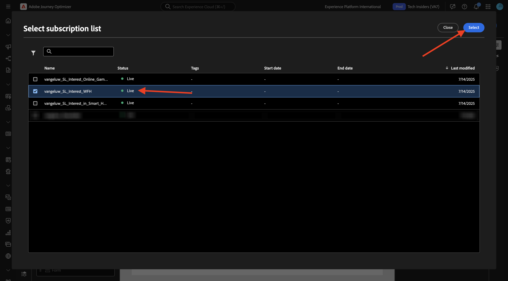
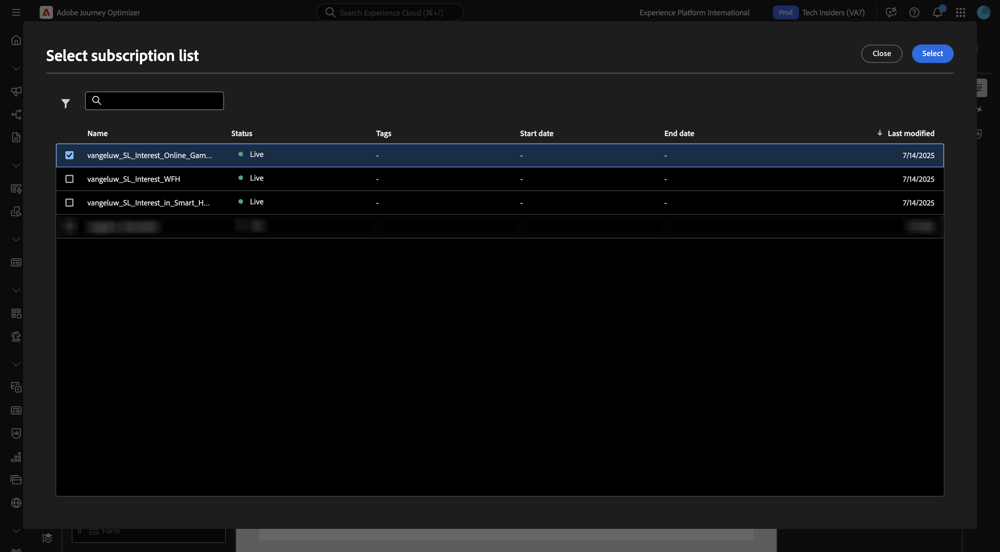
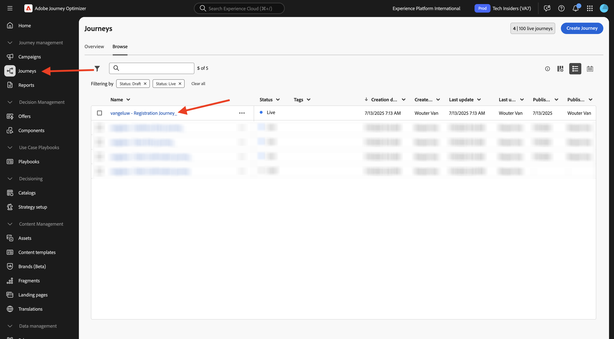
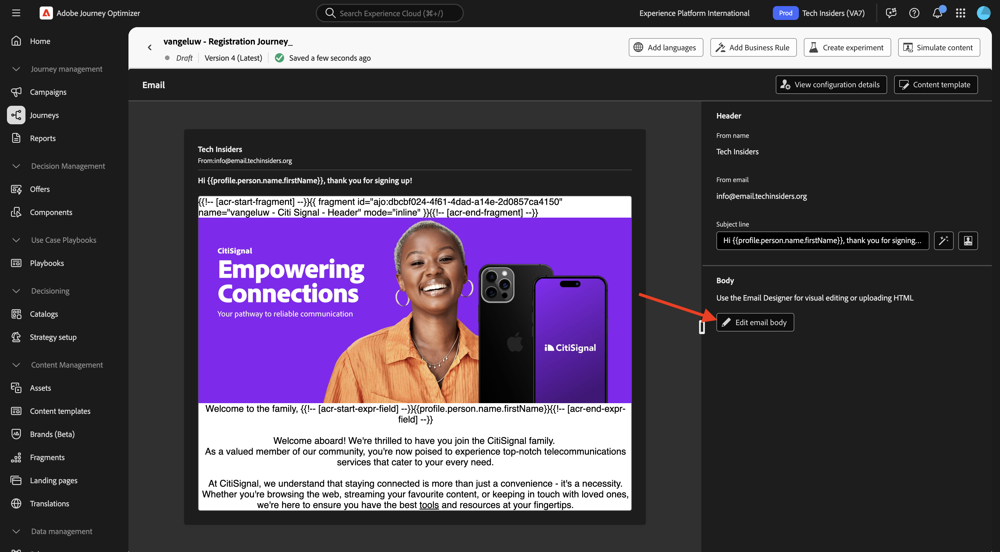
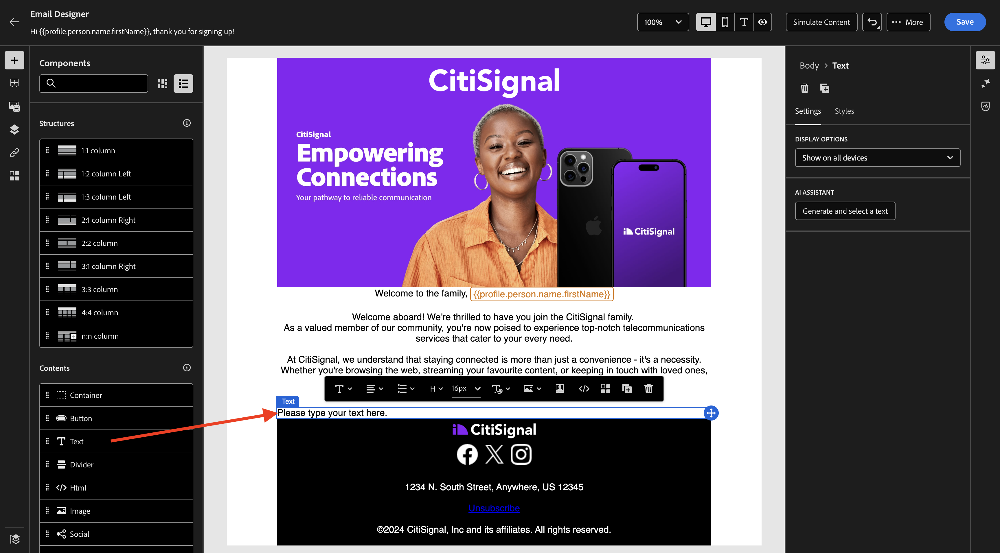
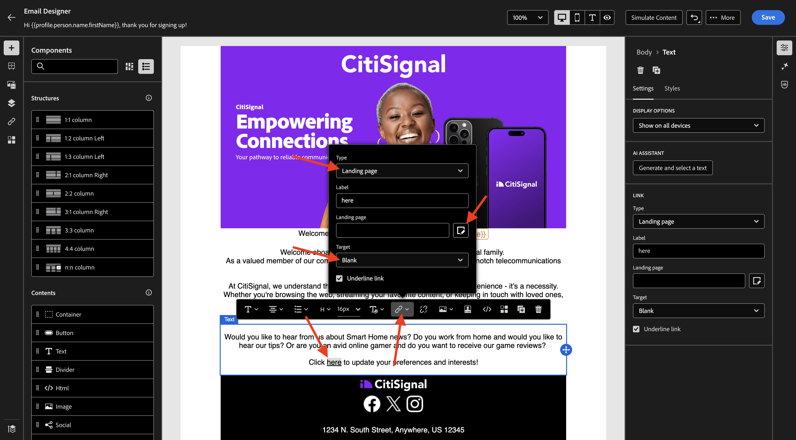

# 3.6.2登陆页面

通过转到[Adobe Experience Cloud](https://experience.adobe.com)登录Adobe Journey Optimizer。 单击&#x200B;**Journey Optimizer**。

您将被重定向到Journey Optimizer中的&#x200B;**主页**&#x200B;视图。 首先，确保使用正确的沙盒。 要使用的沙盒名为`--aepSandboxName--`。 然后，您将进入沙盒&#x200B;**的**&#x200B;主页`--aepSandboxName--`视图。

## 3.6.2.1订阅列表

Adobe Journey Optimizer中的登陆页面可与&#x200B;**订阅列表**&#x200B;配合使用。 要设置登陆页面，您需要先配置&#x200B;**订阅列表**。

CitiSignal希望询问客户对以下领域的兴趣：

- 智能主页
- 在家工作
- 在线游戏

一旦客户表明了对其中任一域感兴趣，则应将该客户添加到特定列表，以便他们之后能够作为即将开展的营销活动的一部分以特定内容为目标。

您现在将创建3个订阅列表。

在左侧菜单中，转到&#x200B;**订阅列表**。 单击&#x200B;**创建订阅列表**。

对于&#x200B;**标题**，使用： `--aepUserLdap--_SL_Interest_in_Smart_Home`。
对于**描述**，使用： `Interest in Smart Home`。

单击&#x200B;**提交**。

单击&#x200B;**创建订阅列表**&#x200B;以创建另一个列表。

对于&#x200B;**标题**，使用： `--aepUserLdap--_SL_Interest_WFH`。
对于**描述**，使用： `Interest in Work From Home`。

单击&#x200B;**提交**。

单击&#x200B;**创建订阅列表**&#x200B;以创建另一个列表。

对于&#x200B;**标题**，使用： `--aepUserLdap--_SL_Interest_Online_Gaming`。
对于**描述**，使用： `Interest in Online Gaming`。

单击&#x200B;**提交**。

您现在已经创建了所需的3个列表。

## 3.6.2.2登陆页面预设

要在Adobe Journey Optimizer中使用登陆页面，需要创建预设。

在左侧菜单中，转到&#x200B;**管理** > **渠道**，然后选择&#x200B;**登陆页面预设**。

单击&#x200B;**创建登陆页面预设**。

对于字段&#x200B;**Name**，使用： `--aepUserLdap-- - CitiSignal LP`并选择实例中可用的子域。

>[!NOTE]
>
>如果您在实例中未看到子域，请与AJO管理员联系以添加子域。

单击&#x200B;**提交**。

现已创建您的登陆页面预设。

## 3.6.2.3登陆页面

您现在可以创建登陆页面。 在左侧菜单中，转到&#x200B;**内容管理** > **登陆页面**。

单击&#x200B;**创建登陆页面**。

对于字段&#x200B;**Title**，使用： `vangeluw - CitiSignal Interests`。 接下来，选择您在上一步中配置的&#x200B;**登陆页面预设**。

单击&#x200B;**创建**。

您应该会看到此内容。

将&#x200B;**页面名称**&#x200B;字段更改为`--aepUserLdap-- - CitiSignal Interests`。

在&#x200B;**访问设置**&#x200B;下输入此自定义名称： `--aepUserLdap---citisignal-interests`。

单击&#x200B;**打开Designer**。

从头开始选择&#x200B;**设计**。

您应该会看到此内容。

将结构组件&#x200B;**1:1列**&#x200B;添加到画布。

将内容组件&#x200B;**表单**&#x200B;添加到画布。

将&#x200B;**复选框1**&#x200B;的字段&#x200B;**标签**&#x200B;更新为`Keep me updated about CitiSignal's offering for Smart Home`。

确保已启用复选框&#x200B;**Opt in （如果选中）**，并且已选中&#x200B;**订阅列表**。

然后单击&#x200B;**选择订阅列表**。

接下来，选择列表`--aepUserLdap--_SL_Interest_in_Smart_Home`并单击&#x200B;**选择**。

单击&#x200B;**+添加字段**，然后选择&#x200B;**复选框**。

您应该会看到此内容。

将&#x200B;**复选框2**&#x200B;的字段&#x200B;**标签**&#x200B;更新为`Keep me updated about CitiSignal's offering for Work From Home`。

确保已启用复选框&#x200B;**Opt in （如果选中）**，并且已选中&#x200B;**订阅列表**。

然后单击&#x200B;**选择订阅列表**。

接下来，选择列表`--aepUserLdap--_SL_Interest_WFH`并单击&#x200B;**选择**。

单击&#x200B;**+添加字段**，然后选择&#x200B;**复选框**。

您应该会看到此内容。

将&#x200B;**复选框3**&#x200B;的字段&#x200B;**标签**&#x200B;更新为`Keep me updated about CitiSignal's offering for Online Gaming`。

确保已启用复选框&#x200B;**Opt in （如果选中）**，并且已选中&#x200B;**订阅列表**。

然后单击&#x200B;**选择订阅列表**。

接下来，选择列表`--aepUserLdap--_SL_Interest_Online_Gaming`并单击&#x200B;**选择**。

您应该会看到此内容。

转到表单字段&#x200B;**CALL TO ACTION**。

更新以下字段：

- **文本** — 按钮标签： `Save`。
- **确认操作**：选择&#x200B;**确认文本**。
- **确认文本**：使用： `Thanks for updating your preferences!`
- **错误操作**：选择&#x200B;**错误文本**。
- **出错时显示的文本**：使用： `There was an error updating your preferences.`

单击&#x200B;**保存**，然后单击左上角的箭头返回上一屏幕。

单击&#x200B;**发布**。

再次单击&#x200B;**发布**。

您的登陆页面现已发布，可在电子邮件中使用。

## 3.6.2.4在电子邮件中包含登陆页面

在练习3.1中，您创建了一个名为`--aepUserLdap-- - Registration Journey`的历程。

您现在应更新该历程中的电子邮件消息，以包含指向登陆页面的链接。

在左侧菜单中，转到&#x200B;**历程**&#x200B;并单击以打开历程`--aepUserLdap-- - Registration Journey`。

单击&#x200B;**更多……**，然后选择&#x200B;**创建新版本**。

单击&#x200B;**创建新版本**。

单击以选择&#x200B;**电子邮件**&#x200B;操作，然后选择&#x200B;**编辑内容**。

单击&#x200B;**编辑电子邮件正文**。

然后您应该会看到类似这样的内容。 向画布中添加新的结构组件&#x200B;**1:1列**。

在新创建的结构组件中添加新的内容组件&#x200B;**文本**。

将以下文本粘贴到&#x200B;**Text**&#x200B;内容组件中。

`Would you like to hear from us about Smart Home news? Do you work from home and would you like to hear our tips? Or are you an avid online gamer and do you want to receive our game reviews? Click here to update your preferences and interests!`

设置文本样式，使其类似于此，然后选择单词`here`。 单击&#x200B;**链接**&#x200B;图标。

将链接的&#x200B;**Type**&#x200B;设置为&#x200B;**登陆页面**，并将字段&#x200B;**Target**&#x200B;设置为&#x200B;**Blank**。

单击&#x200B;**编辑**&#x200B;图标以选择要链接的登陆页面。

选择登陆页面`--aepUserLdap-- - CitiSignal Interests`。 单击&#x200B;**选择**。

您应该会看到此内容。 单击&#x200B;**保存**。

单击左上角的箭头可返回上一个屏幕。

单击左上角的箭头可再次返回上一个屏幕。

单击&#x200B;**保存**。

单击&#x200B;**发布**。

再次单击&#x200B;**发布**。

您的更改现已发布，您可以测试您的历程。

## 3.6.2.5测试您的历程和登陆页面

转到[https://dsn.adobe.com](https://dsn.adobe.com)。 使用Adobe ID登录后，您将看到此内容。 单击网站项目上的3个点&#x200B;**...**，然后单击&#x200B;**运行**&#x200B;以将其打开。

随后您将看到您的演示网站已打开。 选择URL并将其复制到剪贴板。

打开一个新的无痕浏览器窗口。

粘贴您在上一步中复制的演示网站的URL。 然后，系统将要求您使用Adobe ID登录。

选择您的帐户类型并完成登录过程。

然后，您会看到您的网站已加载到无痕浏览器窗口中。 对于每个练习，您将需要使用新的无痕浏览器窗口来加载演示网站URL。 转到&#x200B;**登录**

单击&#x200B;**创建帐户**。 填写详细信息，然后单击&#x200B;**注册**。

您现在将被重定向到主页。 打开配置文件查看器面板，然后转到Real-time Customer Profile。 在“配置文件查看器”面板上，您应该会看到所有显示的个人数据，如新添加的电子邮件和电话标识符。

创建帐户1分钟后，您将收到来自Adobe Journey Optimizer的帐户创建电子邮件。

单击电子邮件中的链接以更新您的首选项。

然后，您应该会看到您创建的表单。 启用一些复选框，然后单击&#x200B;**保存**。

此时，您应该会看到一条确认消息。

## 3.6.2.6订阅列表报告

要查看有关订阅列表的可用报告，请转到左侧菜单中的&#x200B;**订阅列表**，然后单击打开您之前配置的订阅列表之一。

单击&#x200B;**报告**。

然后，您应该会看到列表的概述，以及已订阅或取消订阅列表的人员的数量。

## 后续步骤

转到[3.6.3 AJO和GenStudio for Performance Marketing](./ex3.md)

返回[Adobe Journey Optimizer：内容管理](./ajocontent.md){target="_blank"}

返回[所有模块](./../../../../overview.md){target="_blank"}
