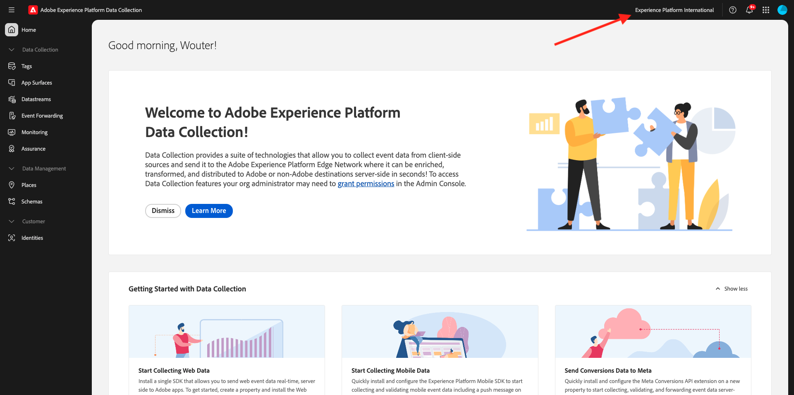

# 1.1.1了解Adobe Experience Platform数据收集

## 上下文

Adobe Experience Platform数据收集由品牌商用于许多用例。 它是新一代Tag Management系统(TMS)，为客户提供了一种简单的方式来部署和管理所有用来改善相关客户体验的分析、营销和广告解决方案。 Adobe Experience Platform数据收集无需额外付费，并且可供任何Adobe Experience Cloud客户使用。 品牌可以使用Adobe Experience Platform数据收集来：

- 实施Adobe Experience Cloud应用程序以及Adobe Experience Platform。
- 通过提供各自要管理的&#x200B;**属性**&#x200B;来管理组织中不同部分的不同要求。
- 允许进行测试和生命周期管理。
- 插入自定义JavaScript和第三方标记，所有这些标记都在一个位置进行管理。

## 浏览 UI

转到[Adobe Experience Platform数据收集](https://experience.adobe.com/#/data-collection/)。 确保您使用的是正确的环境，即`--aepImsOrgName--`。

>[!NOTE]
>
>本教程使用环境&#x200B;**Experience Platform International**&#x200B;进行记录。 您的环境名称可能不同，因此每当您在屏幕快照中看到名称&#x200B;**Experience Platform International**&#x200B;时，都应将其替换为您自己的环境名称，即`--aepImsOrgName--`。

转到&#x200B;**标记**。 您现在看到&#x200B;**[!UICONTROL 属性]**&#x200B;视图。 此处列出的属性用于教程管理。 这些属性表示：

- 应用程序和Web属性
- 不同的网站以不同的方式为客户提供服务。 例如，Luma Retail将拥有一处房产，Luma Travel将拥有另一处房产。
- 旧版以及当前网站
- 适用于多个不同网站的特定Adobe Analytics设计
- 内部Intranet页面与外部站点并存

现在，看看左边栏。

- **[!UICONTROL 标记]**&#x200B;概述了所有客户端属性
- **[!UICONTROL 应用程序表面]**&#x200B;概述了用于启用推送通知（与Sierra项目结合使用/启用）的所有应用程序配置
- **[!UICONTROL 数据流]**&#x200B;将在[下一个练习](./ex2.md)中探讨
- **[!UICONTROL 事件转发]**&#x200B;概述了[模块2.5 - Real-Time CDP连接：事件转发](./../../../../modules/delivery-activation/rtcdp-b2c/rtcdpb2c-5/aep-data-collection-ssf.md)中探索的所有服务器端属性
- **[!UICONTROL 监控]**&#x200B;概述通过事件转发的传入和传出事件流量
- **[!UICONTROL Assurance]**&#x200B;提供使用Adobe Debugger调试实现的访问权限
- **[!UICONTROL 位置]**&#x200B;提供用于管理POI的访问权限，在移动应用程序中基于位置的个性化可访问这些POI
- **[!UICONTROL 架构]**&#x200B;提供对Adobe Experience Platform架构编辑器的访问权限
- **[!UICONTROL 身份]**&#x200B;提供对Adobe Experience Platform身份图设置的访问权限

## 更多信息

Adobe Experience Platform数据收集是一个非常高级的工具，其范围超出了Adobe Experience Platform教程。 组织可能无法使用Adobe Experience Platform数据收集来实现其标记管理功能，而是使用非Adobe标记管理解决方案来插入代码和管理标记。 Adobe和Adobe Professional Services支持使用非Adobe标签管理解决方案。
下面是希望进一步了解Adobe Experience Platform数据收集内容的人可以阅读的一些内容。

- [Adobe Experience Platform数据收集用户指南](https://experienceleague.adobe.com/docs/experience-platform/tags/home.html?lang=zh-Hans)
- [“利用 Web SDK 实施 Adobe Experience Cloud”教程](https://experienceleague.adobe.com/docs/platform-learn/implement-web-sdk/overview.html?lang=zh-Hans)
- [设置用户权限](https://experienceleague.adobe.com/docs/experience-platform/tags/admin/user-permissions.html?lang=zh-Hans)
- [API文档](https://experienceleague.adobe.com/zh-hans/docs/experience-platform/tags/api/overview)

## 后续步骤

转到[1.1.2 Edge Network、数据流和服务器端数据收集](./ex2.md){target="_blank"}

返回到[Adobe Experience Platform数据收集和Web SDK标记扩展的设置](./data-ingestion-launch-web-sdk.md){target="_blank"}

返回[所有模块](./../../../../overview.md){target="_blank"}
