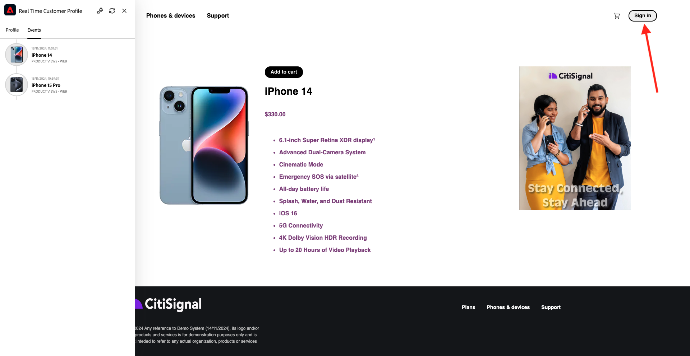

# 1.2.1从未知到网站上已知

## 上下文

从未知到已知的过程，以及客户从收购到维系的过程，是当今品牌圈最重要的主题之一。

Adobe Experience Platform在此历程中发挥着巨大作用。 Platform是沟通的大脑，记录记录的体验系统。

Platform是一个环境，其中单词&#x200B;**customer**&#x200B;比&#x200B;**known**-customers更广。 向品牌客户讲话时需要注意一件非常重要的事：从Platform的角度来看，网站上的未知访客也是客户，因此，作为未知访客的所有行为都会发送到Platform。 凭借这种方法，当该客户最终成为已知客户时，品牌也可以可视化此时之前发生的事情。 这在归因和体验优化方面很有用。

## 你打算做什么

现在，您会将数据摄取到Adobe Experience Platform，该数据将链接到标识符，如ECID和电子邮件地址。 其目的是从配置的角度了解您即将执行的操作的业务环境。 在下一个练习中，您将开始配置所需的一切，以便在您自己的沙盒环境中进行所有的数据摄取。

### 客户历程流程

转到[https://dsn.adobe.com](https://dsn.adobe.com)。 使用Adobe ID登录后，您将看到此内容。 单击网站项目上的3个点&#x200B;**...**，然后单击&#x200B;**运行**&#x200B;以将其打开。

随后您将看到您的演示网站已打开。 选择URL并将其复制到剪贴板。

打开一个新的无痕浏览器窗口。

粘贴您在上一步中复制的演示网站的URL。 然后，系统将要求您使用Adobe ID登录。

选择您的帐户类型并完成登录过程。

然后，您会看到您的网站已加载到无痕浏览器窗口中。 对于每个演示，您将需要使用新的无痕浏览器窗口来加载演示网站URL。

单击屏幕左上角的Adobe徽标图标以打开配置文件查看器。

请查看配置文件查看器面板和实时客户配置文件，将&#x200B;**Experience Cloud ID**&#x200B;作为此当前未知客户的主要标识符。

您还可以查看根据客户行为收集的所有体验事件。 该列表当前为空，但这种情况很快就会改变。

转到&#x200B;**电话和设备**&#x200B;产品类别。 接下来，单击产品&#x200B;**iPhone 15 Pro**。

然后，您将看到产品详细信息页面。 **产品视图**&#x200B;类型的Experience Event现已使用您在上一模块中审查的Web SDK实现发送到Adobe Experience Platform。

打开“配置文件查看器”面板，并查看您的&#x200B;**体验事件**。

>[!NOTE]
>
>如果您没有看到该事件立即显示，请刷新页面。

返回&#x200B;**电话和设备**&#x200B;类别页面，然后单击其他产品。 另一个Experience Event已发送到Adobe Experience Platform。

打开配置文件查看器面板。 您现在将看到2个&#x200B;**产品视图**&#x200B;类型的体验事件。 虽然此类行为是匿名的，但经过适当的同意后，我们便能够跟踪每次点击并将其存储在Adobe Experience Platform中。 一旦匿名客户被识别，我们便能够将所有匿名行为自动合并到已知配置文件中。

单击&#x200B;**登录**&#x200B;以转到注册/登录页面。

单击&#x200B;**创建帐户**。

填写您的详细信息，然后单击&#x200B;**注册**，之后您将被重定向到上一页。

打开配置文件查看器面板，然后转到Real-time Customer Profile。 在“配置文件查看器”面板上，您应该会看到所有显示的个人数据，如新添加的电子邮件和电话标识符。

在配置文件查看器面板上，转到体验事件。 您将会在配置文件查看器面板上看到之前查看的2个产品。 这两个事件现在也关联到您的“已知”配置文件。

现在，您已将数据摄取到Adobe Experience Platform，并且已将该数据关联到ECID和电子邮件地址等标识符。 这样做的目的是为了了解您打算做什么的业务环境。 在下一个练习中，您将开始配置所需的一切配置，以便能够进行所有的数据摄取。

## 后续步骤

转到[1.2.2配置架构并设置标识符](./ex2.md){target="_blank"}

返回[数据摄取](./data-ingestion.md){target="_blank"}

返回[所有模块](./../../../../overview.md){target="_blank"}
