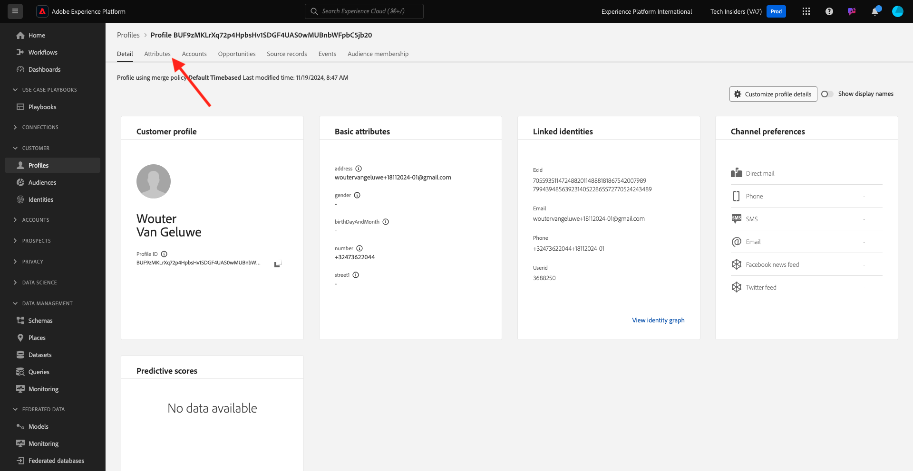

# 2.1.2可视化您自己的实时客户个人资料 — UI

在本练习中，您将登录到Adobe Experience Platform，并在UI中查看自己的实时客户个人资料。

## 上下文

在实时客户个人资料中，所有个人资料数据都与事件数据以及现有区段成员资格一起显示。 所显示的数据可以来自任何位置，包括Adobe应用程序和外部解决方案。 这是Adobe Experience Platform中最强大的视图，真正的体验记录体系。

## 在Adobe Experience Platform中使用“客户个人资料视图”

转到[Adobe Experience Platform](https://experience.adobe.com/platform)。 登录后，您将登录到Adobe Experience Platform的主页。

在继续之前，您需要选择一个&#x200B;**沙盒**。 要选择的沙盒名为``--aepSandboxName--``。 选择适当的[!UICONTROL 沙盒]后，您将看到屏幕更改，现在您已经进入专用的[!UICONTROL 沙盒]。

在左侧菜单中，转到&#x200B;**配置文件**&#x200B;和&#x200B;**浏览**。

在网站上的“配置文件查看器”面板上，您可以找到多个身份。 每个身份都链接到命名空间。

在“配置文件查看器”面板上，您可以看到ID和命名空间的以下组合：

| 身份标识 | 命名空间 |
|:-------------:| :---------------:|
| Experience Cloud ID (ECID) | 79943948563923140522865572770524243489 |
| Experience Cloud ID (ECID) | 70559351147248820114888181867542007989 |
| 电子邮件ID | woutervangeluwe+18112024-01@gmail.com |
| 手机号码ID | +32473622044+18112024-01 |

使用Adobe Experience Platform时，所有ID都同等重要。 以前，ECID是Adobe上下文中最重要的ID，所有其他ID均以层级关系链接到ECID。 在Adobe Experience Platform中，情况已发生了变化，每个ID都可以被视为主标识符。

通常，主要标识符取决于上下文。 如果您询问呼叫中心，**最重要的ID是什么？**&#x200B;他们可能会回答，**电话号码！**，但如果您询问您的CRM团队，他们会回答，**电子邮件地址！** Adobe Experience Platform了解这种复杂性并为您管理它。 每个应用程序(无论是Adobe应用程序还是非Adobe应用程序)都将通过引用Adobe Experience Platform视为主要的ID来与其通信。 而且它只管管用。

对于字段&#x200B;**身份命名空间**，请选择&#x200B;**电子邮件**，对于字段&#x200B;**身份值**，请输入您在上一个练习中注册时使用的电子邮件地址。 单击&#x200B;**查看**。 然后，您将在列表中看到您的个人资料。 单击&#x200B;**配置文件ID**&#x200B;以打开您的配置文件。

您现在可以看到客户个人资料的几个重要&#x200B;**个人资料属性**&#x200B;的概述。 要查看配置文件的所有可用配置文件属性，请单击&#x200B;**属性**。

然后，您将看到所有属性的完整列表。

转到&#x200B;**事件**，您可以在其中查看链接到个人资料的每个体验事件的条目。

最后，转到菜单选项&#x200B;**受众成员资格**。 在这里，您可以找到该客户的所有符合条件的受众。 该列表当前可能为空，但在后续模块中将发生更改。

现在您已了解如何使用Adobe Experience Platform的用户界面查看任何客户的实时个人资料，让我们使用Postman和Adobe I/O针对Adobe Experience Platform的API进行查询，通过API做同样的事情。

## 后续步骤

转到[2.1.3可视化您自己的实时客户个人资料 — API](./ex3.md){target="_blank"}

返回[实时客户个人资料](./real-time-customer-profile.md){target="_blank"}

返回[所有模块](./../../../../overview.md){target="_blank"}
