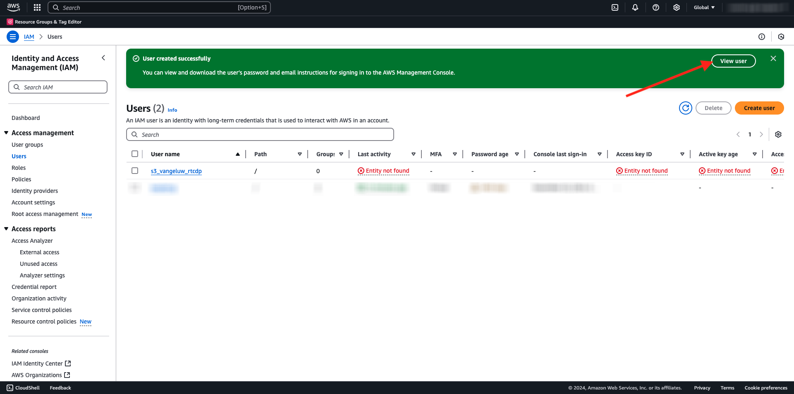

# 2.3.4操作：将受众发送到S3目标

Adobe Experience Platform还能够将受众共享到电子邮件营销目标，如Salesforce Marketing Cloud、Oracle Eloqua、Oracle Responsys和Adobe Campaign。

您可以使用FTP或SFTP作为每个电子邮件营销目标的专用目标的一部分，也可以使用AWS S3在Adobe Experience Platform和这些电子邮件营销目标之间交换客户列表。

在本模块中，您将通过使用AWS S3存储段来配置此类目标。

## 创建您的S3存储段

转到[https://console.aws.amazon.com](https://console.aws.amazon.com)并登录。

>[!NOTE]
>
>如果您还没有AWS帐户，请使用您的个人电子邮件地址创建一个新的AWS帐户。

登录后，您将被重定向到&#x200B;**AWS管理控制台**。

在搜索栏中，搜索&#x200B;**s3**。 单击第一个搜索结果： **S3 — 云中的可扩展存储**。

您随后将看到&#x200B;**Amazon S3**&#x200B;主页。 单击&#x200B;**创建存储桶**。

在&#x200B;**创建Bucket**&#x200B;屏幕中，使用名称`aepmodulertcdp--aepUserLdap--`

保留所有其他默认设置。 向下滚动并单击&#x200B;**创建存储桶**。

然后，您会看到正在创建存储段，并且会被重定向到Amazon S3主页。

## 设置访问S3存储段的权限

下一步是设置对S3存储段的访问权限。

为此，请转到[https://console.aws.amazon.com/iam/home](https://console.aws.amazon.com/iam/home)。

AWS资源的访问权限由Amazon Identity and Access Management (IAM)控制。

您现在可以看到此页面。

在左侧菜单中，单击&#x200B;**用户**。 您随后将看到&#x200B;**用户**&#x200B;屏幕。 单击&#x200B;**创建用户**。

接下来，配置您的用户：

- 用户名：使用`s3_--aepUserLdap--_rtcdp`

单击&#x200B;**下一步**。

然后，您将会看到此权限屏幕。 单击&#x200B;**直接附加策略**。

输入搜索词&#x200B;**s3**&#x200B;以查看所有相关的S3策略。 选择策略&#x200B;**AmazonS3FullAccess**。 向下滚动并单击&#x200B;**下一步**。

检查您的配置。 单击&#x200B;**创建用户**。

你会看到这个。 单击&#x200B;**查看用户**。

单击&#x200B;**安全凭据**，然后单击&#x200B;**创建访问密钥**。

选择&#x200B;**在AWS**&#x200B;外部运行的应用程序。 向下滚动并单击&#x200B;**下一步**。

单击&#x200B;**创建访问密钥**

你会看到这个。 单击&#x200B;**显示**&#x200B;查看您的访问密钥：

您的&#x200B;**访问密钥**&#x200B;现已显示。

>[!IMPORTANT]
>
>将凭据存储在计算机上的文本文件中。
>
> - 访问密钥ID： ...
> - 访问密钥： ...
>
> 单击&#x200B;**完成**&#x200B;后，您将再也看不到您的凭据！

单击&#x200B;**完成**。

您现在已成功创建一个AWS S3存储桶，并创建了一个有权访问此存储桶的用户。

## 在Adobe Experience Platform中配置目标

转到[Adobe Experience Platform](https://experience.adobe.com/platform)。 登录后，您将登录到Adobe Experience Platform的主页。

在继续之前，您需要选择一个&#x200B;**沙盒**。 要选择的沙盒名为``--aepSandboxName--``。 选择适当的[!UICONTROL 沙盒]后，您将看到屏幕更改，现在您已经进入专用的[!UICONTROL 沙盒]。

在左侧菜单中，转到&#x200B;**目标**，然后转到&#x200B;**目录**。 您随后将看到&#x200B;**目标目录**。

单击&#x200B;**云存储**，然后单击&#x200B;**Amazon S3**&#x200B;卡上的&#x200B;**设置**&#x200B;按钮（或在&#x200B;**激活受众**&#x200B;上，具体取决于您的环境）。

选择&#x200B;**访问密钥**&#x200B;作为帐户类型。 请使用上一步中提供给您的S3凭据：

| 访问密钥ID | 访问密钥 |
|:-----------------------:| :-----------------------:|
| 秋叶香..... | 7Icm..... |

单击&#x200B;**连接到目标**。

然后，您将看到一条可视化确认消息，确认此目标现已连接。

您必须提供S3存储段详细信息，以便Adobe Experience Platform可以连接到S3存储段。

作为命名约定，请使用以下内容：

| 访问密钥ID | 访问密钥 |
|:-----------------------:| :-----------------------:|
| 名称 | `AWS - S3 - --aepUserLdap--` |
| 描述 | `AWS - S3 - --aepUserLdap--` |
| 存储段名称 | `aepmodulertcdp--aepUserLdap--` |
| 文件夹路径 | /now |

选择&#x200B;**受众**。

对于&#x200B;**文件类型**，请选择&#x200B;**CSV**，默认设置保持不变。

向下滚动。 对于&#x200B;**压缩格式**，请选择&#x200B;**无**。 单击&#x200B;**下一步**。

您现在可以选择将数据治理策略附加到新目标。 单击&#x200B;**下一步**。

在受众列表中，搜索您在上一个练习`--aepUserLdap-- - Interest in Galaxy S24`中创建的受众，然后选择该受众。 单击&#x200B;**下一步**。

你会看到这个。 如果需要，可以通过单击&#x200B;**铅笔**&#x200B;图标来编辑计划和文件名。 单击&#x200B;**下一步**。

您现在可以选择配置文件属性以导出到AWS S3。 单击&#x200B;**添加新字段**&#x200B;并确保已添加字段`--aepTenantId--.identification.core.ecid`并标记为&#x200B;**重复数据删除键**。

（可选）您可以根据需要添加任意数量的其他配置文件属性。

添加所有字段后，单击&#x200B;**下一步**。

检查您的配置。 单击&#x200B;**完成**&#x200B;以完成配置。

然后，您将返回“目标激活”屏幕，您将看到受众已添加到此目标。

如果要添加更多受众导出，可以单击&#x200B;**激活受众**&#x200B;以重新启动此过程并添加更多受众。

## 后续步骤

转到[2.3.5执行操作：将您的受众发送到Adobe Target](./ex5.md){target="_blank"}

返回[Real-time CDP — 构建受众并执行操作](./real-time-cdp-build-a-segment-take-action.md){target="_blank"}

返回[所有模块](./../../../../overview.md){target="_blank"}
