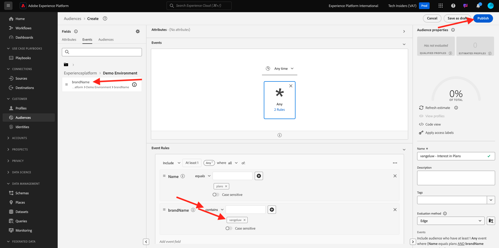

# 2.4.4创建受众

## 简介

您将创建一个简单的受众：

- **客户在访问CitiSignal演示网站的**&#x200B;计划&#x200B;**页面时将有资格参与的计划**。

### 很高兴知道

当您符合某个受众的资格（该受众属于该目标的激活列表）时，Real-time CDP将触发对该目标的激活。 在这种情况下，将发送到该目标的受众资格有效负载将包含&#x200B;**您的客户配置文件符合条件的所有受众**。

本模块的目标是显示近乎实时地将“客户个人资料”的受众资格发送到“事件中心”目标。

### 受众状态

Adobe Experience Platform中的受众资格始终具有&#x200B;**状态** — 属性，可以是以下任一属性：

- **已实现**：这表示有新的受众资格
- **已退出**：这表示配置文件不再符合受众条件

## 构建受众

通过转到以下URL登录Adobe Experience Platform： [https://experience.adobe.com/platform](https://experience.adobe.com/platform)。

登录后，您将登录到Adobe Experience Platform的主页。

在继续之前，您需要选择一个&#x200B;**沙盒**。 要选择的沙盒名为``--aepSandboxName--``。 选择相应的沙盒后，您将看到屏幕变化，现在您位于专用沙盒中。

转到&#x200B;**受众**。 单击&#x200B;**+创建受众**&#x200B;按钮。

选择&#x200B;**生成规则**&#x200B;并单击&#x200B;**创建**。

命名您的受众`--aepUserLdap-- - Interest in Plans`，将评估方法设置为&#x200B;**Edge**，并从体验事件中添加页面名称。

单击&#x200B;**事件**，然后拖放&#x200B;**XDM ExperienceEvent > Web >网页详细信息>名称**。 输入&#x200B;**计划**&#x200B;作为值：

拖放&#x200B;**XDM ExperienceEvent > `--aepTenantId--` > demoEnvironment > brandName**。 输入`--aepUserLdap--`作为值，将比较参数设置为&#x200B;**包含**，然后单击&#x200B;**发布**：

您的受众现已发布。

## 后续步骤

转到[2.4.5激活您的受众](./ex5.md){target="_blank"}

返回至[Real-Time CDP：Audience Activation至Microsoft Azure事件中心](./segment-activation-microsoft-azure-eventhub.md){target="_blank"}

返回[所有模块](./../../../../overview.md){target="_blank"}
