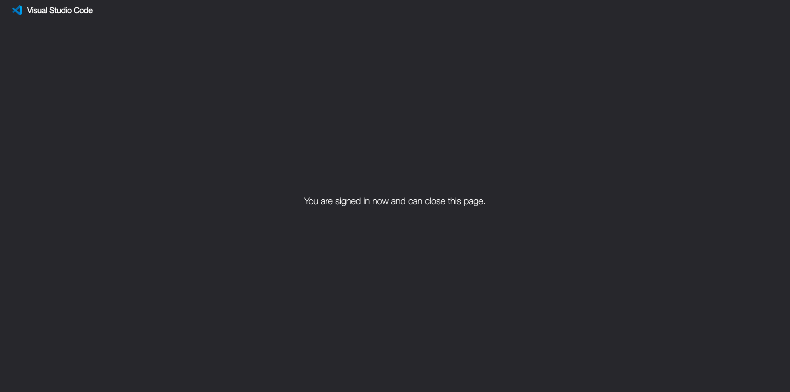
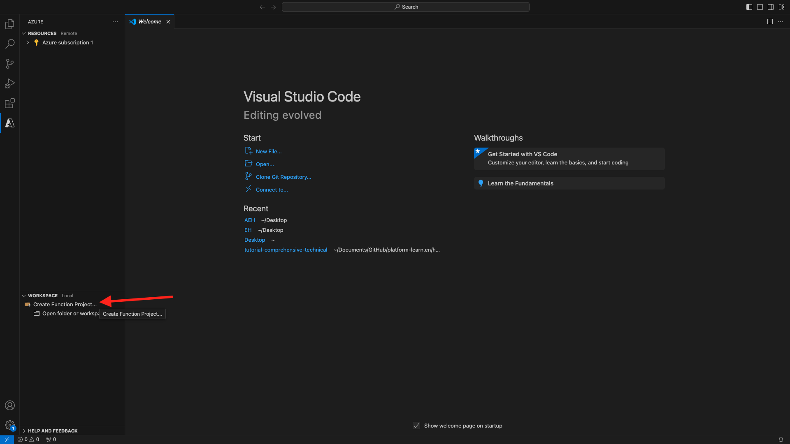

# 2.4.6创建您的Microsoft Azure项目

## 熟悉Azure事件中心功能

Azure Functions允许您运行一小段代码（称为&#x200B;**函数**），而无需担心应用程序基础架构。 利用Azure Functions，云基础架构可提供保持应用程序大规模运行所需的所有最新服务器。
函数是由特定类型的事件触发的&#x200B;**&#x200B;**。 支持的触发器包括响应数据更改、响应消息（例如事件中心）、按计划运行或作为HTTP请求的结果。
Azure Functions是一种无服务器计算服务，可让您运行事件触发的代码，而无需明确配置或管理基础架构。
Azure事件中心与Azure Functions集成以实现无服务器架构。

## 打开Visual Studio代码并登录到Azure

Visual Studio Code可以轻松地……
- 定义Azure函数并将其绑定到事件中心- 本地测试- 部署到Azure- 远程日志函数执行

### 打开Visual Studio Code

### 登录到Azure

使用您在上一个练习中注册的Azure帐户登录时，Visual Studio Code将允许您查找并绑定所有事件中心资源。
打开Visual Studio Code并单击&#x200B;**Azure**&#x200B;图标。
接下来，选择&#x200B;**登录到Azure**：

系统会将您重定向到浏览器以登录。 请记住选择用于注册的Azure帐户。
当您在浏览器中看到以下屏幕时，您是使用Visual Code Studio登录的：

返回到Visual Code Studio（您将看到Azure订阅的名称，例如&#x200B;**Azure订阅1**）：


## 创建Azure项目

单击&#x200B;**创建函数项目……**：

选择或创建您选择的本地文件夹以保存项目，然后单击&#x200B;**选择**：

现在，您将进入项目创建向导。 单击&#x200B;**Javascript**&#x200B;作为项目的语言：

然后选择&#x200B;**模型v4**。

选择&#x200B;**Azure事件中心触发器**&#x200B;作为项目的第一个函数模板：

输入函数的名称，使用以下格式`--aepUserLdap---aep-event-hub-trigger`并按Enter键：

选择&#x200B;**新建本地应用设置**：

单击以选择您之前创建的名为`--aepUserLdap---aep-enablement`的事件中心命名空间。

接下来，单击以选择您之前创建的名为`--aepUserLdap---aep-enablement-event-hub`的事件中心。

单击以选择&#x200B;**RootManageSharedAccessKey**&#x200B;作为事件中心策略：

选择&#x200B;**添加到工作区**，了解如何打开项目：

您随后可能会收到这样的消息。 在这种情况下，请单击&#x200B;**是，我信任作者**。

创建项目后，在编辑器中打开文件`--aepUserLdap---aep-event-hub-trigger.js`：

Adobe Experience Platform发送到事件中心的有效负载将如下所示：

```json
{
  "identityMap": {
    "ecid": [
      {
        "id": "36281682065771928820739672071812090802"
      }
    ]
  },
  "segmentMembership": {
    "ups": {
      "94db5aed-b90e-478d-9637-9b0fad5bba11": {
        "createdAt": 1732129904025,
        "lastQualificationTime": "2024-11-21T07:33:52Z",
        "mappingCreatedAt": 1732130611000,
        "mappingUpdatedAt": 1732130611000,
        "name": "vangeluw - Interest in Plans",
        "status": "realized",
        "updatedAt": 1732129904025
      }
    }
  }
}
```

使用以下代码更新Visual Studio代码的`--aepUserLdap---aep-event-hub-trigger.js`中的代码。 每次Real-time CDP将受众资格发送到事件中心目标时，都将执行此代码。 在此示例中，代码仅用于显示传入有效负载，但您可以想象任何类型的附加功能，以便实时处理受众资格并使用进一步的数据管道生态系统。
文件`--aepUserLdap---aep-event-hub-trigger.js`中的第11行当前显示以下内容：

```javascript
context.log('Event hub message:', message);
```

将`--aepUserLdap---aep-event-hub-trigger.js`中的第11行更改为：

```javascript
context.log('Event hub message:', JSON.stringify(message));
```

总有效负载应如下所示：

```javascript
const { app } = require('@azure/functions');

app.eventHub('--aepUserLdap---aep-event-hub-trigger', {
    connection: '--aepUserLdap--aepenablement_RootManageSharedAccessKey_EVENTHUB',
    eventHubName: '--aepUserLdap---aep-enablement-event-hub',
    cardinality: 'many',
    handler: (messages, context) => {
        if (Array.isArray(messages)) {
            context.log(`Event hub function processed ${messages.length} messages`);
            for (const message of messages) {
                context.log('Event hub message:', message);
            }
        } else {
            context.log('Event hub function processed message:', messages);
        }
    }
});
```


结果应如下所示：


## 运行Azure项目

现在该运行您的项目了。 在此阶段，我们不会将该项目部署到Azure。 我们将在调试模式下在本地运行该程序。 选择运行图标，单击绿色箭头。

首次在调试模式下运行项目时，需要附加Azure存储帐户，请单击&#x200B;**选择存储帐户**。

然后选择您之前创建的名为`--aepUserLdap--aepstorage`的存储帐户。

您的项目现已启动并正在运行，并将列出事件中心中的事件。 在下一个练习中，您将在CitiSignal演示网站上演示符合受众条件的行为。 因此，您将在事件中心触发函数的终端中接收受众资格有效负载。


## 停止Azure项目

要停止项目，请转到VSC中的列&#x200B;**调用栈栈**，单击正在运行的项目上的箭头，然后单击&#x200B;**停止**。


## 后续步骤

转到[2.4.7端到端方案](./ex7.md){target="_blank"}
返回至[Real-Time CDP：Audience Activation至Microsoft Azure事件中心](./segment-activation-microsoft-azure-eventhub.md){target="_blank"}
返回[所有模块](./../../../../overview.md){target="_blank"}
