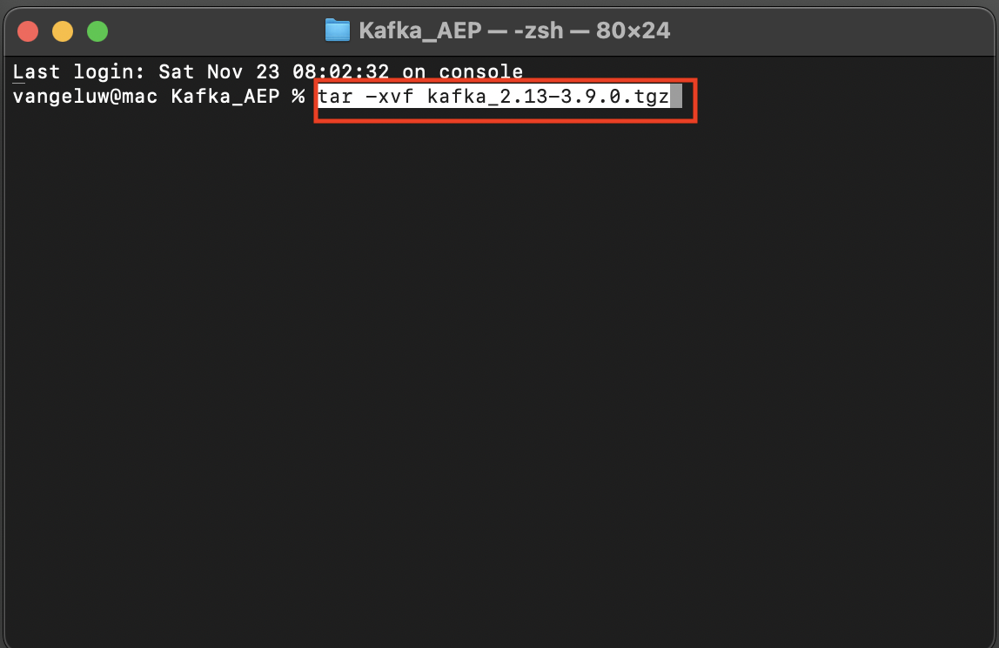
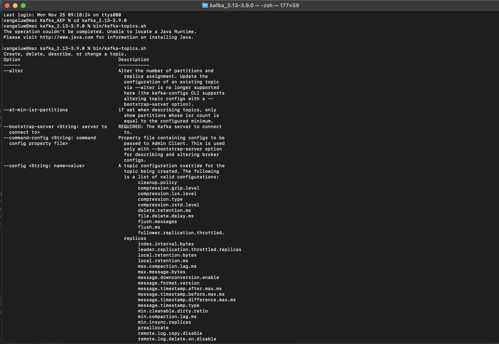
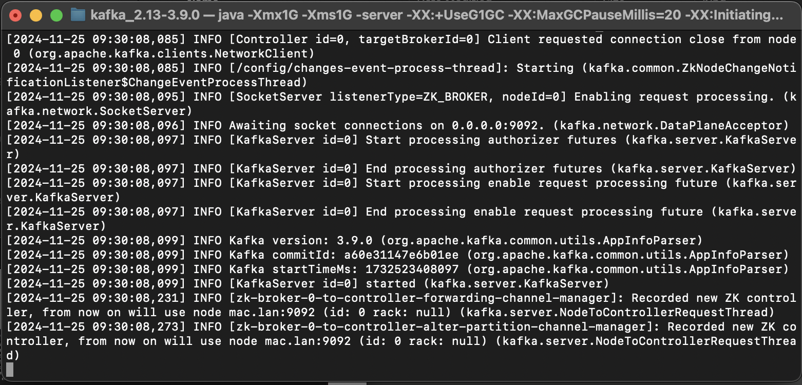

# 2.6.2安装和配置Kafka群集

## 下载Apache Kafka

转到[https://kafka.apache.org/downloads](https://kafka.apache.org/downloads)并下载最新发布的版本。 选择最新的二进制版本，在本例中为&#x200B;**3.9.0**。 将会开始下载。

在桌面上创建名为&#x200B;**Kafka_AEP**&#x200B;的文件夹，并将下载的文件放置在该目录中。

打开&#x200B;**终端**&#x200B;窗口，方法是：右键单击您的文件夹，然后单击&#x200B;**在文件夹新建终端**。

在“终端”窗口中运行此命令以解压缩下载的文件：

`tar -xvf kafka_2.13-3.9.0.tgz`

>[!NOTE]
>
>请验证上述命令是否与您下载的文件的版本匹配。 如果您的版本较新，则需要更新上述命令以匹配该版本。

您随后将看到以下内容：

解压缩该文件后，您现在拥有如下目录：

在该目录中，您将看到以下子目录：

返回到“终端”窗口。 输入以下命令：

`cd kafka_2.13-3.9.0`

>[!NOTE]
>
>请验证上述命令是否与您下载的文件的版本匹配。 如果您的版本较新，则需要更新上述命令以匹配该版本。

接下来，输入命令`bin/kafka-topics.sh`。

然后，您应该会看到此响应。 这意味着Kafka已正确安装，并且Java工作正常。 (提醒：您需要安装Java 23 JDK才能使此功能正常工作！。 您可以使用命令`java -version`查看已安装的Java版本。)

## 启动Kafka

要启动Kafka，您需要按此顺序启动Kafka Zookeeper和Kafka。

打开&#x200B;**终端**&#x200B;窗口，方法是右键单击您的文件夹&#x200B;**kafka_2.13-3.9.0**，然后单击&#x200B;**在文件夹新建终端**。

输入以下命令：

`bin/zookeeper-server-start.sh config/zookeeper.properties`

您随后将看到以下内容：

在进行这些练习时，请保持此窗口打开！

打开另一个新&#x200B;**终端**&#x200B;窗口，方法是右键单击您的文件夹&#x200B;**kafka_2.13-3.9.0**，然后单击&#x200B;**文件夹上的新终端**。

输入以下命令：

`bin/kafka-server-start.sh config/server.properties`

您随后将看到以下内容：

在进行这些练习时，请保持此窗口打开！

## 创建Kafka主题

打开&#x200B;**终端**&#x200B;窗口，方法是右键单击您的文件夹&#x200B;**kafka_2.13-3.9.0**，然后单击&#x200B;**在文件夹新建终端**。

输入此命令以创建名称为&#x200B;**aeptest**&#x200B;的新Kafka主题。 本主题将用于本练习中的测试。

`bin/kafka-topics.sh --create --topic aeptest --bootstrap-server localhost:9092`

然后，您将看到一个确认消息：

输入此命令以创建名称为&#x200B;**aep**&#x200B;的新Kafka主题。 您将在下一个练习中配置的Adobe Experience Platform接收器连接器将使用此主题。

`bin/kafka-topics.sh --create --topic aep --bootstrap-server localhost:9092`

随后您将看到类似的确认：

## 生成事件

返回创建第一个Kafka主题的“终端”窗口，然后输入以下命令：

`bin/kafka-console-producer.sh --broker-list 127.0.0.1:9092 --topic aeptest`

你会看到这个。 按下Enter按钮后每行新行都将导致新消息被发送到主题&#x200B;**aeptest**。

输入`Hello AEP`并按Enter键。 您的第一个事件现已发送到本地Kafka实例中，并放入主题&#x200B;**aeptest**&#x200B;中。

输入`Hello AEP again.`并按Enter键。

输入`AEP Data Collection is the best.`并按Enter键。

您现在已生成主题&#x200B;**aeptest**&#x200B;中的3个事件。 这些事件现在可以由可能需要该数据的应用程序使用。

在键盘上，同时单击`Control`和`C`以关闭制作程序。

## 使用事件

在用于生成事件的同一“终端”窗口中，输入以下命令：

`bin/kafka-console-consumer.sh --bootstrap-server 127.0.0.1:9092 --topic aeptest --from-beginning`

然后，您将看到在上一个练习中为主题&#x200B;**aeptest**&#x200B;生成的所有消息都显示在使用者中。 这是Apache Kafka的工作方式：生产者在管道中创建事件，消费者使用这些事件。

在键盘上，同时单击`Control`和`C`以关闭制作程序。

在本练习中，您已完成所有基础知识来设置本地Kafka聚类、创建Kafka主题、生成事件和使用事件。

此模块的目的是模拟如果实际组织已经实施Apache Kafka群集，并且希望将数据从其Kafka群集流式传输到Adobe Experience Platform中时将发生的情况。

为了便于这种实现，创建了一个Adobe Experience Platform接收器连接器，可使用Kafka Connect实现该连接器。 您可以在此处找到该Adobe Experience Platform接收器连接器的文档： [https://github.com/adobe/experience-platform-streaming-connect](https://github.com/adobe/experience-platform-streaming-connect)。

在接下来的练习中，您将从自己的本地Kafka群集中实施使用该Adobe Experience Platform接收器连接器所需的一切。

关闭终端窗口。

您已完成此练习。

## 后续步骤

转到[2.6.3在Adobe Experience Platform中配置HTTP API端点](./ex3.md){target="_blank"}

返回到[将数据从Apache Kafka流式传输到Adobe Experience Platform](./aep-apache-kafka.md){target="_blank"}

返回[所有模块](./../../../../overview.md){target="_blank"}
