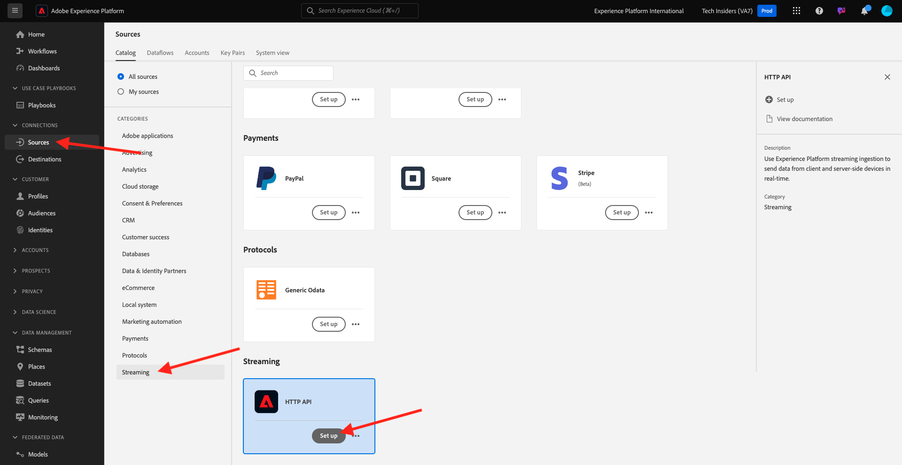
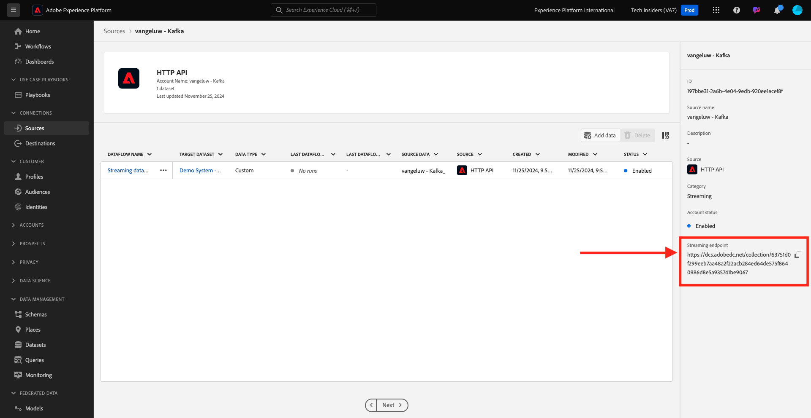

# 2.6.3在Adobe Experience Platform中配置HTTP API流端点

在Kafka中设置Adobe Experience Platform接收器连接器之前，您需要在Adobe Experience Platform中创建HTTP API Source连接器。 设置Adobe Experience Platform接收器连接器需要HTTP API流端点URL。

要创建HTTP API Source Connector，请转到以下URL登录Adobe Experience Platform： [https://experience.adobe.com/platform](https://experience.adobe.com/platform)。

登录后，您将登录到Adobe Experience Platform的主页。

在继续之前，您需要选择一个&#x200B;**沙盒**。 要选择的沙盒名为``--aepSandboxName--``。 选择相应的沙盒后，您将看到屏幕变化，现在您位于专用沙盒中。

在左侧菜单中，转到&#x200B;**源**&#x200B;并在&#x200B;**源目录**&#x200B;中向下滚动，直到看到&#x200B;**HTTP API**。 单击&#x200B;**设置**。

单击&#x200B;**新建帐户**。 使用`--aepUserLdap-- - Kafka`作为您的HTTP API连接的名称，在本例中为&#x200B;**vangeluw - Kafka**。 启用&#x200B;**XDM Compatible**&#x200B;复选框。 单击&#x200B;**连接到源**。

你将看到此内容，请单击&#x200B;**下一步**。

选择&#x200B;**现有数据集**，打开下拉菜单。 搜索并选择数据集&#x200B;**演示系统 — 呼叫中心事件数据集(Global v1.1)**。

单击&#x200B;**下一步**。

单击&#x200B;**完成**。

然后，您将看到刚刚创建的HTTP API Source Connector概述。

您需要复制&#x200B;**流式处理终结点** URL，它类似于下面的那个，因为您将在下一个练习中需要它。

`https://dcs.adobedc.net/collection/63751d0f299eeb7aa48a2f22acb284ed64de575f8640986d8e5a935741be9067`

您已完成此练习。

## 后续步骤

转到[2.6.4安装和配置Kafka Connect和Adobe Experience Platform接收器连接器](./ex4.md){target="_blank"}

返回到[将数据从Apache Kafka流式传输到Adobe Experience Platform](./aep-apache-kafka.md){target="_blank"}

返回[所有模块](./../../../../overview.md){target="_blank"}
