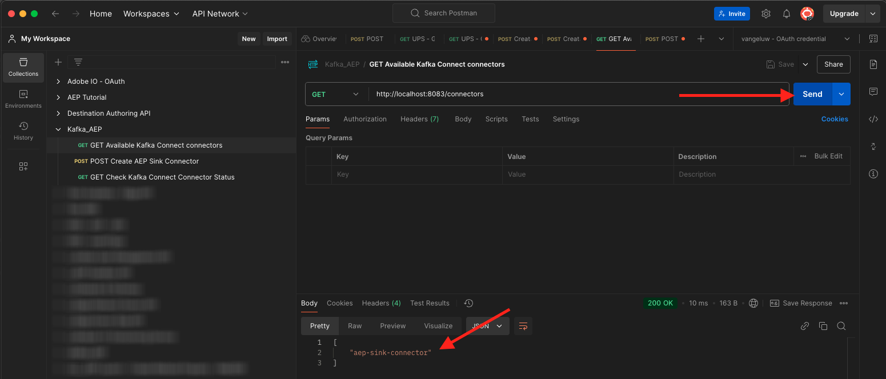

# 2.6.4安装和配置Kafka Connect和Adobe Experience Platform接收器连接器

## 下载Adobe Experience Platform接收器连接器

转到[https://github.com/adobe/experience-platform-streaming-connect/releases](https://github.com/adobe/experience-platform-streaming-connect/releases)并下载Adobe Experience Platform接收器连接器的最新正式版本。


下载文件&#x200B;**streaming-connect-sink-0.0.27-java-11.jar**。


将下载文件&#x200B;**streaming-connect-sink-0.0.27-java-11.jar**&#x200B;放在桌面上。


## 配置Kafka连接

转到桌面上名为&#x200B;**Kafka_AEP**&#x200B;的文件夹，然后导航到文件夹`kafka_2.13-3.9.0/config`。
在该文件夹中，使用任意文本编辑器打开文件**connect-distributed.properties**。


在文本编辑器中，转到第34和35行并确保将字段`key.converter.schemas.enable`和`value.converter.schemas.enable`设置为`false`

```json
key.converter.schemas.enable=false
value.converter.schemas.enable=false
```

保存对此文件所做的更改。


接下来，返回文件夹`kafka_2.13-3.1.0`并手动创建新文件夹并将其命名为`connectors`。


右键单击新文件夹，然后单击&#x200B;**在文件夹**&#x200B;新建终端。


你会看到这个。 输入命令`pwd`以检索该文件夹的完整路径。 选择完整路径并将其复制到剪贴板。


返回文本编辑器，转到文件&#x200B;**connect-distributed.properties**，然后向下滚动到最后一行（屏幕快照中的第89行）。 您应该取消注释以`#`开头的行（删除`# plugin.path=`），并且应该将完整路径粘贴到名为`connectors`的文件夹。 结果应类似于下面这样：

`plugin.path=/Users/woutervangeluwe/Desktop/Kafka_AEP/kafka_2.13-3.9.0/connectors`

保存对文件&#x200B;**connect-distributed.properties**&#x200B;所做的更改并关闭文本编辑器。


接下来，将下载到名为`connectors`的文件夹中的Adobe Experience Platform接收器连接器的最新正式版本复制。 您之前下载的文件名为&#x200B;**streaming-connect-sink-0.0.27-java-11.jar**，只需将其移到`connectors`文件夹中即可。


接下来，在&#x200B;**kafka_2.13-3.9.0**&#x200B;文件夹级别打开一个新的“终端”窗口。 右键单击该文件夹，然后单击&#x200B;**在文件夹**&#x200B;新建终端。

在“终端”窗口中，粘贴以下命令： `bin/connect-distributed.sh config/connect-distributed.properties`并单击&#x200B;**Enter**。 此命令将启动Kafka Connect并加载Adobe Experience Platform接收器连接器的库。


几秒钟后，您将会看到如下内容：


## 使用Postman创建Adobe Experience Platform接收器连接器

您现在可以使用Postman与Kafka Connect交互。 为此，请下载[此Postman收藏集](./../../../../assets/postman/postman_kafka.zip)并将其解压缩到桌面上的本地计算机。 然后，您将拥有一个名为`Kafka_AEP.postman_collection.json`的文件。


您需要在Postman中导入此文件。 为此，请打开Postman，单击&#x200B;**导入**，将文件`Kafka_AEP.postman_collection.json`拖放到弹出窗口中，然后单击&#x200B;**导入**。


然后，您可以在Postman的左侧菜单中找到此收藏集。 单击第一个请求&#x200B;**GET Available Kafka Connect连接器**&#x200B;以将其打开。


你会看到这个。 单击蓝色的&#x200B;**发送**&#x200B;按钮，之后您应该会看到空响应`[]`。 空响应是由于当前未定义Kafka Connect连接器。


要创建连接器，请单击以打开Kafka集合中的第二个请求，**POST创建AEP接收器连接器**，然后转到&#x200B;**正文**。 你会看到这个。 在第11行，上面显示“**”aep.endpoint“：”**，您需要将粘贴到您在上一个练习结束时收到的HTTP API流端点URL。 HTTP API流终结点URL如下所示： `https://dcs.adobedc.net/collection/63751d0f299eeb7aa48a2f22acb284ed64de575f8640986d8e5a935741be9067`。


粘贴后，请求正文应如下所示。 单击蓝色的&#x200B;**发送**&#x200B;按钮以创建您的连接器。 您的连接器创建操作会立即得到响应。


单击第一个请求&#x200B;**GET Available Kafka Connect连接器**&#x200B;以再次打开它，然后再次单击蓝色的&#x200B;**发送**&#x200B;按钮。 您现在将看到Kafka Connect连接器存在。



接下来，打开Kafka集合中的第三个请求，**GET检查Kafka连接连接器状态**。 单击蓝色的&#x200B;**发送**&#x200B;按钮，您将获得如下响应：连接器正在运行。


## 生成体验事件

打开一个新的&#x200B;**终端**&#x200B;窗口，方法是右键单击您的文件夹&#x200B;**kafka_2.13-3.9.0**，然后单击&#x200B;**位于文件夹的新终端**。


输入以下命令：

`bin/kafka-console-producer.sh --broker-list 127.0.0.1:9092 --topic aep`

你会看到这个。 按下Enter按钮后每行新内容都将导致新消息被发送到主题&#x200B;**aep**。


您现在可以发送消息，这最终会被Adobe Experience Platform接收器连接器占用，并且会实时将其摄取到Adobe Experience Platform中。

获取以下示例体验事件有效负载并将其复制到文本编辑器中。

```json
{
  "header": {
    "datasetId": "61fe23fd242870194a6d779c",
    "imsOrgId": "--aepImsOrgID--",
    "source": {
      "name": "Launch"
    },
    "schemaRef": {
      "id": "https://ns.adobe.com/experienceplatform/schemas/b0190276c6e1e1e99cf56c99f4c07a6e517bf02091dcec90",
      "contentType": "application/vnd.adobe.xed-full+json;version=1"
    }
  },
  "body": {
    "xdmMeta": {
      "schemaRef": {
        "id": "https://ns.adobe.com/experienceplatform/schemas/b0190276c6e1e1e99cf56c99f4c07a6e517bf02091dcec90",
        "contentType": "application/vnd.adobe.xed-full+json;version=1"
      }
    },
    "xdmEntity": {
      "eventType": "callCenterInteractionKafka",
      "_id": "",
      "timestamp": "2024-11-25T09:54:12.232Z",
      "_experienceplatform": {
        "identification": {
          "core": {
            "phoneNumber": ""
          }
        },
        "interactionDetails": {
          "core": {
            "callCenterAgent": {
              "callID": "Support Contact - 3767767",
              "callTopic": "contract",
              "callFeeling": "negative"
            }
          }
        }
      }
    }
  }
}
```

你会看到这个。 您需要手动更新2个字段：

- **_id**：请将其设置为类似`--aepUserLdap--1234`的随机id
- **timestamp**：将时间戳更新为当前日期和时间
- **phoneNumber**：输入之前在演示网站上创建的帐户的phoneNumber。 您可以在“配置文件查看器”面板的&#x200B;**标识**&#x200B;下找到它。

您还需要检查并可能更新以下字段：

- **datasetId**：您需要复制数据集演示系统的数据集ID — 呼叫中心的事件数据集(Global v1.1)


- **imsOrgID**：您的IMS组织ID为`--aepImsOrgId--`

>[!NOTE]
>
>字段&#x200B;**_id**&#x200B;对于每次数据引入都必须是唯一的。 如果您生成多个事件，请确保每次将字段&#x200B;**_id**&#x200B;更新为新的唯一值。

然后，您应该具有如下内容：


接下来，将完整的体验事件复制到剪贴板。 需要去除JSON有效负载的空格，我们将使用在线工具来去除空格。 转到[https://jsonviewer.stack.hu/](https://jsonviewer.stack.hu/)以执行该操作。

将您的体验事件粘贴到编辑器中，然后单击&#x200B;**删除空格**。


接下来，选择所有输出文本并将其复制到剪贴板。


返回到“终端”窗口。


将不带空格的新有效负载粘贴到“终端”窗口中，然后单击&#x200B;**Enter**。


接下来，返回您的演示网站并刷新页面。 您现在应会在&#x200B;**体验事件**&#x200B;下的个人资料中看到一个体验事件，如下所示：


>[!NOTE]
>
>如果希望呼叫中心交互显示在配置文件查看器面板上，则需要在[https://dsn.adobe.com](https://dsn.adobe.com)上的项目中添加以下标签和过滤器，方法是转到选项卡&#x200B;**配置文件查看器**&#x200B;并在&#x200B;**事件**&#x200B;下添加一个新行，其中包含以下变量：
>- **事件类型标签**：呼叫中心交互
>- **事件类型筛选器**： callCenterInteractionKafka
>- **标题**： `--aepTenantId--.interactionDetails.core.callCenterAgent.callID`


您已完成此练习。

## 后续步骤

返回到[将数据从Apache Kafka流式传输到Adobe Experience Platform](./aep-apache-kafka.md){target="_blank"}

返回[所有模块](./../../../../overview.md){target="_blank"}
