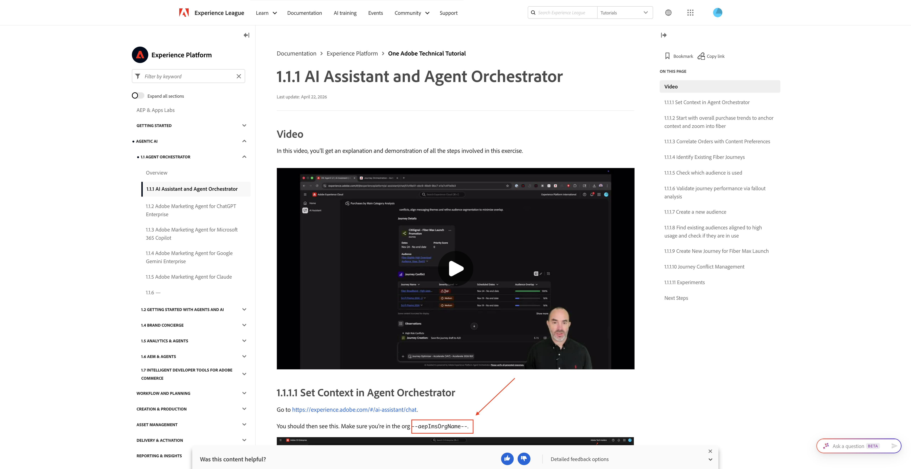
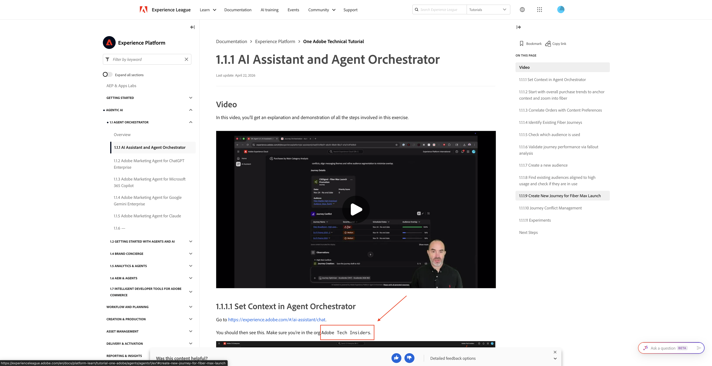
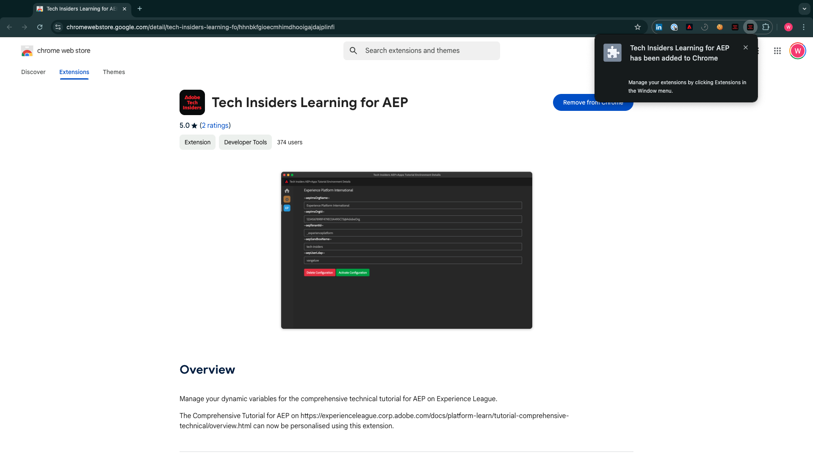

# 安装适用于Experience League文档的Chrome扩展

## 关于Chrome扩展

本教程已变得通用，任何人都可以使用任何Adobe Experience Cloud实例轻松重复使用。

为了使文档可重用，在教程中引入了&#x200B;**环境变量**，这意味着您将在文档中找到以下&#x200B;**占位符**。 每个占位符都是适用于特定环境的特定变量，Chrome扩展会更改该变量，以便您轻松地从教程页面复制代码和文本，并将其粘贴到教程中使用的各种用户界面中。

此类值的示例如下所示。 目前，这些值尚无法使用，但一旦您安装和激活Chrome扩展，就会看到这些变量变为可供复制和重用的普通文本。

| 名称 | 键 | 示例 |
|:-------------:| :---------------:| :---------------:|
| IMS 组织 ID | `--aepImsOrgId--` | `907075E95BF479EC0A495C73@AdobeOrg` |
| IMS组织名称 | `--aepImsOrgName--` | `Adobe Tech Insiders` |
| AEP租户ID | `--aepTenantId--` | `_experienceplatform` |
| AEP沙盒名称 | `--aepSandboxName--` | `one-adobe` |
| 学习者配置文件LDAP | `--aepUserLdap--` | `vangeluw` |

例如，在以下屏幕截图中，您可以看到对`aepImsOrgName`的引用。

安装扩展后，该文本将自动更改以反映实例特定的值。

## 安装Chrome扩展

要安装该Chrome扩展，请打开Chrome浏览器，然后转到： [https://chromewebstore.google.com/detail/tech-insiders-learning-fo/hhnbkfgioecmhimdhooigajdajplinfi](https://chromewebstore.google.com/detail/tech-insiders-learning-fo/hhnbkfgioecmhimdhooigajdajplinfi){target="_blank"}。 你会看到这个。

单击&#x200B;**添加到Chrome**。

你会看到这个。 单击&#x200B;**添加扩展**。

随后将安装扩展，您会看到一条类似通知。

在&#x200B;**扩展**&#x200B;菜单中，单击&#x200B;**拼图块**&#x200B;图标，并将&#x200B;**Platform Learn - Configuration**&#x200B;扩展固定到扩展菜单。

## 配置Chrome扩展

转到[https://experienceleague.adobe.com/en/docs/platform-learn/tutorial-comprehensive-technical/overview](https://experienceleague.adobe.com/en/docs/platform-learn/tutorial-comprehensive-technical/overview){target="_blank"}，然后单击扩展图标以将其打开。

然后您会看到此弹出窗口。 单击&#x200B;**+**&#x200B;图标。

输入如下所示的值，这些值都与您的Adobe Experience Platform实例相关。

如果您正在参加以下活动之一，请使用如下所示的值。

| 名称 | 新奥尔良合作伙伴技术实验室 | 技术业内人士现场研讨会 | 技术内部人员按需支持 |
|:-------------:| :---------------:| :---------------:|:---------------:|
| IMS 组织 ID | `907075E95BF479EC0A495C73@AdobeOrg` | `907075E95BF479EC0A495C73@AdobeOrg` | `0B6930256441790E0A495FFE@AdobeOrg` |
| IMS组织名称 | `Adobe Tech Insiders` | `Adobe Tech Insiders` | `CXO Enablement Training LAB` |
| AEP租户ID | `_experienceplatform` | `_experienceplatform` | `_acsultimatesupport` |
| AEP沙盒名称 | `one-adobe` | `one-adobe` | `one-adobe` |
| 学习者配置文件LDAP | `XXX` | `XXX` | `XXX` |

**您的学习者个人资料LDAP**

该用户名将在本教程中使用。 在此示例中，LDAP基于此用户的电子邮件地址。 如果电子邮件地址为&#x200B;**vangeluw@adobe.com**，则LDAP将变为&#x200B;**vangeluw**。

如果您正在参加新奥尔良的合作伙伴技术实验室活动，请应用相同的逻辑并使用电子邮件地址的第一部分作为LDAP。

LDAP用于确保您即将执行的配置将链接到您，并且不会与您正在使用的同一实例和沙盒的其他用户发生冲突。

您的值应当类似于以下内容。
最后，单击**新建**。

在扩展的左侧菜单中，您现在将看到一个包含环境缩写的新图标。 单击它。 然后，您将看到&#x200B;**环境变量**&#x200B;与您的特定Adobe Experience Platform实例值之间的映射。 单击&#x200B;**激活配置**。

激活配置后，您将在环境的首字母缩写旁看到一个绿色圆点。 这意味着您的环境现在处于活动状态。

## 验证教程内容

作为测试，请转到[此页面](https://experienceleague.adobe.com/en/docs/platform-learn/tutorial-one-adobe/agents/agents1/ex1){target="_blank"}。

您现在应该会看到，根据Chrome扩展中激活的环境，此页面上的所有&#x200B;**环境变量**&#x200B;都已替换为其真值。

您现在应具有类似于下面的视图，其中环境变量`aepSandboxName`已被您的实际AEP沙盒名称（在本例中为&#x200B;**one-adobe**）替换。

## 后续步骤

转到[要安装的应用程序](./ex2.md){target="_blank"}

返回[快速入门 — 代理AI](./getting-started-agentic-ai.md){target="_blank"}

返回[所有模块](./../../../overview.md){target="_blank"}
