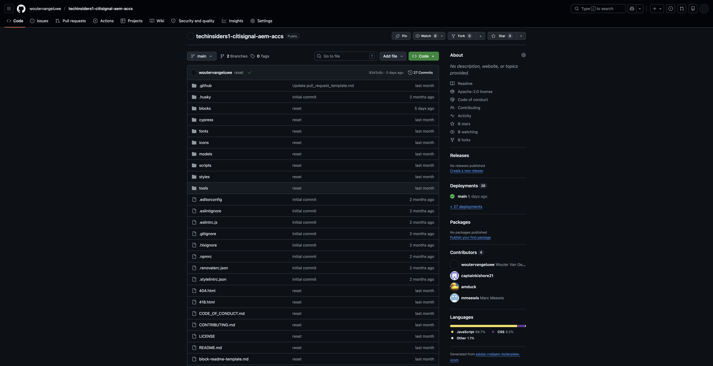
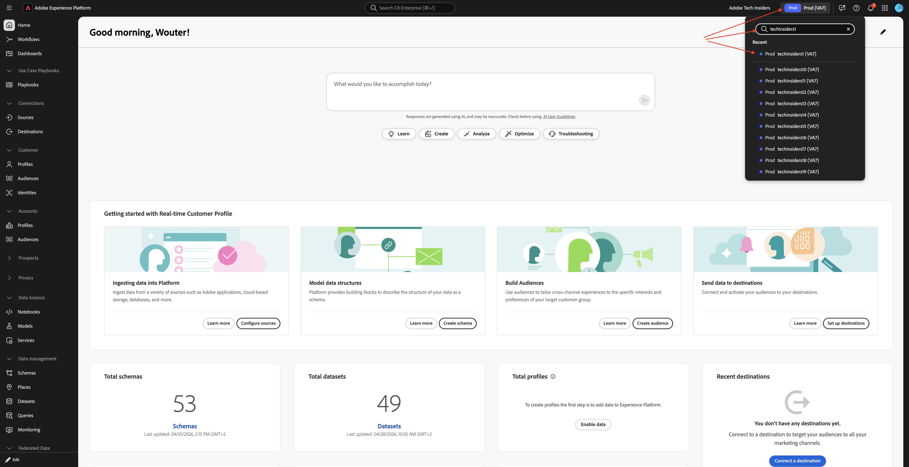

# 使用您的AEM网站和AEP沙盒

在参加Agentic AI技术实验室时，您将使用使用Edge Delivery Services的现有AEM as a Cloud Service项目。 这个使用Edge Delivery Services的AEM as a Cloud Service计划已经为您创建，并且已在技术实验室开始时可用。

## 您的号码

当您访问启用环境时，会为您分配一个编号。 此数字表示您需要使用哪个AEM as a Cloud Service程序，它还表示您需要为Brand Concierge技术实验室使用哪个AEP沙盒。

>[!IMPORTANT]
>
>如果您尚未收到此电子邮件，则无法执行以下步骤。 您需要等到收到以下电子邮件之后才能访问以下Adobe应用程序。

## 您的AEM项目

>[!NOTE]
>
>以下所有屏幕截图都使用数字1仅供说明之用。 在执行以下步骤时，您需要使用分配给您的编号作为您收到的电子邮件的一部分。

您的AEM程序会使用其名称中分配给您的编号。 您的AEM项目的名称应为：

- **技术内部人士 — AEM + ACCS X**，其中X代表分配给您的数字。

您可以通过转到[https://experience.adobe.com/cloud-manager/landing.html](https://experience.adobe.com/cloud-manager/landing.html)来访问和查找您的AEM程序。 请确保选择的环境为&#x200B;**`--aepImsOrgName--`**，您可以在屏幕的右上角对此进行验证。

### 解除您的AEM项目休眠

使用的AEM程序是一个“沙盒”程序。 AEM沙盒将在几小时未使用后自动休眠，这意味着您需要在使用沙盒之前解除这些沙盒的休眠。 若要解除程序休眠，请转到[https://experience.adobe.com/cloud-manager/landing.html](https://experience.adobe.com/cloud-manager/landing.html)。 单击以打开您的项目。

您应该会看到此内容。 单击3个点&#x200B;**...**，然后选择&#x200B;**解除休眠**。

单击&#x200B;**提交**。 解除休眠需要10-15分钟。

### AEM项目的GitHub存储库

每个AEM程序都使用Edge Delivery Services来部署您的网站。 这意味着网站的代码托管在GitHub存储库中。 已为您创建GitHub存储库，可通过以下位置访问：

**https://github.com/woutervangeluwe/techinsidersX-citisignal-aem-accs**，必须将X替换为您的号码。

您的GitHub存储库应当如下所示。

作为技术实验室课程开始之前的入门培训流程的一部分，您需要提供GitHub用户名。 通过提供GitHub用户名，您将作为协作者添加到附加到您网站的GitHub存储库中，以便您可以对其进行更改。

### 访问您的网站

要访问您的网站，您可以使用以下默认URL：

- **https://main--techinsidersX-citisignal-aem-accs--woutervangeluwe.aem.page/**
- **https://main--techinsidersX-citisignal-aem-accs--woutervangeluwe.aem.live/**

您需要使用分配给您的编号来替换这些URL中的X。

此外，还为每个网站创建了一个自定义域名，您可以使用此URL访问该域名：

- **https://techinsidersX.adobedemosystem.com/**

您需要使用分配给您的编号来替换这些URL中的X。

然后，您应该能够看到您的网站，它类似于下图：

## 您的AEP沙盒

>[!NOTE]
>
>以下所有屏幕截图都使用数字1仅供说明之用。 在执行以下步骤时，您需要使用分配给您的编号作为您收到的电子邮件的一部分。

对于Brand Concierge技术实验室，您需要使用特定的AEP沙盒。 此AEP沙盒的名称为： **techinsidersX**，您需要使用分配给您的编号替换X。

转到[https://platform.adobe.com](https://platform.adobe.com)。 在屏幕右上角，打开下拉菜单以选择沙盒。

您只需将此沙盒用于Brand Concierge技术实验室。

## 后续步骤

返回[快速入门 — 代理AI](./getting-started-agentic-ai.md){target="_blank"}

返回[所有模块](./../../../overview.md){target="_blank"}./images
