# 选项1：使用Postman

>[!IMPORTANT]
>
>如果您是Adobe员工，请按照说明[安装PostBuster](./ex4.md){target="_blank"}！

## 视频

在本视频中，您将获得本练习涉及的所有步骤的解释和演示。

>[!VIDEO](https://video.tv.adobe.com/v/3476495?quality=12&learn=on)

## Postman环境下载

转到[https://developer.adobe.com/console/home](https://developer.adobe.com/console/home){target="_blank"}并打开您的项目。

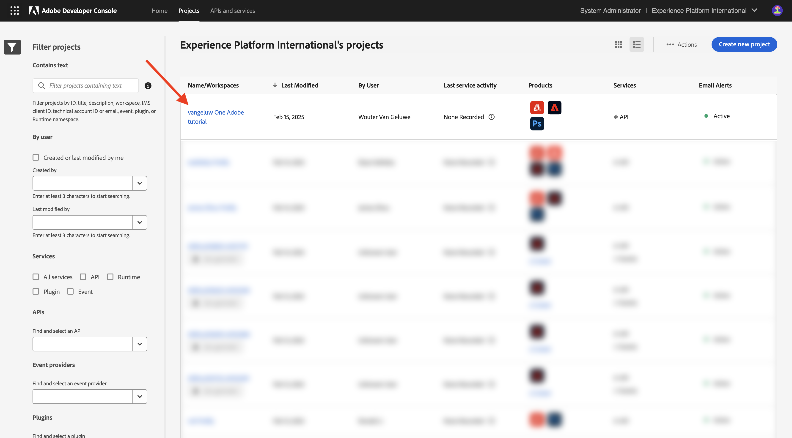

单击&#x200B;**Firefly - Firefly Services** API。 然后，单击&#x200B;**下载Postman**&#x200B;并选择&#x200B;**OAuth服务器到服务器**&#x200B;以下载Postman环境。

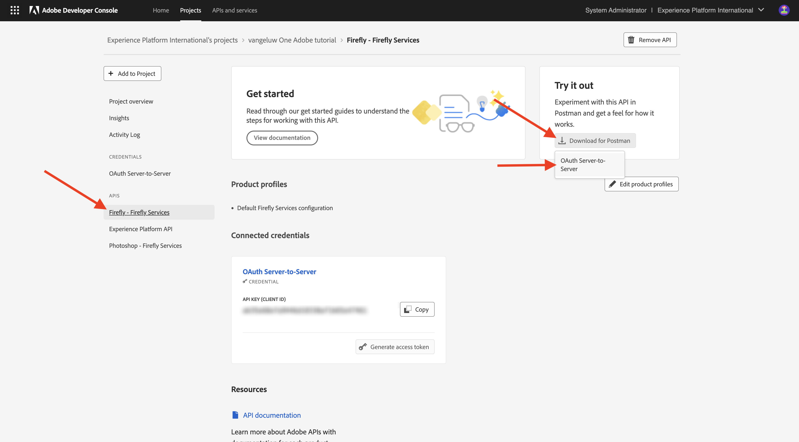

## Postman对Adobe I/O的身份验证

在[Postman下载](https://www.postman.com/downloads/){target="_blank"}上下载并安装适用于您的操作系统的相关Postman版本。

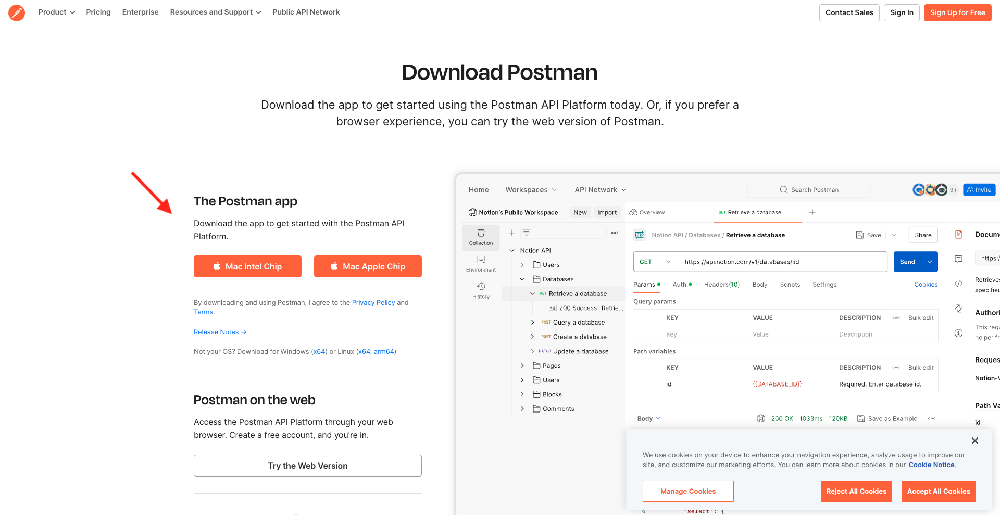

启动应用程序。

在Postman中，有2个概念：环境和收藏集。

环境文件包含所有比较一致或不太一致的环境变量。 在该环境中，您可以找到Adobe环境的IMSOrg等内容，以及客户端ID和其他安全凭据。 您之前在Adobe I/O设置过程中下载了名为&#x200B;**`oauth_server_to_server.postman_environment.json`**&#x200B;的环境文件。

收藏集包含大量您可以使用的API请求。 您将使用以下收藏集：

- 1个集合用于对Adobe I/O进行身份验证
- 1本单元中Adobe Firefly服务练习的收藏集
- 1本模块中的Adobe Frame.io V4练习的收藏集

Download [postman-ff.zip](./../../../assets/postman/postman-ff.zip){target="_blank"} to your local desktop.

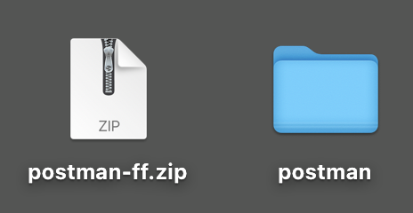

In **postman-ff.zip** file are the following files:

- `Adobe IO - OAuth.postman_collection.json`
- `FF - Firefly Services Tech Insiders.postman_collection.json`
- `Frame.io V4 - Tech Insiders.postman_collection.json`

Unzip **postman-ff.zip** and store the following files in a folder on your desktop:

- `Adobe IO - OAuth.postman_collection.json`
- `FF - Firefly Services Tech Insiders.postman_collection.json`
- `Frame.io V4 - Tech Insiders.postman_collection.json`
- `oauth_server_to_server.postman_environment.json`

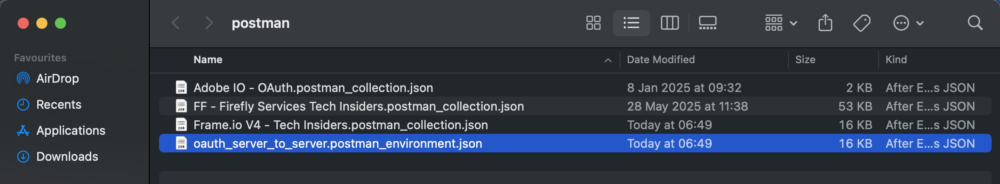

In Postman, select **Import**.

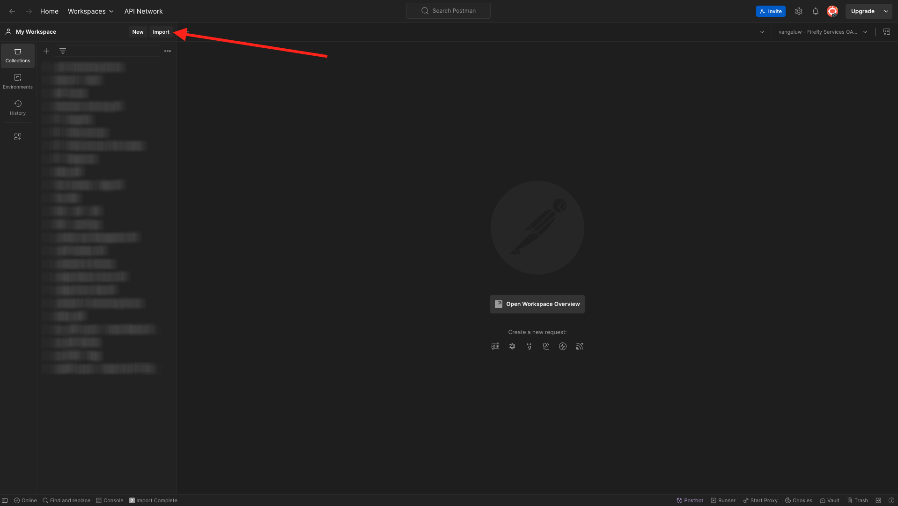

Select **Files**.

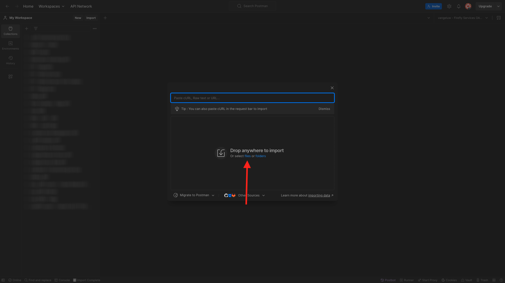

Choose all the files from the folder, then select **Open** and **Import**.

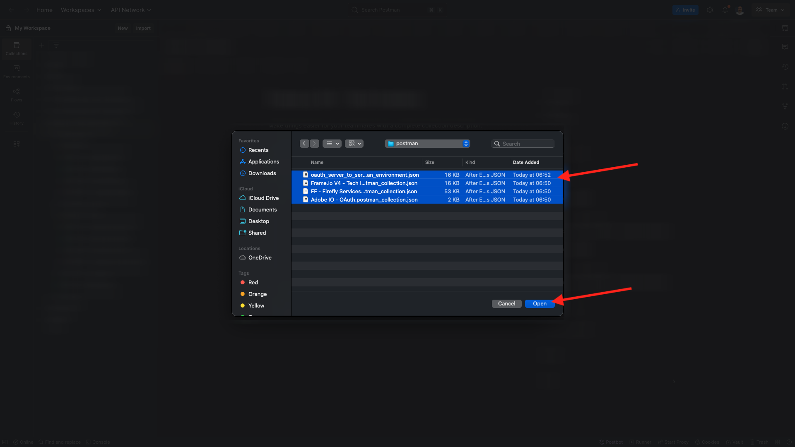

单击&#x200B;**导入**。

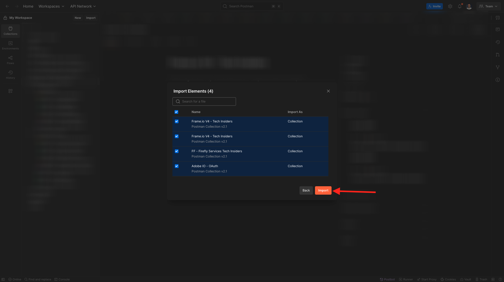

Now you have everything you need in Postman to start interacting with Firefly Services through the APIs.

## Request an access token

Next, to make sure you&#39;re properly authenticated, you need to request an access token.

Make sure that you&#39;ve got the right environment selected before executing any request by verifying the Environment-dropdown list in the top right corner. The selected Environment should have a name similar to this one, `--aepUserLdap-- One Adobe OAuth Credential`.

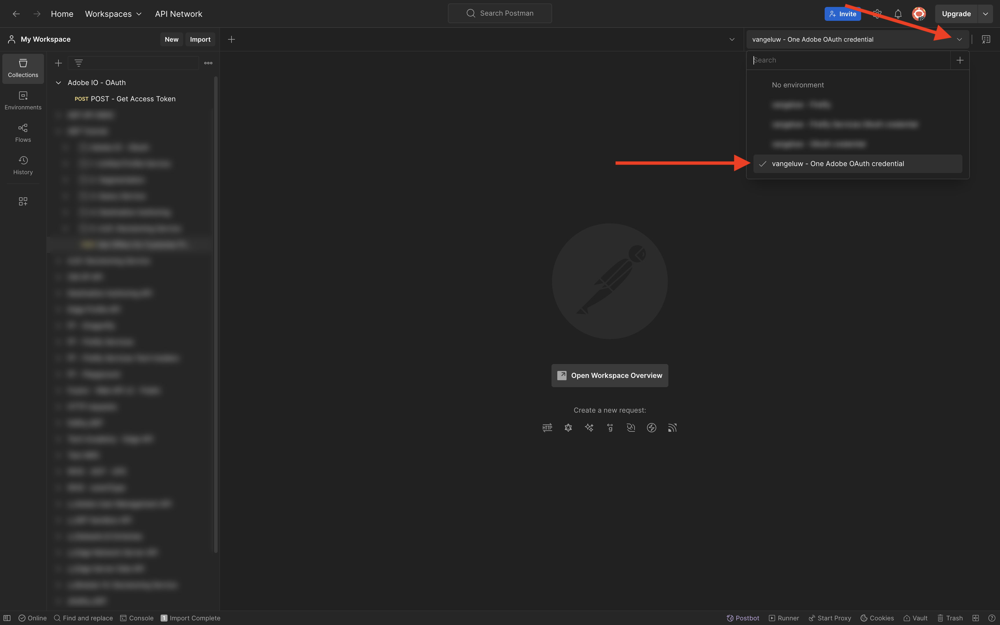

The selected Environment should have a name similar to this one, `--aepUserLdap-- One Adobe OAuth Credential`.

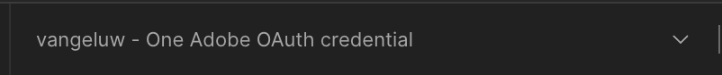

Now that your Postman environment and collections are configured and working, you can authenticate from Postman to Adobe I/O.

In the **Adobe IO - OAuth** collection, select the request named **POST - Get Access Token** and select **Send**.

Notice under **Query Params**, two variables are referenced, `API_KEY` and `CLIENT_SECRET`. These variables are taken from the selected environment, `--aepUserLdap-- One Adobe OAuth Credential`.

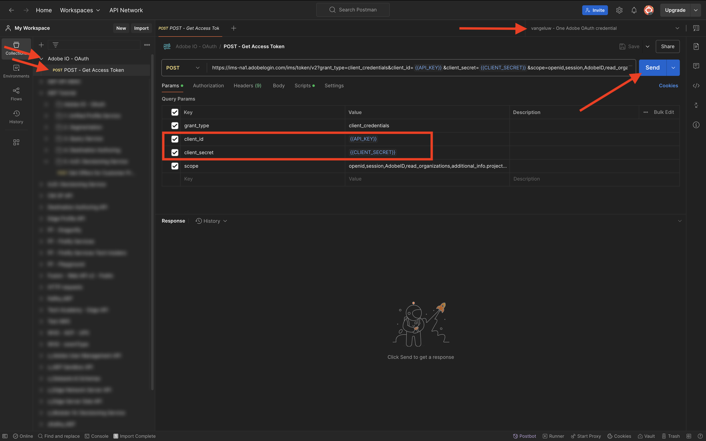

如果成功，将在Postman的&#x200B;**正文**&#x200B;部分中显示一个包含持有者令牌、访问令牌和到期窗口的响应。

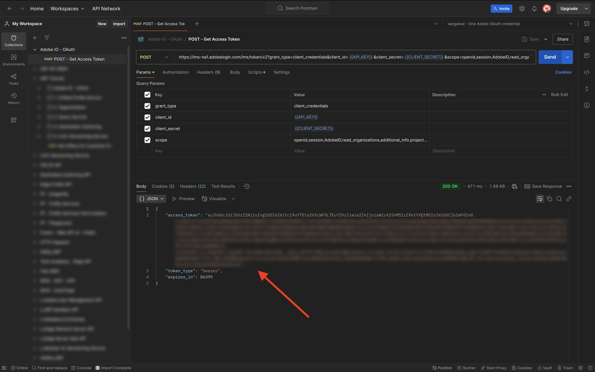

您应会看到包含以下信息的类似响应：

| 键 | 值 |
|:-------------:| :---------------:|
| token_type | **持有人** |
| access_token | **eyJhbGciOiJSUz...** |
| expires_in | **86399** |

Adobe I/O **bearer-token**&#x200B;具有特定值（非常长的access_token）和到期窗口，现在有效期为24小时。 这意味着24小时后，如果您要使用Postman与Adobe API交互，则必须通过再次运行此请求来生成新令牌。

您的Postman环境现已配置完毕，可正常使用。

## 后续步骤

转到[要安装的应用程序](./ex5.md){target="_blank"}

返回[快速入门 — GenStudio](./getting-started-genstudio.md){target="_blank"}

返回[所有模块](./../../../overview.md){target="_blank"}
