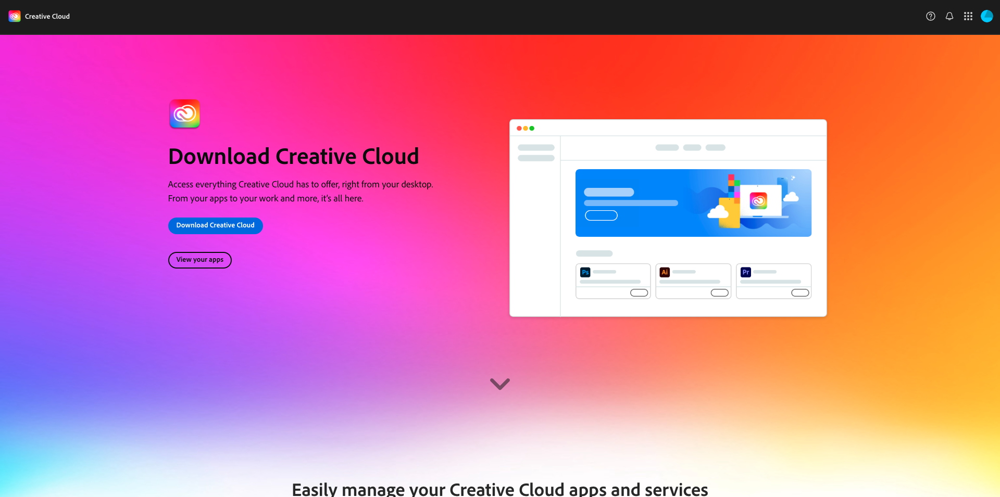
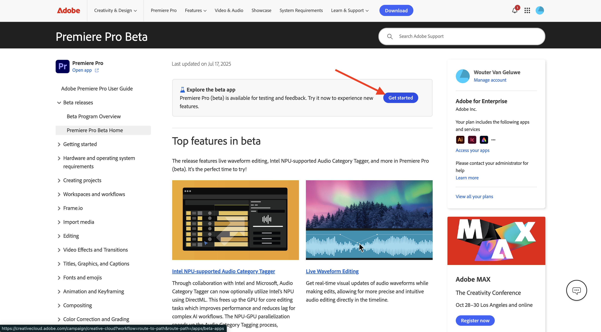
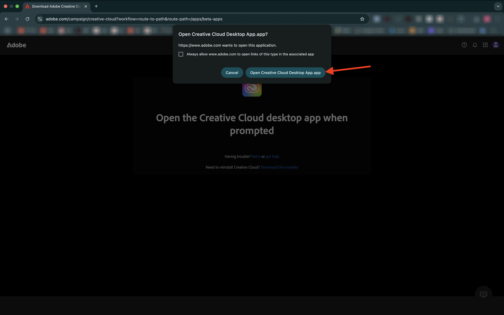
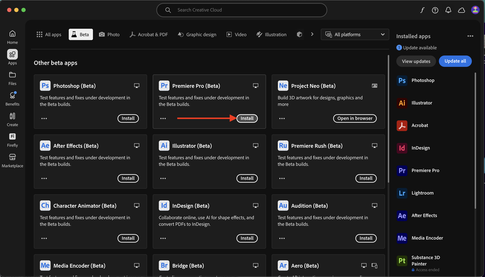
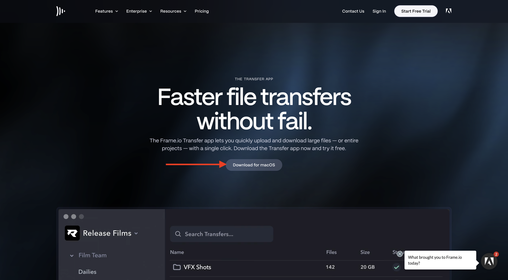
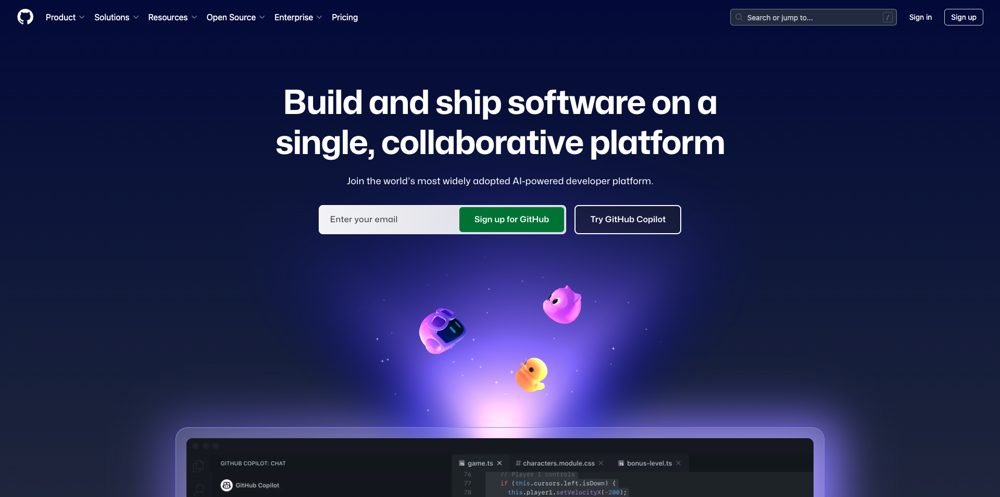
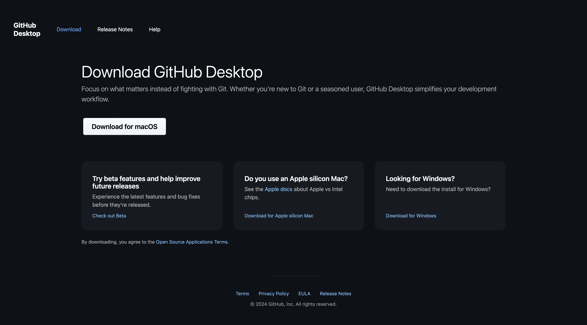
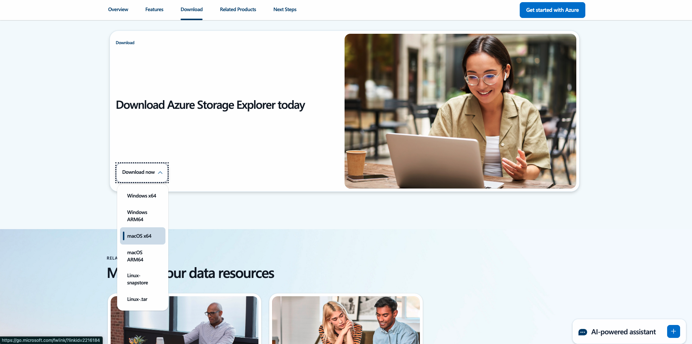

# 要安装的应用程序

以下是启动本教程之前需要在计算机上安装的应用程序概述。

## Adobe Creative Cloud

Go to [https://creativecloud.adobe.com/apps/download/creative-cloud](https://creativecloud.adobe.com/apps/download/creative-cloud){target="_blank"}.

## Adobe Photoshop

打开&#x200B;**Adobe Creative Cloud**&#x200B;应用，转到&#x200B;**应用**。 在计算机上安装Photoshop。

## Adobe Illustrator

打开&#x200B;**Adobe Creative Cloud**&#x200B;应用，转到&#x200B;**应用**。 Install Illustrator on your computer.

## Adobe Premiere Pro

Install Adobe Premiere Pro Beta version on your computer from [https://helpx.adobe.com/premiere-pro/using/premiere-pro-beta.html](https://helpx.adobe.com/premiere-pro/using/premiere-pro-beta.html)

单击&#x200B;**打开Creative Cloud桌面应用程序**。

在&#x200B;**Premiere Pro (Beta)**&#x200B;应用的卡片上单击&#x200B;**安装**。

## Frame.io传输应用程序

转到[https://frame.io/transfer](https://frame.io/transfer)并下载计算机的版本。

## Visual Studio代码

转到[https://code.visualstudio.com/](https://code.visualstudio.com/){target="_blank"}，下载并安装&#x200B;**Visual Studio Code**。

## 文本编辑器

如果您没有文本编辑器应用程序，则可以转到[https://www.sublimetext.com/](https://www.sublimetext.com/){target="_blank"}并下载和安装此文本编辑器。

## GitHub帐户

如果您还没有GitHub帐户，请转到[https://github.com/](https://github.com/){target="_blank"}，然后单击&#x200B;**注册**。 使用您的个人电子邮件地址并创建您的帐户。

## GitHub Desktop

转到[https://desktop.github.com/download/](https://desktop.github.com/download/){target="_blank"}，下载并安装&#x200B;**Github Desktop**。

## Azure存储资源管理器

[下载Microsoft Azure Storage Explorer以管理文件](https://azure.microsoft.com/en-us/products/storage/storage-explorer#Download-4){target="_blank"}。 为您的特定操作系统选择正确的版本，然后下载并安装该版本。

{zoomable="yes"}

您现在已完成入门模块。

## 后续步骤

返回[快速入门 — GenStudio](./getting-started-genstudio.md){target="_blank"}

返回[所有模块](./../../../overview.md){target="_blank"}./images
