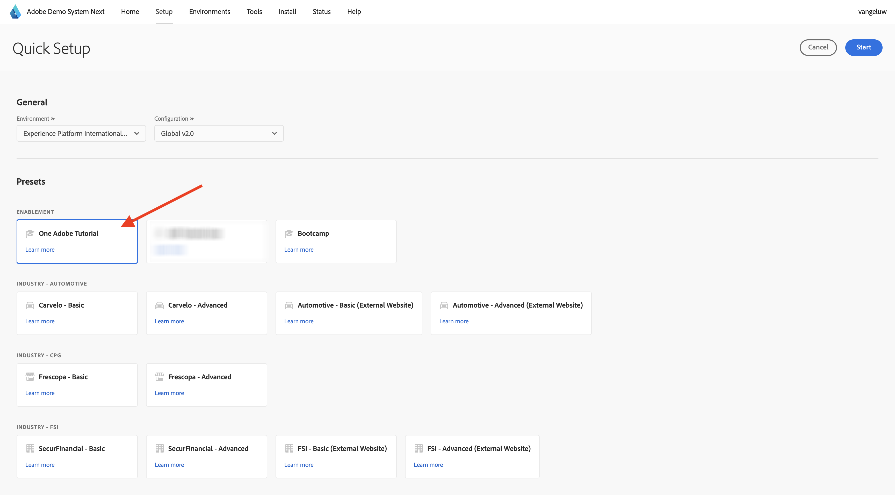
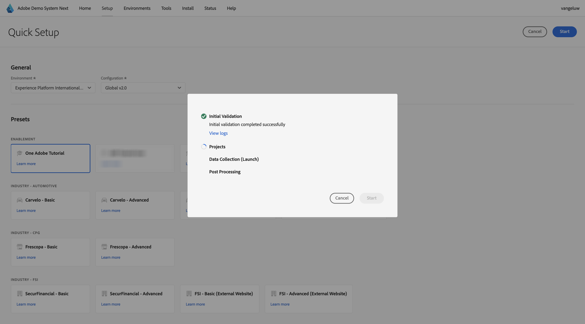

# 使用Demo System Next设置您的Adobe Experience Platform数据收集客户端资产

为了可视化本教程中的学习内容并使您能够在安全的环境中测试您的配置，本教程正在使用Adobe的Demo System Next工具。 为了充分利用本教程，需要将AEP实例配置为与演示系统下一步集成。

获得演示系统访问权限后，请继续执行以下步骤。

转到[https://dsn.adobe.com/](https://dsn.adobe.com/)并导航到&#x200B;**安装程序**。

在&#x200B;**环境**&#x200B;下拉列表中，选择您的AEP实例和沙盒。

接下来，选择预设&#x200B;**AEP教程用户**。

接下来，单击&#x200B;**开始**。

在弹出窗口中，输入数据收集属性和Experience Builder项目的名称。 请使用此命名约定：**一个Adobe (DD/MM/YYYY)**。 仅供参考：您的LDAP将自动附加，您无需自行添加。

单击&#x200B;**开始**。

然后，您会看到此弹出窗口，其中显示创建网站和移动应用程序项目以及数据收集属性时的进度。

完成快速设置过程后，您将拥有：

- 1个web项目，因此可以使用带有telco演示品牌的演示网站
- 1个移动应用程序项目，因此可以将演示移动应用程序与电信演示品牌结合使用
- 1个CX App项目，因此可以使用带有telco演示品牌的呼叫中心应用程序
- 1个用于Web的数据收集属性，您将使用该属性从网站收集数据
- 1个用于移动设备的数据收集属性，您将使用该属性从移动设备应用程序中收集数据

在后续步骤中根据需要保持此屏幕打开。

## 后续步骤

转到[创建您的数据流](./ex3.md)

返回[开始使用](./getting-started.md){target="_blank"}

返回[所有模块](./../../../overview.md){target="_blank"}