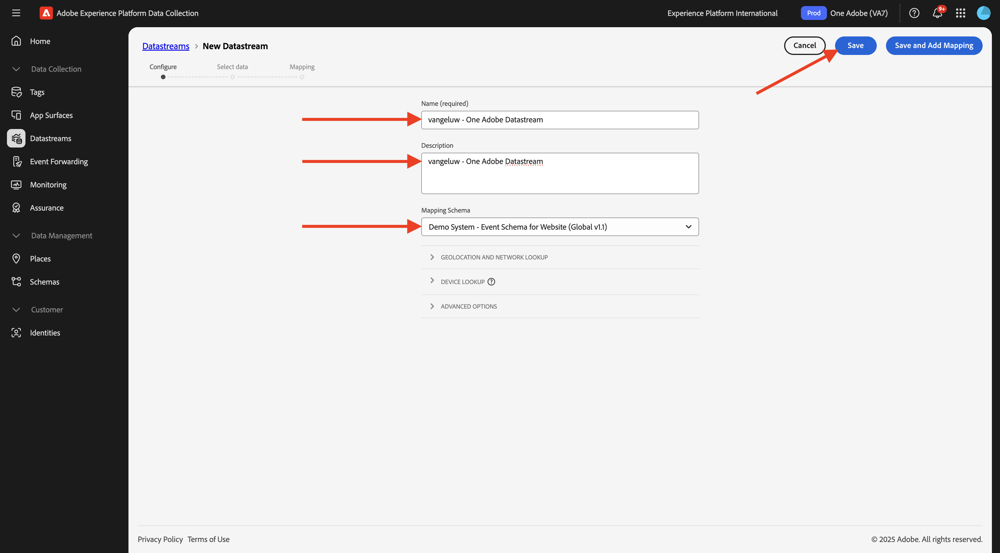
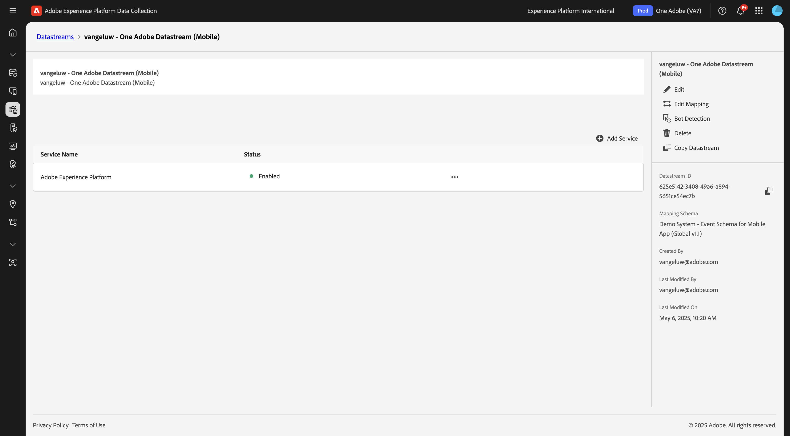
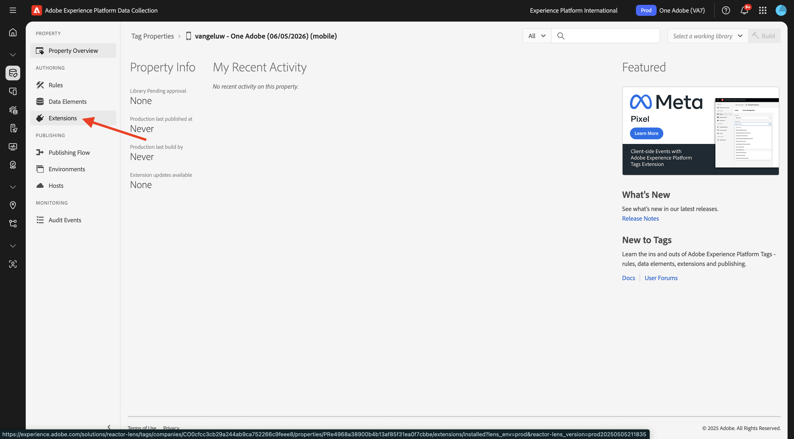
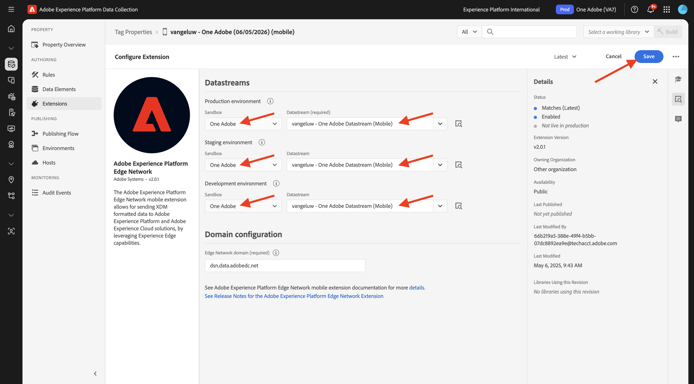
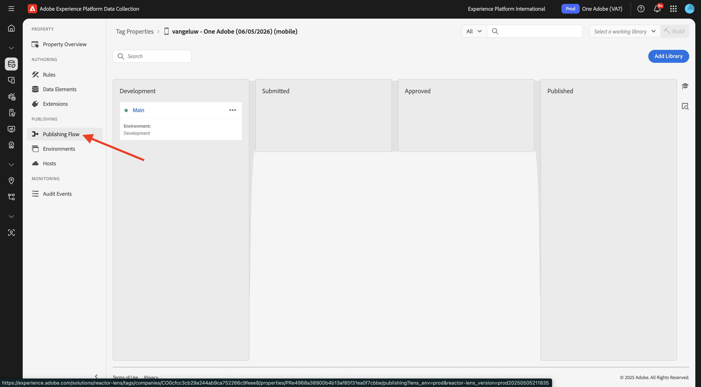
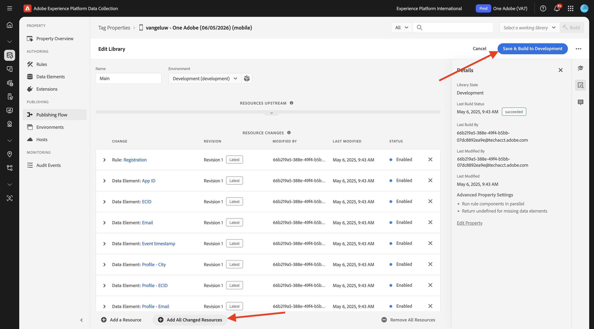

# 创建数据流

转到[https://experience.adobe.com/#/data-collection/](https://experience.adobe.com/#/data-collection/)。

在左侧菜单中，单击&#x200B;**[!UICONTROL 标记]**。 在上一个练习之后，您现在拥有3个数据收集属性：一个用于Web、一个用于移动设备，一个用于CX应用程序。

这些属性几乎已准备就绪，可以使用，但在使用这些属性开始收集数据之前，您需要设置数据流。 您将在数据收集模块的后续练习中，获得有关什么是数据流及其含义的更多信息。

目前，请按照以下步骤操作。

## 为Web创建数据流

单击&#x200B;**[!UICONTROL 数据流]**。

在屏幕右上角，选择沙盒名称，应为`--aepSandboxName--`。

单击&#x200B;**[!UICONTROL 新建数据流]**。

对于&#x200B;**[!UICONTROL Name]**，对于可选描述，请输入`--aepUserLdap-- - One Adobe Datastream`。 对于&#x200B;**映射架构**，请选择&#x200B;**演示系统 — 网站(Global v1.1)**&#x200B;的事件架构。 单击&#x200B;**保存**。

你会看到这个。 单击&#x200B;**添加服务**。

选择将公开其他字段的服务&#x200B;**[!UICONTROL Adobe Experience Platform]**。 你会看到这个。

对于事件数据集，请选择&#x200B;**Demo System - Event Dataset for Website (Global v1.1)**；对于配置文件数据集，请选择&#x200B;**Demo System - Profile Dataset for Website (Global v1.1)**。 单击&#x200B;**保存**。

您现在将看到此内容。

在左侧菜单中，单击&#x200B;**[!UICONTROL 标记]**。

筛选搜索结果以查看您的数据收集属性。 通过单击&#x200B;**Web**&#x200B;的属性将其打开。

你会看到这个。 单击&#x200B;**扩展**。

首先，单击Adobe Experience Platform Web SDK扩展，然后单击&#x200B;**配置**。

你会看到这个。 请查看&#x200B;**数据流**&#x200B;菜单并确保选择了正确的沙盒，在这种情况下，应选择`--aepSandboxName--`。

打开&#x200B;**数据流**&#x200B;下拉列表，然后选择您之前创建的数据流。

确保在全部三个不同的环境中都选择了您的&#x200B;**数据流**。 然后，单击&#x200B;**保存**。

转到&#x200B;**发布流**。

单击&#x200B;**主要**&#x200B;的&#x200B;**...**，然后单击&#x200B;**编辑**。

单击&#x200B;**添加所有更改的资源**，然后单击&#x200B;**保存并生成以进行开发**。

您的更改现已发布，几分钟后即可准备就绪，之后您会看到&#x200B;**Main**&#x200B;旁边的绿色圆点。

## 为移动设备创建数据流

转到[https://experience.adobe.com/#/data-collection/](https://experience.adobe.com/#/data-collection/)。

单击&#x200B;**[!UICONTROL 数据流]**。

在屏幕右上角，选择沙盒名称，应为`--aepSandboxName--`。

单击&#x200B;**[!UICONTROL 新建数据流]**。

对于&#x200B;**[!UICONTROL 友好名称]**&#x200B;和可选描述，请输入`--aepUserLdap-- - One Adobe Datastream (Mobile)`。 对于&#x200B;**映射架构**，请选择&#x200B;**演示系统 — 移动应用程序的事件架构(Global v1.1)**。 单击&#x200B;**保存**。

单击&#x200B;**[!UICONTROL 保存]**。

你会看到这个。 单击&#x200B;**添加服务**。

选择将公开其他字段的服务&#x200B;**[!UICONTROL Adobe Experience Platform]**。 你会看到这个。

对于事件数据集，请选择&#x200B;**演示系统 — 移动设备应用程序的事件数据集(Global v1.1)**；对于配置文件数据集，请选择&#x200B;**演示系统 — 移动设备应用程序的配置文件数据集(Global v1.1)**。 单击&#x200B;**保存**。

你会看到这个。

您的数据流现已准备就绪，可用于移动设备的Adobe Experience Platform数据收集客户端资产。

转到&#x200B;**标记**&#x200B;并筛选搜索结果以查看您的两个数据收集属性。 通过单击&#x200B;**移动设备**&#x200B;的属性将其打开。

你会看到这个。 单击&#x200B;**扩展**。

单击&#x200B;**Adobe Experience Platform Edge Network**&#x200B;扩展，然后单击&#x200B;**配置**。

你会看到这个。 现在，您需要选择刚刚配置的正确沙盒和数据流。 要使用的沙盒是`--aepSandboxName--`，数据流名为`--aepUserLdap-- - Demo System Datastream (Mobile)`。

对于&#x200B;**Edge Network域**，请使用默认域。

单击&#x200B;**保存**&#x200B;以保存更改。

转到&#x200B;**发布流**。

单击&#x200B;**Main**&#x200B;旁边的&#x200B;**...**，然后单击&#x200B;**编辑**。

单击&#x200B;**添加所有更改的资源**，然后单击&#x200B;**保存并生成以进行开发**。

您的更改现已发布，几分钟后即可准备就绪，之后您会看到&#x200B;**Main**&#x200B;旁边的绿色圆点。

## 后续步骤

转到[使用网站](./ex4.md)

返回[开始使用](./getting-started.md){target="_blank"}

返回[所有模块](./../../../overview.md){target="_blank"}