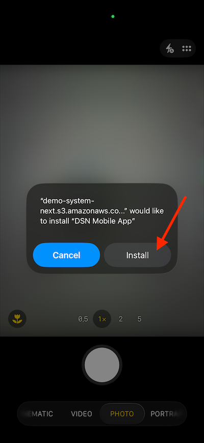
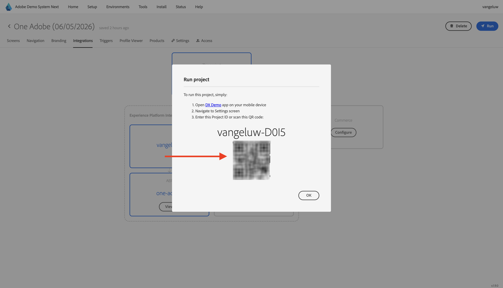

# 使用移动应用程序

## 下载应用程序

在计算机上转到[https://dsn.adobe.com/install](https://dsn.adobe.com/install){target="_blank"}，然后转到&#x200B;**Beta版本**。 使用您的Adobe ID登录，您随后将看到此信息。

使用智能手机上的&#x200B;**摄像头**&#x200B;应用为你的设备操作系统安装移动应用。 对于此支持，您需要安装使用Adobe Experience Platform Mobile SDK的&#x200B;**0.6.1**（或更高版本）。

>[!NOTE]
>
>在iOS设备上首次安装应用程序后，在尝试打开应用程序时可能会收到一条错误消息，显示：**不受信任的企业开发人员**。 要解决此问题，您需要转到&#x200B;**设置>常规> VPN和设备管理> Adobe Systems Inc.**，然后单击&#x200B;**信任Adobe Systems Inc.**。

扫描此二维码后，选择&#x200B;**安装**。

安装应用程序后，您将在设备的主屏幕上找到该应用程序。 单击图标以打开应用程序。

登录后，您将看到一条通知，请求您发送通知的权限。 我们将在本教程中发送通知，因此请单击&#x200B;**允许**。

然后，您将看到该应用程序的主页。 转到&#x200B;**设置**。

在设置中，您会看到当前应用程序中已加载&#x200B;**公共项目**。 单击&#x200B;**自定义项目**。

您现在可以加载自定义项目。 单击二维码可轻松加载项目。

在上一个练习之后，您得到了此结果。 单击以打开为您创建的&#x200B;**Mobile Edge Telco项目**。

如果您意外关闭了浏览器窗口，或者为了将来演示或支持会议，还可以转到[https://dsn.adobe.com](https://dsn.adobe.com){target="_blank"}访问您的网站项目。 使用Adobe ID登录后，您将看到此内容。 单击移动应用项目上的三个圆点&#x200B;**...**，然后单击&#x200B;**编辑**。

在&#x200B;**集成**&#x200B;页面上，您需要选择在上一个练习中创建的数据收集属性。 为此，请单击&#x200B;**选择环境**。

在上一步中创建的数据收集属性（名为&#x200B;**）上单击**&#x200B;选择`--aepUserLdap - One Adobe (DD/MM/YYYY) (mobile)`。 然后，单击&#x200B;**保存**。

你会看到这个。 接下来，单击&#x200B;**运行**。

随后您将看到一个弹出窗口，其中包含二维码。 在移动设备应用程序中扫描此二维码。

随后您会看到您的项目ID已加载到应用程序中，之后您可以单击&#x200B;**切换**。

然后，您应该会看到正在加载&#x200B;**CitiSignal**&#x200B;演示品牌。 您的应用程序现已准备就绪，可供使用。

## 后续步骤

转到[配置您的Adobe I/O项目](./ex6.md){target="_blank"}

返回[开始使用](./getting-started.md){target="_blank"}

返回[所有模块](./../../../overview.md){target="_blank"}