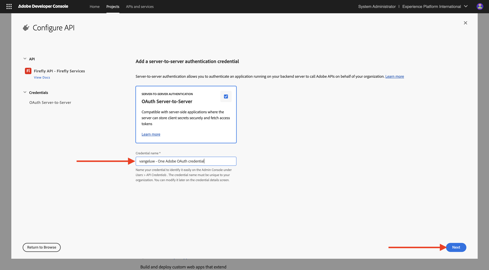

# 配置Adobe I/O项目

## 创建您的Adobe I/O项目

在本练习中，Adobe I/O用于查询各种Adobe端点。 按照以下步骤设置Adobe I/O。

转到[https://developer.adobe.com/console/home](https://developer.adobe.com/console/home){target="_blank"}。

{zoomable="yes"}

确保在屏幕右上角选择正确的实例。 您的实例为`--aepImsOrgName--`。
接下来，选择**新建项目**。

{zoomable="yes"}

### Firefly服务API

您应该会看到此内容。 选择&#x200B;**+添加到项目**&#x200B;并选择&#x200B;**API**。

{zoomable="yes"}

您的屏幕应如下所示。

{zoomable="yes"}

选择&#x200B;**Creative Cloud**&#x200B;并选择&#x200B;**Firefly - Firefly服务**，然后选择&#x200B;**下一步**。

{zoomable="yes"}

为您的凭据提供一个名称： `--aepUserLdap-- - One Adobe OAuth credential`并选择&#x200B;**下一步**。

{zoomable="yes"}

选择默认配置文件&#x200B;**默认Firefly服务配置**，然后选择&#x200B;**保存配置的API**。

{zoomable="yes"}

您应该会看到此内容。

{zoomable="yes"}

### PHOTOSHOP SERVICES API

选择&#x200B;**+添加到项目**，然后选择&#x200B;**API**。

{zoomable="yes"}

选择&#x200B;**Creative Cloud**，然后选择&#x200B;**Photoshop - Firefly服务**。 选择&#x200B;**下一步**。

{zoomable="yes"}

选择&#x200B;**下一步**。

{zoomable="yes"}

接下来，您需要选择一个产品配置文件，以定义此集成可用的权限。

选择&#x200B;**默认Firefly服务配置**&#x200B;和&#x200B;**默认Creative Cloud自动化服务配置**。

选择&#x200B;**保存配置的API**。

{zoomable="yes"}

您应该会看到此内容。

{zoomable="yes"}

### ADOBE EXPERIENCE PLATFORM API

选择&#x200B;**+添加到项目**，然后选择&#x200B;**API**。

{zoomable="yes"}

选择&#x200B;**Adobe Experience Platform**，然后选择&#x200B;**Experience Platform API**。 选择&#x200B;**下一步**。

{zoomable="yes"}

选择&#x200B;**下一步**。

{zoomable="yes"}

接下来，您需要选择一个产品配置文件，以定义此集成可用的权限。

选择&#x200B;**Adobe Experience Platform — 所有用户 — PROD**。

选择&#x200B;**保存配置的API**。

{zoomable="yes"}

您应该会看到此内容。

{zoomable="yes"}

### 项目名称

单击您的项目名称。

{zoomable="yes"}

选择&#x200B;**编辑项目**。

{zoomable="yes"}

为您的集成输入友好名称： `--aepUserLdap-- One Adobe tutorial`并选择&#x200B;**保存**。

{zoomable="yes"}

Adobe I/O项目的设置现已完成。

{zoomable="yes"}

## 后续步骤

转到[选项1：Postman设置](./ex7.md){target="_blank"}

转到[选项2：PostBuster设置](./ex8.md){target="_blank"}

返回[开始使用](./getting-started.md){target="_blank"}

返回[所有模块](./../../../overview.md){target="_blank"}