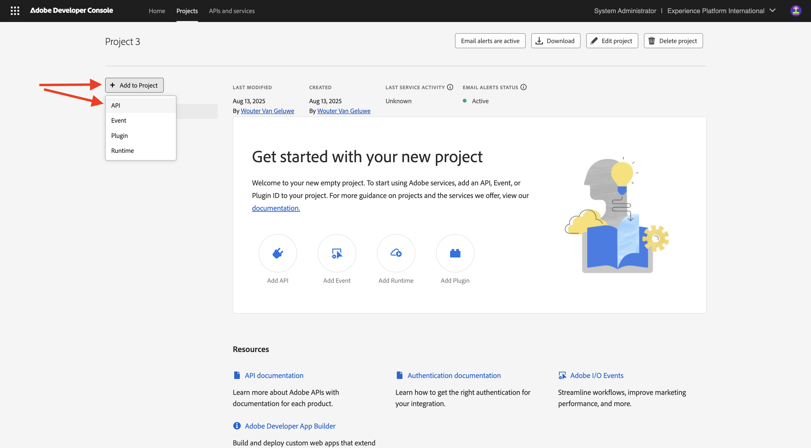
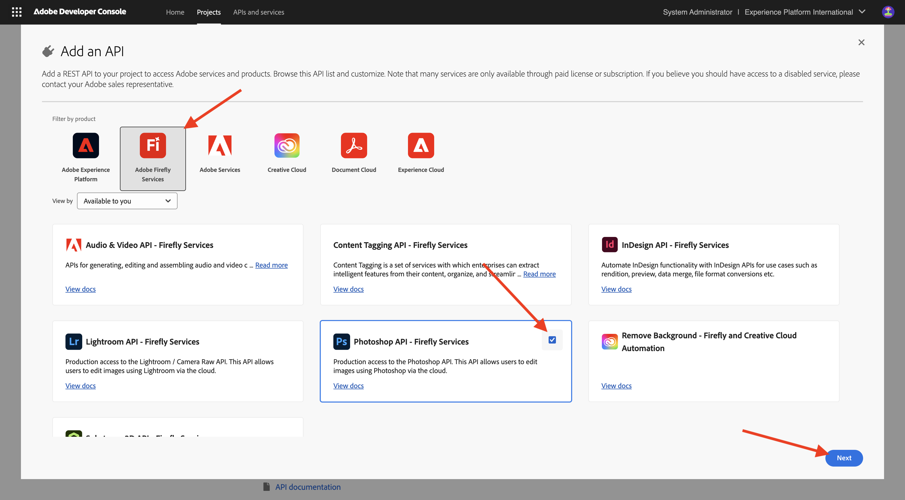

# 配置Adobe I/O项目

## 创建您的Adobe I/O项目

在本练习中，Adobe I/O用于查询各种Adobe端点。 按照以下步骤设置Adobe I/O。

转到[https://developer.adobe.com/console/home](https://developer.adobe.com/console/home){target="_blank"}。

确保在屏幕右上角选择正确的实例。 您的实例为`--aepImsOrgName--`。

>[!NOTE]
>
> 以下屏幕截图显示了正在选择的特定组织。 在阅读本教程时，您的组织很可能具有不同的名称。 当您注册本教程时，系统已为您提供了要使用的环境详细信息，请按照这些说明操作。

接下来，选择&#x200B;**新建项目**。

### FIREFLY SERVICES API

>[!IMPORTANT]
>
>根据您选择的学习路径，您可能无权访问Firefly Services API。 只有当您位于学习路径&#x200B;**Firefly**、**Workfront Fusion**、**ALL**&#x200B;上或参加&#x200B;**现场研讨会**&#x200B;时，您才有权访问Firefly Services API。 如果您未按照以下学习路径之一进行学习，则可以跳过此步骤。

您应该会看到此内容。 选择&#x200B;**+添加到项目**&#x200B;并选择&#x200B;**API**。

选择&#x200B;**Adobe Firefly Services**&#x200B;并选择&#x200B;**Firefly - Firefly Services**，然后选择&#x200B;**下一步**。

为您的凭据提供一个名称： `--aepUserLdap-- - One Adobe OAuth credential`并选择&#x200B;**下一步**。

选择默认配置文件&#x200B;**默认Firefly Services配置**，然后选择&#x200B;**保存配置的API**。

您应该会看到此内容。

### PHOTOSHOP SERVICES API

>[!IMPORTANT]
>
>根据您选择的学习路径，您可能无权访问Photoshop Services API。 只有当您位于学习路径&#x200B;**Firefly**、**Workfront Fusion**、**ALL**&#x200B;上或参加&#x200B;**现场研讨会**&#x200B;时，您才有权访问Photoshop Services API。 如果您未按照以下学习路径之一进行学习，则可以跳过此步骤。
>
>选择&#x200B;**+添加到项目**，然后选择&#x200B;**API**。

选择&#x200B;**Adobe Firefly Services**，然后选择&#x200B;**Photoshop - Firefly Services**。 选择&#x200B;**下一步**。

选择&#x200B;**下一步**。

接下来，您需要选择一个产品配置文件，以定义此集成可用的权限。

选择&#x200B;**默认Firefly Services配置**&#x200B;和&#x200B;**默认Creative Cloud自动化服务配置**。

选择&#x200B;**保存配置的API**。

您应该会看到此内容。

### ADOBE EXPERIENCE PLATFORM API

>[!IMPORTANT]
>
>根据您选择的学习路径，您可能无权访问Adobe Experience Platform API。 只有在您位于学习路径&#x200B;**AEP + Apps**、**ALL**&#x200B;上或参加&#x200B;**现场研讨会**&#x200B;时，您才有权访问Adobe Experience Platform API。 如果您未按照以下学习路径之一进行学习，则可以跳过此步骤。

选择&#x200B;**+添加到项目**，然后选择&#x200B;**API**。

选择&#x200B;**Adobe Experience Platform**，然后选择&#x200B;**Experience Platform API**。 选择&#x200B;**下一步**。

选择&#x200B;**下一步**。

接下来，您需要选择一个产品配置文件，以定义此集成可用的权限。

选择&#x200B;**Adobe Experience Platform — 所有用户 — PROD**。

>[!NOTE]
>
>AEP的产品配置文件的名称取决于环境的配置方式。 如果您没有看到上述产品配置文件，则可能有一个名为&#x200B;**默认的生产所有访问权限**&#x200B;的产品配置文件。 如果您不确定要选择哪一个，请咨询您的AEP系统管理员。

选择&#x200B;**保存配置的API**。

您应该会看到此内容。

### Frame.io API

>[!IMPORTANT]
>
>根据您选择的学习路径，您可能无权访问Frame.io API。 只有当您位于学习路径&#x200B;**Workfront Fusion**、**ALL**&#x200B;上或参加&#x200B;**现场研讨会**&#x200B;时，才能访问Frame.io API。 如果您未按照以下学习路径之一进行学习，则可以跳过此步骤。

选择&#x200B;**+添加到项目**，然后选择&#x200B;**API**。

选择&#x200B;**Creative Cloud**&#x200B;并选择&#x200B;**Frame.io API**。 选择&#x200B;**下一步**。

选择&#x200B;**服务器到服务器身份验证**，然后单击&#x200B;**下一步**。

选择&#x200B;**OAuth服务器到服务器**，然后单击&#x200B;**下一步**。

接下来，您需要选择一个产品配置文件，以定义此集成可用的权限。

选择&#x200B;**默认Frame.io Enterprise - Prime配置**，然后单击&#x200B;**保存配置的API**。

您应该会看到此内容。

### 项目名称

单击您的项目名称。

{zoomable="yes"}

选择&#x200B;**编辑项目**。

{zoomable="yes"}

为您的集成输入友好名称： `--aepUserLdap-- One Adobe tutorial`，然后选择&#x200B;**保存**。

{zoomable="yes"}

Adobe I/O项目的设置现已完成。

{zoomable="yes"}

## 后续步骤

转到[选项1：Postman设置](./ex7.md){target="_blank"}

转到[选项2：PostBuster设置](./ex8.md){target="_blank"}

返回[开始使用](./getting-started.md){target="_blank"}

返回[所有模块](./../../../overview.md){target="_blank"}
