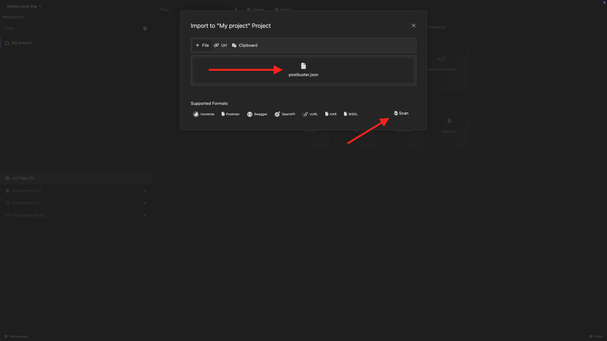

# 选项2：PostBuster设置

>[!IMPORTANT]
>
>如果您不是Adobe员工，请按照说明[安装Postman](./ex7.md)。 以下说明仅适用于Adobe员工。

## 安装PostBuster

转到[https://adobe.service-now.com/esc?id=adb_esc_kb_article&amp;sysparm_article=KB0020542](https://adobe.service-now.com/esc?id=adb_esc_kb_article&amp;sysparm_article=KB0020542)。

单击以下载&#x200B;**PostBuster**&#x200B;的最新版本。


下载适用于您的操作系统的正确版本。


下载完成并安装后，打开PostBuster。 您应该会看到此内容。 单击&#x200B;**导入**。


下载[postbuster.json.zip](./../../../assets/postman/postbuster.json.zip)并将其解压缩到桌面上。


单击&#x200B;**选择文件**。


选择文件&#x200B;**postbuster.json**。 单击&#x200B;**打开**。


您应该会看到此内容。 单击&#x200B;**扫描**。



单击&#x200B;**导入**。


您应该会看到此内容。 单击以打开导入的收藏集。


现在，您可以看到自己的收藏集。 您仍需要配置环境以保存某些环境变量。


单击&#x200B;**基本环境**，然后单击&#x200B;**编辑**&#x200B;图标。


您应该会看到此内容。


复制以下环境占位符并将其粘贴到&#x200B;**基本环境**&#x200B;中。

```json
{
	"CLIENT_SECRET": "",
	"API_KEY": "",
	"ACCESS_TOKEN": "",
	"SCOPES": [
		"openid",
		"AdobeID",
		"read_organizations", 
		"additional_info.projectedProductContext", 
		"session",
		"ff_apis",
		"firefly_api"
	],
	"TECHNICAL_ACCOUNT_ID": "",
	"IMS": "ims-na1.adobelogin.com",
	"IMS_ORG": "",
	"access_token": "",
	"IMS_TOKEN": "",
	"AZURE_STORAGE_URL": "",
	"AZURE_STORAGE_CONTAINER": "",
	"AZURE_STORAGE_SAS_READ": "",
	"AZURE_STORAGE_SAS_WRITE": ""
}
```

然后您应该拥有此项。


## 输入Adobe I/O变量

转到[https://developer.adobe.com/console/home](https://developer.adobe.com/console/home){target="_blank"}并打开您的项目。

{zoomable="yes"}

转到&#x200B;**OAuth服务器到服务器**。

{zoomable="yes"}

您现在需要从Adobe I/O项目中复制以下值，并将其粘贴到PostBuster基本环境中。

- 客户端 ID
- 客户端密码（单击&#x200B;**检索客户端密码**）
- 技术帐户ID
- 组织ID（向下滚动以查找您的组织ID）

{zoomable="yes"}

逐一复制上述变量，并将其粘贴到PostBuster中的&#x200B;**基本环境**&#x200B;中。

| Adobe I/O中的Variable Name | PostBuster基本环境中的变量名称 |
|:-------------:| :---------------:| 
| 客户端 ID | `API_KEY` |
| 客户端密码 | `CLIENT_SECRET` |
| 技术帐户ID | `TECHNICAL_ACCOUNT_ID` |
| 组织 ID | `IMS_ORG` |

逐个复制这些变量后，您的PostBuster基本环境应如下所示：

{zoomable="yes"}

在&#x200B;**Adobe IO - OAuth**&#x200B;集合中，选择名为&#x200B;**POST — 获取访问令牌**&#x200B;的请求，然后选择&#x200B;**发送**。

您应会看到包含以下信息的类似响应：

| 键 | 值 |
|:-------------:| :---------------:| 
| token_type | **持有人** |
| access_token | **eyJhbGciOiJS...** |
| expires_in | **86399** |

Adobe I/O **bearer-token**&#x200B;具有特定值（非常长的access_token）和到期窗口，现在有效期为24小时。 这意味着24小时后，如果您要使用Postman与Adobe API交互，则必须通过再次运行此请求来生成新令牌。

{zoomable="yes"}

您的PostBuster环境现已设置并正常工作。 您现在已完成入门模块。

## 后续步骤

转到[要安装的应用程序](./ex9.md){target="_blank"}

返回[开始使用](./getting-started.md){target="_blank"}

返回[所有模块](./../../../overview.md){target="_blank"}
