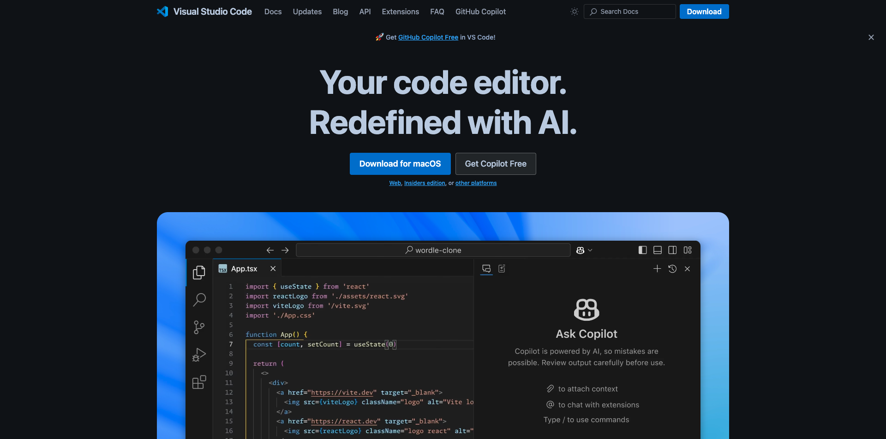

# 要安装的应用程序

以下是启动本教程之前需要在计算机上安装的应用程序概述。

## Adobe Creative Cloud

转到[https://creativecloud.adobe.com/apps/download/creative-cloud](https://creativecloud.adobe.com/apps/download/creative-cloud){target="_blank"}。

## Adobe Photoshop

打开&#x200B;**Adobe Creative Cloud**&#x200B;应用，转到&#x200B;**应用**。 在计算机上安装Photoshop。

## Adobe Illustrator

打开&#x200B;**Adobe Creative Cloud**&#x200B;应用，转到&#x200B;**应用**。 在计算机上安装Illustrator。

## Visual Studio代码

转到[https://code.visualstudio.com/](https://code.visualstudio.com/){target="_blank"}，下载并安装&#x200B;**Visual Studio Code**。

## 文本编辑器

如果您没有文本编辑器应用程序，则可以转到[https://www.sublimetext.com/](https://www.sublimetext.com/){target="_blank"}并下载和安装此文本编辑器。

## GitHub帐户

如果您还没有GitHub帐户，请转到[https://github.com/](https://github.com/){target="_blank"}，然后单击&#x200B;**注册**。 使用您的个人电子邮件地址并创建您的帐户。

## GitHub Desktop

转到[https://desktop.github.com/download/](https://desktop.github.com/download/){target="_blank"}，下载并安装&#x200B;**Github Desktop**。

## Azure存储资源管理器

[下载Microsoft Azure Storage Explorer以管理您的文件](https://azure.microsoft.com/en-us/products/storage/storage-explorer#Download-4){target="_blank"}。 为您的特定操作系统选择正确的版本，然后下载并安装该版本。

{zoomable="yes"}

您现在已完成入门模块。

## 后续步骤

返回[开始使用](./getting-started.md){target="_blank"}

返回[所有模块](./../../../overview.md){target="_blank"}。/images
