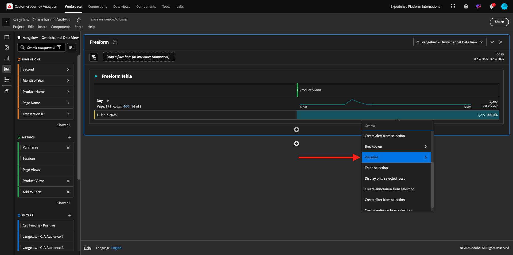
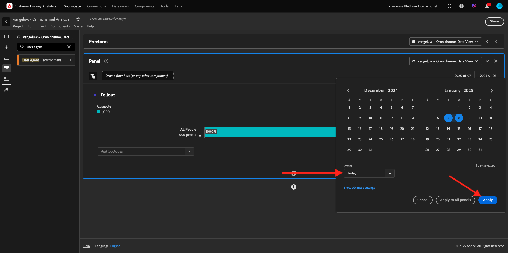
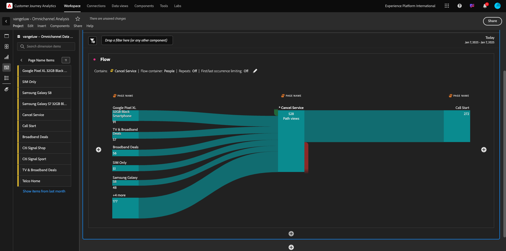
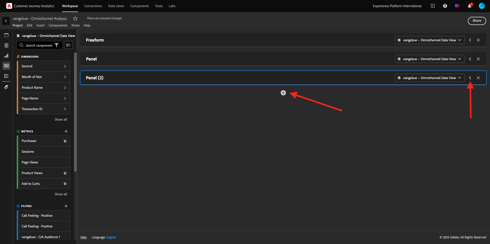
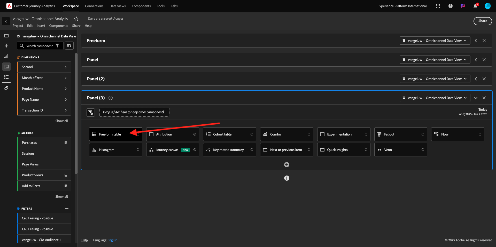

# 使用Customer Journey Analytics的1.1.5可视化图表

## 目标

- 了解Analysis Workspace UI
- 了解一些使Analysis Workspace如此与众不同的功能。
- 了解如何使用Analysis Workspace在CJA中分析

## 上下文

在本练习中，您将使用CJA中的Analysis Workspace来分析产品查看、产品漏斗、流失率等。

我们将介绍在“模块7 — 查询服务”中完成的一些查询，这样您就可以了解运行相同的查询以及更多查询有多么容易，但是请不要使用SQL并且只依赖于Analysis Workspace的拖放原则。

让我们使用您在Analysis Workspace[&#128279;](./ex4.md)中的1.1.4数据准备中创建的项目，转到[https://analytics.adobe.com](https://analytics.adobe.com)。

单击以打开您的项目`--aepUserLdap-- - Omnichannel Analysis`。

打开您的项目并选择数据视图`--aepUserLdap-- - Omnichannel Analysis`后，您就可以开始构建第一个可视化图表了。

## 我们每天查看了多少项产品

首先，您需要选择正确的日期来分析数据。 转到画布右侧的日历下拉菜单。 单击该日期范围并选择适用的日期范围。

在左侧菜单（组件区域）中，找到计算量度&#x200B;**产品视图**。 选择它并将其拖放到画布中（位于自由格式表的右上方）。

将自动添加维度&#x200B;**Day**&#x200B;以创建您的第一个表。 现在你可以看到你的问题被迅速回答了。

接下来，右键单击量度摘要。 单击&#x200B;**可视化**。

单击&#x200B;**行**。

您将按小时查看产品查看次数。

您可以通过单击可视化图表中的&#x200B;**设置**&#x200B;来更改时间范围。

单击&#x200B;**行**&#x200B;到&#x200B;**管理数据Source**&#x200B;旁边的点。

接下来，单击&#x200B;**锁定选择**&#x200B;并选择&#x200B;**选定项目**&#x200B;以锁定此可视化图表，以便它始终显示产品查看的时间线。

## 查看的前5项产品

查看的前5项产品是什么？

请记得偶尔保存项目。

| 操作系统 | 捷径 |
| ----------------- |-------------| 
| Windows | Control + S |
| Mac | Command + S |

让我们开始查找查看的前5个产品。 在左侧菜单中，找到&#x200B;**产品名称** - Dimension。

现在拖放&#x200B;**产品名称**&#x200B;以替换&#x200B;**天**&#x200B;维度：

结果就是这样。 选择4个产品名称，您将看到可视化更新。

接下来，尝试按品牌名称划分产品之一。 搜索&#x200B;**brandName**，并将其拖动到第一个产品名称下。

接下来，使用用户代理进行划分。 搜索&#x200B;**用户代理**&#x200B;并将其拖动到品牌名下。

您随后将看到以下内容：

最后，您可以添加更多可视化图表。 在左侧的可视化图表下，搜索`Donut`。 获取`Donut`，将其拖放到画布上的&#x200B;**折线图**&#x200B;可视化图表下。

接下来，在表中，从我们在&#x200B;**Google Pixel XL 32GB Black Smartphone** > **Citi Signal**&#x200B;下执行的划分中选择前5个&#x200B;**用户代理**&#x200B;行。 在选择3行时，按住&#x200B;**CTRL**&#x200B;按钮（在Windows上）或&#x200B;**Command**&#x200B;按钮(在Mac上)。 您会看到圆环图正在更新。

您甚至可以将设计调整为更易读，方法是将&#x200B;**折线**&#x200B;图和&#x200B;**圆环图**&#x200B;图缩小一点，以便它们可以彼此相邻：

单击&#x200B;**圆环图**&#x200B;旁的点以&#x200B;**管理数据Source**。
接下来，单击&#x200B;**锁定选择**&#x200B;以锁定此可视化图表，使其始终显示产品查看的时间线。

有关使用Analysis Workspace的可视化图表的更多信息，请访问：

- [https://experienceleague.adobe.com/docs/analytics/analyze/analysis-workspace/visualizations/freeform-analysis-visualizations.html](https://experienceleague.adobe.com/docs/analytics/analyze/analysis-workspace/visualizations/freeform-analysis-visualizations.html)
- [https://experienceleague.adobe.com/docs/analytics/analyze/analysis-workspace/visualizations/t-sync-visualization.html](https://experienceleague.adobe.com/docs/analytics/analyze/analysis-workspace/visualizations/t-sync-visualization.html)

## 产品互动漏斗，从查看到购买

有很多方法可以解决这个问题。 其中之一是使用“产品交互类型”，并将其用于自由格式表。 另一种方法是使用&#x200B;**流失可视化图表**。 让我们使用最后一个变量，因为我们希望同时进行可视化和分析。

单击此处关闭当前面板：

现在，通过单击&#x200B;**+添加空白面板**&#x200B;来添加新的空白面板。

单击可视化图表&#x200B;**流失**。

选择与上一个练习相同的日期范围。

你会看到这个。

在左侧的组件下找到维度&#x200B;**事件类型**。 单击箭头以打开尺寸。

您将看到所有可用的事件类型。

选择项&#x200B;**commerce.productViews**&#x200B;并将其拖放到&#x200B;**流失可视化图表**&#x200B;中的&#x200B;**添加接触点**&#x200B;字段。

对&#x200B;**commerce.productListAdds**&#x200B;和&#x200B;**commerce.purchases**&#x200B;执行相同的操作，并将它们放置到&#x200B;**流失可视化图表**&#x200B;中的&#x200B;**添加接触点**&#x200B;字段。 您的可视化图表现在将如下所示：

在这里你可以做很多事。 一些示例：随时间比较、按设备比较每个步骤或按忠诚度比较。 但是，如果您想分析一些有趣的事情，如为什么客户在将项目添加到购物车后不购买，我们可以使用CJA中的最佳工具：右键单击。

右键单击接触点&#x200B;**commerce.productListAdds**。 然后，在此接触点单击&#x200B;**划分流失**。

将创建一个新的自由格式表，以分析用户如果未购买则做了哪些操作。

在新的自由格式表中按&#x200B;**Page Name**&#x200B;更改&#x200B;**事件类型**，以查看它们要访问的页面而不是购买确认页面。

## 用户在访问“取消服务”页面之前在网站上做什么？

同样，有许多方法可执行此分析。 让我们使用流分析来启动发现部分。

单击此处关闭当前面板，然后单击&#x200B;**+添加空白面板**&#x200B;添加新的空白面板。

单击可视化图表&#x200B;**流量**。

你会看到这个。 选择与上一个练习相同的日期范围。 单击&#x200B;**应用**。

在左侧的组件下找到维度&#x200B;**页面名称**，然后单击箭头以打开该维度。

您将找到查看的所有页面。 查找页面名称： **取消服务**。
将&#x200B;**取消服务**&#x200B;拖放到中间字段上的流量可视化中。 单击&#x200B;**生成**。

您随后将看到以下内容：

现在，让我们分析访问网站上的&#x200B;**取消服务**&#x200B;页面的客户是否也称为呼叫中心，以及结果如何。

在维度下，返回并查找&#x200B;**调用交互类型**。
拖放&#x200B;**调用交互类型**&#x200B;以替换&#x200B;**流量可视化图表**&#x200B;右侧的第一个交互。

您现在可以看到在访问&#x200B;**取消服务**&#x200B;页面后致电呼叫中心的客户的支持工单。

接下来，在维度下搜索&#x200B;**呼叫感觉**。  将其拖放以替换&#x200B;**流量可视化图表**&#x200B;右侧的第一次交互。

您随后将看到以下内容：

如您所见，我们已使用流量可视化图表运行了全渠道分析。 多亏了这一点，我们发现似乎有些客户在考虑取消其服务后，在致电呼叫中心后有了积极的感受。 我们是否通过提升改变了他们的想法？

## 具有肯定呼叫中心联系人的客户在主KPI方面的表现如何？

让我们先对数据进行分段，以仅获取具有&#x200B;**正面**&#x200B;调用的用户。 在CJA中，区段称为过滤器。 转到组件区域（左侧）中的筛选器，然后单击&#x200B;**+**。

在筛选器生成器中，为筛选器提供一个名称

| 名称 | 描述 |
| ----------------- |-------------| 
| 通话感觉 — 积极 | 通话感觉 — 积极 |

在组件下（在筛选器生成器中），找到&#x200B;**调用感觉**，并将其拖放到筛选器生成器定义中。

现在选择&#x200B;**正值**&#x200B;作为筛选器的值。

将范围更改为&#x200B;**人员**&#x200B;级别。 单击&#x200B;**保存**。

你以后会回到这里的。 如果尚未完成，请关闭上一个面板，然后单击&#x200B;**+添加空白面板**&#x200B;以添加新的空白面板。

选择与上一个练习相同的日期范围。 单击&#x200B;**应用**。

单击&#x200B;**自由格式表**。

现在，拖放您刚刚创建的过滤器。

添加一些量度所花的时间。 从&#x200B;**产品视图**&#x200B;开始。 拖放到自由格式表中。 您还可以删除&#x200B;**事件**&#x200B;量度。

对&#x200B;**人员**、**添加到购物车**&#x200B;和&#x200B;**购买**&#x200B;执行相同操作。 你最后会得到一张这样的桌子。

由于第一个流量分析，出现了一个新问题。 因此，我们决定创建此表格并根据区段检查一些KPI来回答该问题。 如您所见，洞察时间比使用SQL或其他BI解决方案快得多。

## Customer Journey Analytics和Analysis Workspace回顾

正如您在本实验中了解到的，Analysis Workspace会将来自所有渠道的数据拼合在一起，以分析整个客户历程。 此外，请记住，您可以将数据引入未与历程绑定的同一工作区。
将断开连接的数据纳入您的分析以提供历程上下文会非常有用。 例如，NPS数据、调查、Facebook广告事件或离线交互（未识别）。

## 后续步骤

转到[摘要和优点](./summary.md){target="_blank"}

返回[Customer Journey Analytics](./customer-journey-analytics-build-a-dashboard.md){target="_blank"}

返回[所有模块](./../../../../overview.md){target="_blank"}
