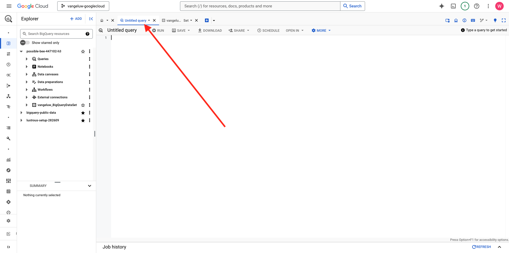

# 1.2.2在BigQuery中创建第一个查询

## 目标

- 探索BigQuery UI
- 在BigQuery中创建SQL查询
- 将SQL查询的结果保存在BigQuery内的数据集中

## 上下文

当Google Analytics数据位于BigQuery中时，维度、量度和其他变量全部嵌套。 此外，Google Analytics数据每天都会加载到不同的表中。 这意味着，尝试将BigQuery中的Google Analytics表直接连接到Adobe Experience Platform非常困难，并且不是一个好主意。

此问题的解决方案是将Google Analytics数据转换为可读格式，以便更轻松地将其摄取到Adobe Experience Platform。

## 1.2.2.1创建数据集以保存新的BigQuery表

转到[BigQuery控制台](https://console.cloud.google.com/bigquery)。


在&#x200B;**资源管理器**&#x200B;中，您将看到项目ID。 单击项目ID（请勿单击&#x200B;**bigquery-public-data**&#x200B;数据集）。


您可以看到还没有数据集，因此让我们立即创建一个。
单击3 **...**，然后单击&#x200B;**创建数据集**。


在屏幕的右侧，您会看到&#x200B;**创建数据集**&#x200B;菜单。


对于&#x200B;**数据集ID**，请使用以下命名约定。 对于其他字段，请保留默认设置。

| 命名 | 示例 |
| ----------------- | ------------- | 
| `--aepUserLdap--_BigQueryDataSet` | vangeluw_BigQueryDataSet |

单击&#x200B;**创建数据集**。


然后，您将返回到BigQuery控制台，并创建数据集。


## 1.2.2.2创建您的第一个SQL BigQuery

接下来，将在BigQuery中创建您的第一个查询。 此查询的目标是获取Google Analytics示例数据并对其进行转换，以便将其摄取到Adobe Experience Platform中。 转到&#x200B;**无标题的查询**&#x200B;选项卡。



复制以下SQL查询并将其粘贴到该查询编辑器中。 欢迎阅读查询并了解Google Analytics BigQuery语法。


```sql
SELECT
  CONCAT(fullVisitorId, CAST(hitTime AS String), '-', hitNumber) AS _id,
  TIMESTAMP(DATETIME(Year_Current, Month_Current, Day_Current, Hour, Minutes, Seconds)) AS timeStamp,
  fullVisitorId as GA_ID,
  -- Fake CUSTOMER ID
  CONCAT('3E-D4-',fullVisitorId, '-1W-93F' ) as customerID,
  Page,
  Landing_Page,
  Exit_Page,
  Device,
  Browser,
  MarketingChannel,
  TrafficSource,
  TrafficMedium,
  -- Enhanced Ecommerce
  TransactionID,
  CASE
      WHEN EcommerceActionType = '2' THEN 'Product_Detail_Views'
      WHEN EcommerceActionType = '3' THEN 'Adds_To_Cart'
      WHEN EcommerceActionType = '4' THEN 'Product_Removes_From_Cart'
      WHEN EcommerceActionType = '5' THEN 'Product_Checkouts'
      WHEN EcommerceActionType = '6' THEN 'Product_Refunds'
    ELSE
    NULL
  END
     AS Ecommerce_Action_Type,
  -- Entrances (metric)
  SUM(CASE
      WHEN isEntrance = TRUE THEN 1
    ELSE
    0
  END
    ) AS Entries,
    
--Pageviews (metric)
    COUNT(*) AS Pageviews,
    
 -- Exits 
    SUM(
    IF
      (isExit IS NOT NULL,
        1,
        0)) AS Exits,
        
 --Bounces
   SUM(CASE
      WHEN isExit = TRUE AND isEntrance = TRUE THEN 1
    ELSE
    0
  END
    ) AS Bounces,
        
  -- Unique Purchases (metric)
  COUNT(DISTINCT TransactionID) AS Unique_Purchases,
  -- Product Detail Views (metric)
  COUNT(CASE
      WHEN EcommerceActionType = '2' THEN fullVisitorId
    ELSE
    NULL
  END
    ) AS Product_Detail_Views,
  -- Product Adds To Cart (metric)
  COUNT(CASE
      WHEN EcommerceActionType = '3' THEN fullVisitorId
    ELSE
    NULL
  END
    ) AS Adds_To_Cart,
  -- Product Removes From Cart (metric)
  COUNT(CASE
      WHEN EcommerceActionType = '4' THEN fullVisitorId
    ELSE
    NULL
  END
    ) AS Product_Removes_From_Cart,
  -- Product Checkouts (metric)
  COUNT(CASE
      WHEN EcommerceActionType = '5' THEN fullVisitorId
    ELSE
    NULL
  END
    ) AS Product_Checkouts,
  -- Product Refunds (metric)
  COUNT(CASE
      WHEN EcommerceActionType = '7' THEN fullVisitorId
    ELSE
    NULL
  END
    ) AS Product_Refunds
  FROM (
  SELECT
    -- Landing Page (dimension)
    CASE
      WHEN hits.isEntrance = TRUE THEN hits.page.pageTitle
    ELSE NULL
  END
    AS Landing_page,
    
        -- Exit Page (dimension)
    CASE
      WHEN hits.isExit = TRUE THEN hits.page.pageTitle
    ELSE
    NULL
  END
    AS Exit_page,
    
    hits.page.pageTitle AS Page,
    hits.isEntrance,
    hits.isExit,
    hits.hitNumber as hitNumber,
    hits.time as hitTime,
    date as Fecha,
    fullVisitorId,
    visitStartTime,
    device.deviceCategory AS Device,
    device.browser AS Browser,
    channelGrouping AS MarketingChannel,
    trafficSource.source AS TrafficSource,
    trafficSource.medium AS TrafficMedium,
    hits.transaction.transactionId AS TransactionID,
    CAST(EXTRACT(YEAR FROM CURRENT_DATE()) AS INT64) AS Year_Current,
    CAST(EXTRACT(MONTH FROM CURRENT_DATE()) AS INT64) AS Month_Current,
     CAST(EXTRACT(DAY FROM CURRENT_DATE()) AS INT64) AS Day_Current,
    CAST(EXTRACT(DAY FROM DATE_SUB(CURRENT_DATE(),INTERVAL 1 DAY)) AS INT64) AS Day_Current_Before,
    CAST(FORMAT_DATE('%Y', PARSE_DATE("%Y%m%d", date)) AS INT64) AS Year,
  CAST(FORMAT_DATE('%m', PARSE_DATE("%Y%m%d",date)) AS INT64) AS Month,
  CAST(FORMAT_DATE('%d', PARSE_DATE("%Y%m%d",date)) AS INT64) AS Day,
    CAST(EXTRACT (hour FROM TIMESTAMP_SECONDS(hits.time)) AS INT64) AS Hour,
  CAST(EXTRACT (minute FROM TIMESTAMP_SECONDS(hits.time)) AS INT64) AS Minutes,
  CAST(EXTRACT (second FROM TIMESTAMP_SECONDS(hits.time)) AS INT64) AS SecondS,
    hits.eCommerceAction.action_type AS EcommerceActionType
  
  FROM
    `bigquery-public-data.google_analytics_sample.ga_sessions_*`,
     UNNEST(hits) AS hits
  WHERE
    _table_suffix BETWEEN '20170101'
    AND '20170331'
    AND totals.visits = 1
    AND hits.type = 'PAGE'
    )
    
GROUP BY
  1,
  2,
  3,
  4,
  5,
  6,
  7,
  8,
  9,
  10,
  11,
  12,
  13,
  14
    
  ORDER BY 2 DESC
```

准备就绪后，单击&#x200B;**运行**&#x200B;以运行查询：


执行查询可能需要几分钟的时间。

查询运行完成后，您将在&#x200B;**查询结果**&#x200B;中看到以下输出。


## 1.2.2.3保存BigQuery SQL查询的结果

下一步是单击&#x200B;**保存结果**&#x200B;按钮以保存查询输出。


作为输出的位置，选择&#x200B;**BigQuery表**。


随后您将看到一个新弹出窗口，其中预填充了您的&#x200B;**项目名称**&#x200B;和&#x200B;**数据集名称**。 数据集名称应该是您在本练习开始时创建的数据集，并采用以下命名约定：

| 命名 | 示例 |
| ----------------- | ------------- | 
| `--aepUserLdap--_BigQueryDataSet` | `vangeluw_BigQueryDataSet` |

现在，您需要输入表名称。 请使用此命名约定：

| 命名 | 示例 |
| ----------------- |------------- | 
| `--aepUserLdap--_GAdataTableBigQuery` | `vangeluw_GAdataTableBigQuery` |

单击&#x200B;**保存**。


在您创建的表中准备好数据可能需要一些时间。 几分钟后，刷新浏览器。 然后，您应该会在数据集内看到BigQuery项目内&#x200B;**资源管理器**&#x200B;下的`--aepUserLdap--_GAdataTableBigquery`表。


您现在可以继续进行下一个练习，您将此表连接到Adobe Experience Platform。

## 后续步骤

转到[1.2.3将GCP和BigQuery连接到Adobe Experience Platform](./ex3.md){target="_blank"}

返回至[使用BigQuery Google Analytics Connector在Adobe Experience Platform中摄取和分析Source数据](./customer-journey-analytics-bigquery-gcp.md){target="_blank"}

返回[所有模块](./../../../../overview.md){target="_blank"}
