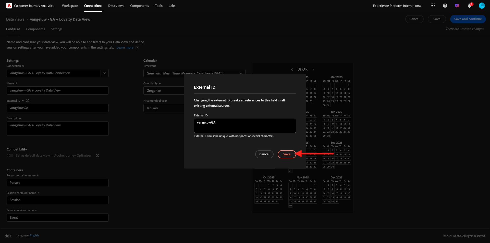
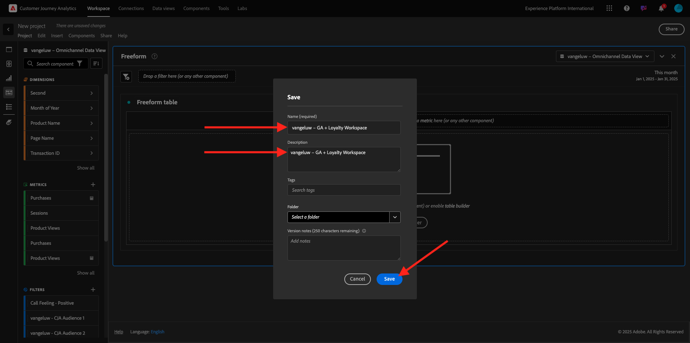
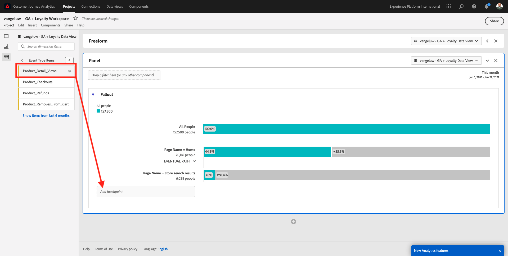

# 1.2.5使用Customer Journey Analytics分析Google Analytics数据

## 目标

- 将我们的BigQuery数据集连接到Customer Journey Analytics (CJA)
- 使用忠诚度数据连接并加入Google Analytics。
- 熟悉CJA UI

## 1.2.5.1创建连接

转到[analytics.adobe.com](https://analytics.adobe.com)以访问Customer Journey Analytics。

在Customer Journey Analytics主页上，转到&#x200B;**连接**。

在这里，您可以看到CJA和Platform之间建立的各种连接。 这些连接与Adobe Analytics中的报表包具有相同的目标。 然而，数据的收集是完全不同的。 所有数据都来自Adobe Experience Platform数据集。

单击&#x200B;**新建连接**。

您随后将看到&#x200B;**创建连接**&#x200B;用户界面。

对于名称，使用此： `--aepUserLdap-- - GA + Loyalty Data Connection`。

您需要选择要使用的正确沙盒。 在沙盒菜单中，选择您的沙盒，应为`--aepSandboxName--`。 在此示例中，要使用的沙盒是&#x200B;**技术内部人员**。

将&#x200B;**平均每日事件数**&#x200B;设置为&#x200B;**小于100万**。

在数据集菜单中，您现在可以开始添加数据集。 单击&#x200B;**添加数据集**。

要添加的数据集包括：
- `Demo System - Profile Dataset for CRM (Global v1.1)`
- `Demo System - Event Dataset for BigQuery (Global v1.1)`

搜索这两个数据集，选中其复选框，然后单击&#x200B;**下一步**。

您随后将看到以下内容：

对于数据集`Demo System - Event Dataset for BigQuery (Global v1.1)`，将&#x200B;**人员ID**&#x200B;更改为&#x200B;**忠诚度ID**，并将&#x200B;**数据源类型**&#x200B;设置为&#x200B;**Web数据**。 为&#x200B;**导入所有新数据**&#x200B;和&#x200B;**回填所有现有数据**&#x200B;启用这两个选项。

对于数据集`Demo System - Event Dataset for BigQuery (Global v1.1)`，验证&#x200B;**人员ID**&#x200B;是否设置为&#x200B;**crmId**，并将&#x200B;**数据源类型**&#x200B;设置为&#x200B;**Web数据**。 为&#x200B;**导入所有新数据**&#x200B;和&#x200B;**回填所有现有数据**&#x200B;启用这两个选项。 单击&#x200B;**添加数据集**。

到时候你就在这里。 单击&#x200B;**保存**。

创建&#x200B;**Connection**&#x200B;后，可能需要几个小时才能在CJA中使用您的数据。

然后，您将在可用连接列表中看到您的连接。

## 1.2.5.2创建数据视图

完成连接后，您现在可以继续影响可视化图表。 Adobe Analytics和CJA之间的区别在于，CJA需要数据视图，以便在可视化之前清理和准备数据。

数据视图与Adobe Analytics中虚拟报表包的概念类似，您可以在其中定义上下文感知访问定义、筛选以及组件的调用方式。

每个连接至少需要一个数据视图。 但是，对于某些用例，最好是针对同一连接有多个数据视图，以便向不同团队提供不同的见解。

如果您希望公司成为数据驱动型公司，您应该调整每个团队中数据的查看方式。 一些示例：

- 仅适用于UX设计团队的UX量度
- 为Google Analytics的KPI和量度使用与Customer Journey Analytics相同的名称，以便数字分析团队只能说1种语言。
- 数据视图经过筛选，仅显示1个市场、1个品牌或移动设备的实例数据。

在&#x200B;**连接**&#x200B;屏幕上，选中您刚刚创建的连接前面的复选框。 单击&#x200B;**创建数据视图**。

您将被重定向到&#x200B;**创建数据视图**&#x200B;工作流。

您现在可以配置数据视图的基本定义。 时区、会话超时或数据视图筛选等内容(分段部分类似于Adobe Analytics中的虚拟报表包)。

您在上一个练习中创建的&#x200B;**连接**&#x200B;已选定。 您的连接名为`--aepUserLdap-- - GA + Loyalty Data Connection`。

接下来，按照以下命名惯例为数据视图命名： `--aepUserLdap-- - GA + Loyalty Data View`。

为描述输入相同的值： `--aepUserLdap-- - GA + Loyalty Data View`。

在执行任何分析或可视化之前，我们需要创建一个数据视图，其中包含所有字段、维度和量度及其归因设置。

| 字段 | 命名约定 |
| ----------------- |-------------|  
| 名称连接 | `--aepUserLdap-- - GA + Loyalty Data View` | vangeluw - GA +忠诚度数据视图 |
| 描述 | `--aepUserLdap-- - GA + Loyalty Data View` |
| 外部 ID | `--aepUserLdap--GA` |

单击&#x200B;**保存并继续**。

单击&#x200B;**保存**。

您现在可以将组件添加到数据视图。 如您所见，某些量度和维度会自动添加。

将以下组件添加到数据视图。 另请确保将字段名称更新为友好名称。 为此，请选择量度或维度，然后更新右侧菜单中的&#x200B;**组件名称**&#x200B;字段。

| 组件类型 | 组件原始名称 | 显示名称 | 组件路径 |
| -----------------| -----------------|-----------------|-----------------|
| 量度 | commerce.checkouts.value | 结账次数 | `commerce.checkouts.value` |
| 量度 | commerce.productListRemovals.value | 购物车减货 | `commerce.productListRemovals.value` |
| 量度 | commerce.productListAdds | 购物车添加次数 | `commerce.productListAdds` |
| 量度 | commerce.productViews.value | 产品查看次数 | `commerce.productViews.value` |
| 量度 | commerce.purchases.value | 购买次数 | `commerce.purchases.value` |
| 量度 | web.webPageDetails.pageViews | Page Views | `web.webPageDetails.pageViews` |
| 量度 | 点 | 忠诚度积分 | `_experienceplatform.loyaltyDetails.points` |
| 维度 | 级别 | 忠诚度级别 | `_experienceplatform.loyaltyDetails.level` |
| 维度 | channel.mediaType | 流量Medium | `channel.mediaType` |
| 维度 | channel.typeAtSource | 流量源 | `channel.typeAtSource` |
| 维度 | 跟踪代码 | 营销渠道 | `marketing.trackingCode` |
| 维度 | gaid | GOOGLE ANALYTICS ID | `_experienceplatform.identification.core.gaid` |
| 维度 | web.webPageDetails.name | 页面标题 | `web.webPageDetails.name` |
| 维度 | 供应商 | 浏览器 | `environment.browserDetails.vendor` |
| 维度 | 类型 | Device Type | `device.type` |
| 维度 | loyaltyId | 忠诚度 ID | `_experienceplatform.identification.core.loyaltyId` |
| 维度 | commerce.order.payments.transactionID | Transaction ID | `commerce.order.payments.transactionID` |
| 维度 | 事件类型 | 事件类型 | `eventType` |
| 维度 | 时间戳 | 时间戳 | `timestamp` |
| 维度 | `_id` | 标识符 | `_id` |

然后，您将会看到如下内容：

接下来，您需要通过更改&#x200B;**归因或持久性设置**，对其中一些组件的人员和会话上下文进行一些更改。

请更改以下组件的&#x200B;**归因设置**：

| 组件 |
| -----------------|
| 流量源 |
| 营销渠道 |
| 浏览器 |
| 流量Medium |
| Device Type |
| GOOGLE ANALYTICS ID |

为此，请选择该组件，单击&#x200B;**使用自定义归因模型**&#x200B;并将&#x200B;**模型**&#x200B;设置为&#x200B;**最近**，并将&#x200B;**到期**&#x200B;设置为&#x200B;**人员报告窗口**。 对上述所有组件重复此操作。

在更改所有上述组件的归因设置后，您应该拥有此视图。 单击&#x200B;**保存并继续**。

在&#x200B;**设置**&#x200B;屏幕上，无需进行更改。 单击&#x200B;**保存并完成**。

现在，您可以在Adobe Analytics Analysis Workspace中分析Google Analytics数据了。 让我们转到下一个练习。

## 1.2.5.3创建项目

在Customer Journey Analytics中，转到&#x200B;**Workspace**。 单击&#x200B;**创建项目**

选择&#x200B;**空白Workspace项目**，然后单击&#x200B;**创建**。

现在，您有一个空白项目：

首先，保存您的项目并为其命名。 可以使用以下命令进行保存：

| 操作系统 | 捷径 |
| ----------------- |-------------| 
| Windows | Control + S |
| Mac | Command + S |

你会看到这个弹出窗口。 请使用此命名约定：

| 名称 | 描述 |
| ----------------- |-------------| 
| `--aepUserLdap-- – GA + Loyalty Workspace` | `--aepUserLdap-- – GA + Loyalty Workspace` |

接下来，单击&#x200B;**保存**。

接下来，确保选择屏幕右上角的正确数据视图。 这是您在上一个练习中创建的数据视图，使用命名约定`--aepUserLdap-- - GA + Loyalty Data View`。

### 1.2.5.3.1自由格式表

自由格式表或多或少地用作Excel中的透视表。 从左栏中选取一些内容，然后将其拖放到自由格式中，您会获得一个表格报表。

自由格式表几乎是无限的。 您几乎可以执行任何操作，与Google Analytics相比，这提供了如此大的价值（因为此工具存在一些分析限制）。 这是将Google Analytics数据加载到其他分析工具中的原因之一。

请查看两个示例，在这些示例中，您需要使用SQL、BigQuery和一段时间来回答无法在Google Analytics UI或Google Data Studio中执行的简单问题：

- 有多少人通过由营销渠道拆分的Safari浏览器进入结账流程？ 请查看Safari浏览器是否正在过滤签出量度。 我们刚才将变量Browser = Safari拖放到签出列顶部。

- 作为分析师，我可以看到社交营销渠道的转化率较低。 我使用“最近联系”归因作为默认值，但“首次联系”呢？ 将鼠标悬停在任意指标上时，将显示指标设置。 在那里，我可以选择所需的归因模型。 您可以在GA中（而不是在Data Studio中）将归因作为独立活动来执行，但同一表中不能有与归因分析无关的其他量度或维度。

让我们在CJA中通过Analysis Workspace回答这些问题以及其他一些问题。

首先，在面板右侧选择正确的日期范围(**Today**)。 单击&#x200B;**应用**。

>[!NOTE]
>
>如果您刚刚创建了&#x200B;**数据连接**&#x200B;和&#x200B;**数据视图**，则可能需要等待几个小时。 当存在大量数据记录时，CJA需要一些时间来回填历史数据。

让我们拖放一些维度和量度来分析营销渠道。 首先使用维度&#x200B;**营销渠道**，并将其拖放到&#x200B;**自由格式表**&#x200B;的画布上。 （如果您没有在“量度”菜单中立即看到该量度，请单击&#x200B;**显示全部**）

您随后将看到以下内容：

接下来，您需要将量度添加到自由格式表。 您应该添加以下量度：**人员**、**会话**、**产品查看**、**结账**、**购买**、**转化率** （计算量度）。

为此，您需要创建计算量度&#x200B;**转化率**。 为此，请单击“量度”旁边的&#x200B;**+**&#x200B;图标：

作为计算量度的名称，请使用&#x200B;**转化率**&#x200B;并为&#x200B;**外部ID**&#x200B;使用&#x200B;**转化率**。 然后将指标&#x200B;**purchase**&#x200B;和&#x200B;**Sessions**&#x200B;拖到画布上。 将&#x200B;**Format**&#x200B;设置为&#x200B;**Percent**&#x200B;并将&#x200B;**小数位**&#x200B;设置为&#x200B;**2**。 最后，单击&#x200B;**保存**。

单击&#x200B;**保存**。

接下来，要在&#x200B;**自由格式表**&#x200B;中使用所有这些量度，请逐个将其拖放到&#x200B;**自由格式表**&#x200B;上。 请参阅以下示例。

最后会有一张这样的桌子：

如上所述，**自由格式表**&#x200B;为您提供了执行深入分析所需的自由。 例如，您可以选择任何其他Dimension来划分表内的特定量度。

例如，转到维度和搜索并选择&#x200B;**浏览器**&#x200B;变量。

然后，您将看到此Dimension可用值的概述。

选择Dimension **Safari**&#x200B;并将其拖放到指标上，例如&#x200B;**结帐**。 您随后将看到以下内容：

这样做时，您刚刚回答了一个您潜在的问题：有多少人使用Safari进入结账页面（按营销渠道划分）？

现在，我们来回答归因问题。

在表中找到&#x200B;**Purchase**&#x200B;量度。

将鼠标悬停在指标上，此时将显示&#x200B;**设置**&#x200B;图标。 单击它。

此时将显示一个上下文菜单。 选中&#x200B;**非默认归因模型**&#x200B;的复选框。

在显示的弹出窗口中，您可以轻松更改归因模型和回顾窗口（使用SQL实现起来非常复杂）。

选择&#x200B;**首次联系**&#x200B;作为归因模型。

选择&#x200B;**人员**&#x200B;作为回顾时间范围。

现在单击&#x200B;**应用**。

现在，您可以看到该特定量度的归因模型为“首次联系”。

您可以执行所需数量的细分，不受变量、区段、维度或日期范围类型的限制。

更特别的是，能够从Adobe Experience Platform连接任何数据集，以丰富Google Analytics的数字行为数据。 例如，离线、呼叫中心、忠诚度或CRM数据。

为了展示该功能，让我们配置您的第一个划分，该划分将离线数据与在线数据相结合。 选择维度&#x200B;**忠诚度级别**&#x200B;并将其拖放到任何&#x200B;**营销渠道**，例如&#x200B;**有机搜索**：

接下来，让我们分析使用&#x200B;**忠诚度级别**&#x200B;为&#x200B;**铜级**&#x200B;的&#x200B;**有机搜索**&#x200B;访问网站的客户使用的是哪个&#x200B;**设备类型**。 将Dimension **设备类型**&#x200B;拖放到&#x200B;**铜牌**&#x200B;上。 您随后将看到以下内容：

您可以看到，对于您的第一次细分，将使用忠诚度级别。 此维度来自与您用于BigQuery连接器的数据集和架构不同的数据集。 人员ID **loyaltyID** (演示系统 — BigQuery的事件架构（全局v1.1）)和&#x200B;**loyaltyID** (演示系统 — 忠诚度的配置文件架构（全局v1.1）)相互匹配。 因此，您可以将Google Analytics中的体验事件与忠诚度模式中的用户档案数据结合使用。

我们可以不断拆分包含区段或特定日期范围的行（也许是为了反映特定的电视促销活动），以便向Customer Journey Analytics提问并在旅途中获取答案。

使用SQL以及第三方可视化工具实现相同的最终结果是非常困难的。 特别是当你问问题并试图迅速得到答案的时候。 Customer Journey Analytics没有这种挑战，它允许数据分析人员灵活、实时地查询数据。

## 1.2.5.3.2漏斗或流失分析

漏斗是一种非常好的机制，可用于了解客户历程中的主要步骤。 这些步骤也可以来自离线交互（例如，呼叫中心），然后您可以将其与同一漏斗中的数字接触点组合。

Customer Journey Analytics可让您完成更多任务。 如果您还记得模块13，我们可以在其中单击鼠标右键并执行以下操作：

- 分析用户执行流失步骤后的去向
- 从漏斗的任意点创建区段
- 在折线图可视化图表中查看任何阶段的趋势

让我们看一看您能做的另一件事：本月我的客户历程漏斗与上个月相比情况如何？ 移动设备和桌面设备呢？

在下方，您将创建两个面板：

- 漏斗分析（1月）
- 漏斗分析（2月）

您将看到我们正在对按设备类型划分的不同时间段（一月和二月）的漏斗进行比较。

此类分析无法在Google Analytics UI中执行，或者非常有限。 因此，CJA再次为Google Analytics捕获的数据增加了大量价值。

创建您的第一个流失可视化图表。 请关闭当前面板以从新面板开始。

查看面板的右侧，单击箭头将其关闭。

接下来，单击&#x200B;**+**&#x200B;以创建新面板。

现在选择&#x200B;**流失**&#x200B;可视化图表。

作为分析师，假设您想要了解主要电子商务漏斗的情况：主页>内部搜索>产品详细信息>结账>购买。

我们先从向漏斗中添加一些新步骤开始。 为此，请打开&#x200B;**页面名称**&#x200B;维度。

然后，您将看到已访问的所有可用页面。

将&#x200B;**Home**&#x200B;拖放到第一步。

作为第二步，使用&#x200B;**存储搜索结果**

现在，您需要添加一些电子商务操作。 在维度中，搜索Dimension **事件类型**&#x200B;维度。 单击以打开尺寸。

选择&#x200B;**Product_Detail_Views**&#x200B;并将其拖放到下一步中。

选择&#x200B;**Product_Checkouts**&#x200B;并将其拖放到下一步中。

调整流失可视化图表的大小。

流失可视化图表现已准备就绪。

要开始分析和记录见解，最好使用&#x200B;**文本**&#x200B;可视化图表。 要添加&#x200B;**文本**&#x200B;可视化图表，请单击左侧菜单中的&#x200B;**图形**&#x200B;图标以查看所有可用的可视化图表。 然后将&#x200B;**文本**&#x200B;可视化拖放到画布上。 调整其大小并移动，使其与下图相似。

同样，调整其大小以适合仪表板：

流失可视化还允许进行划分。 使用&#x200B;**设备类型**&#x200B;维度，方法是打开该维度并将某些值逐一拖放到可视化上：

最终获得更高级的可视化图表：

Customer Journey Analytics可让您完成更多任务。 通过右键单击流失中的任意位置，您可以……

- 分析用户从流失步骤前往的位置
- 从漏斗的任意点创建区段
- 显示折线图可视化图表中任何步骤的趋势
- 以可视方式比较任何漏斗与不同的时间段。

例如，在流失的任意步骤中右键单击以查看其中一些分析选项。

## 1.2.5.3.3流量分析和可视化

如果要使用Google Analytics进行高级流量分析，则需要使用SQL提取数据，然后使用第三方解决方案作为可视化部分。 Customer Journey Analytics将帮助解决此问题。

在此步骤中，您将配置流量分析以回答以下问题：在特定登陆页面之前，哪些是主要贡献渠道。  通过两次拖放和一次单击，作为分析师，您可以了解用户通过最后两次接触营销渠道而流向登陆页面的情况。

Customer Journey Analytics可以帮助您回答的其他问题：

- 在特定登陆页面之前，渠道的主要组合是什么？
- 是什么导致用户在到达Product_Checkout时退出会话？ 前面的步骤是什么？

让我们再次从空白面板开始回答这些问题。 关闭当前面板，然后单击&#x200B;**+**。

现在选择&#x200B;**流量**&#x200B;可视化图表。

现在，我们来设置一个多路径营销渠道流量分析。 将&#x200B;**营销渠道**&#x200B;维度拖放到&#x200B;**登入维度**&#x200B;区域。

您现在可以看到第一个进入路径：

单击第一个路径可对其向下展开。

您现在可以看到下一个路径（营销渠道）。

让我们进行第三次深入探讨。 单击新路径中的第一个选项&#x200B;**反向链接**。

现在，您应会看到如下可视化图表：

让我们把事情弄复杂吧。 假设您要分析两条营销路径之后的登陆页面？ 为此，您可以使用辅助维度更改最后一个路径。 查找&#x200B;**Page Name**&#x200B;维度，并将其拖放如下：

您现在将看到以下内容：

让我们再做一次流量分析。 这次您将分析特定退出点后发生的情况。 其他Analytics解决方案需要使用SQL/ETL和第三方可视化工具来实现相同目的。

将新的&#x200B;**流量可视化图表**&#x200B;引入面板。

然后，您将拥有以下权限：

查找Dimension **事件类型**，并将其拖放到&#x200B;**退出维度**&#x200B;区域。

现在您可以看到哪些&#x200B;**事件类型**&#x200B;路径将客户引导至退出。

让我们调查退出签出操作之前发生的情况。 单击&#x200B;**Product_Checkouts**&#x200B;路径：

随后将显示新的操作路径，其中有些数据不够深入。

让我们进一步分析！ 搜索Dimension **Page Name**，并将其拖放到新生成的路径中。

现在，可在几分钟内完成高级流量分析。 您可以单击不同的路径，以查看它们如何从退出连接到前面的步骤。

您现在拥有了一款功能强大的工具包，可以分析漏斗并探索客户在数字接触点以及离线接触点中的行为路径。

不要忘记保存您的更改！

## 1.2.5.4共享项目

>[!IMPORTANT]
>
>以下内容仅供参考 — 您&#x200B;**不需要**&#x200B;与任何人共享您的项目。

仅供参考 — 您可以与同事共享此项目以进行协作或一起分析业务问题。

## 后续步骤

转到[摘要和优点](./summary.md){target="_blank"}

返回至[使用BigQuery Google Analytics Connector在Adobe Experience Platform中摄取和分析Source数据](./customer-journey-analytics-bigquery-gcp.md){target="_blank"}

返回[所有模块](./../../../../overview.md){target="_blank"}
